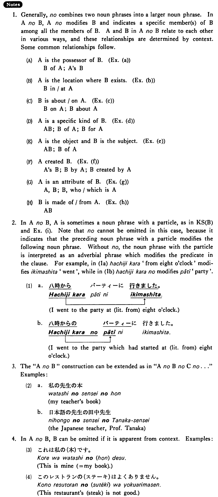

# の (1)

[1. Summary](#summary) 
[2. Formation](#formation) 
[3. Example Sentences](#example-sentences) 
[4. Explanation](#explanation) 
 

## Summary

<table><tr>   <td>Summary</td>   <td>A particle which, with a preceding noun phrase, forms a phrase to modify a following noun phrase.</td></tr><tr>   <td>English</td>   <td>‘s; of; in; at; for; by; from</td></tr><tr>   <td>Part of speech</td>   <td>Particle</td></tr><tr>   <td>Related expression</td>   <td>の2</td></tr></table>

## Formation

<table class="table"> <tbody><tr class="tr head"> <td class="td">(i)  Noun の Noun</td> <td class="td">田中さんの家 </td> <td class="td">Mr.    Tanaka’s house</td> </tr> <tr class="tr"> <td class="td">&nbsp;</td> <td class="td">アメリカの大学 </td> <td class="td">A    university in America</td> </tr> <tr class="tr head"> <td class="td">(ii)  Noun Particle の Noun</td> <td class="td">日本での仕事 </td> <td class="td">A    job in Japan</td> </tr> <tr class="tr"> <td class="td">&nbsp;</td> <td class="td">メアリーへのプレゼント </td> <td class="td">A    present for Mary</td> </tr></tbody></table>

## Example Sentences

<table><tr>   <td>これは先生の本だ・です。</td>   <td>This is my teacher's book.</td></tr><tr>   <td>これは友達からの手紙だ・です。</td>   <td>This is a letter from my friend.</td></tr><tr>   <td>私の本  学校の名前  今日の新聞</td>   <td>my book&emsp;&emsp;the name of the school&emsp;&emsp;today's paper</td></tr><tr>   <td>日本の寺  駅の電話</td>   <td>a temple in Japan&emsp;&emsp;a telephone at the station</td></tr><tr>   <td>美術の本  日本語の試験</td>   <td>a book on fine arts&emsp;&emsp;an exam on Japanese</td></tr><tr>   <td>桜の花  桃の木  バスの切符  風邪の薬</td>   <td>a cherry blossom&emsp;&emsp;a peach tree&emsp;&emsp;a bus ticket&emsp;&emsp;cold medicine</td></tr><tr>   <td>日本語の先生  音楽の学生</td>   <td>a teacher of Japanese&emsp;&emsp;a student of music</td></tr><tr>   <td>友達の大木さん  医者の森田さん  カラーの写真  十歳の子供</td>   <td>my friend Mr. Ooki&emsp;&emsp;a medical doctor, Dr. Morita&emsp;&emsp;a photo in colour&emsp;&emsp;a ten year old child</td></tr><tr>   <td>絹のドレス  れんがの家</td>   <td>a silk dress&emsp;&emsp;a brick house</td></tr><tr>   <td>八時からのパーティー  先生との話し合い</td>   <td>a party which starts at eight o’clock&emsp;&emsp;a discussion with the teacher</td></tr></table>

## Explanation

1. Generally, の combines two noun phrases into a larger noun phrase. In AのB, Aの modifies B and indicates a specific member(s) of B among all the members of B. A and B in AのB relate to each other in various ways, and these relationships are determined by context. Some common relationships follow.
  <ul>(A)&nbsp;&nbsp;&nbsp;&nbsp;A is the possessor of B. [Example (a)] <li>B of A; A's B</li> </ul>  <ul>(B)&nbsp;&nbsp;&nbsp;&nbsp;A is the location where B exists. [Example (b)] <li>B in/at A</li> </ul>  <ul>(C)&nbsp;&nbsp;&nbsp;&nbsp;B is about/on A. [Example (c)] <li>B on A; B about A</li> </ul>  <ul>(D)&nbsp;&nbsp;&nbsp;&nbsp;A is a specific kind of B. [Example (d)] <li>AB; B of A; B for A</li> </ul>  <ul>(E)&nbsp;&nbsp;&nbsp;&nbsp;A is the object and B is the subject. [Example (e)] <li>AB ; B of A</li> </ul>  <ul>(F)&nbsp;&nbsp;&nbsp;&nbsp;A created B. [Example (f)] <li>A's B; B by A; B created by A</li> </ul>  <ul>(G)&nbsp;&nbsp;&nbsp;&nbsp;A is an attribute of B. [Example (g)] <li>A, B; B, who/which is A</li> </ul>  <ul>(H)&nbsp;&nbsp;&nbsp;&nbsp;B is made of/from A. [Example (h)] <li>AB</li> </ul>  
2. In AのB, A is sometimes a noun phrase with a particle, as in Key Sentence (B) and Example (i). Note that の cannot be omitted in this case, because it indicates that the preceding noun phrase with a particle modifies the following noun phrase. Without の, the noun phrase with the particle is interpreted as an adverbial phrase which modifies the predicate in the clause. For example, in (1a) 八時から 'from eight o'clock' modifies 行きました 'went', while in (1b) 八時からの modifies パーティー 'party'.
  <ul>(1)</ul>  <ul> <table class="table"> <tbody> <tr class="tr"> <td class="td">a. 八時から&nbsp;⎪&nbsp;パーティーに&nbsp;⎪&nbsp;行きました。</td> </tr> <tr class="tr"> <td class="td">&nbsp;&nbsp;&nbsp;&nbsp;&nbsp;&nbsp;&nbsp;&nbsp;&nbsp;&nbsp;&nbsp;↑____________________↑</td> </tr> <tr class="tr"> <td class="td">I went to the party at (literally: from) eight o'clock.</td> </tr> </tbody> </table> </ul>  <ul> <table class="table"> <tbody> <tr class="tr"> <td class="td">b. 八時からの&nbsp;⎪&nbsp;パーティーに&nbsp;⎪&nbsp;行きました。</td> </tr> <tr class="tr"> <td class="td">&nbsp;&nbsp;&nbsp;&nbsp;&nbsp;&nbsp;&nbsp;&nbsp;&nbsp;&nbsp;&nbsp;↑___________↑</td> </tr> <tr class="tr"> <td class="td">I went to the party which had started (literally: from) eight o'clock.</td> </tr> </tbody> </table> </ul>   
3. The "AのB" construction can be extended as in "AのBのCの..." Examples:
   <ul>(2) <li>a. 私の先生の本</li> <li>my teacher's book</li> 

 <li>b.日本語の先生の田中先生</li> <li>the Japanese teacher, Professor Tanaka</li> </ul>  
4. In AのB, B can be omitted if it is apparent from context. Examples:
  <ul>(3) <li>これは私の(本)です。</li> <li>This is mine (= my book).</li> </ul>  <ul>(4) <li>このレストランの(ステーキ)はよくありません。</li> <li>This restaurant's (steak) is not good.</li> </ul>

## Grammar Book Page

