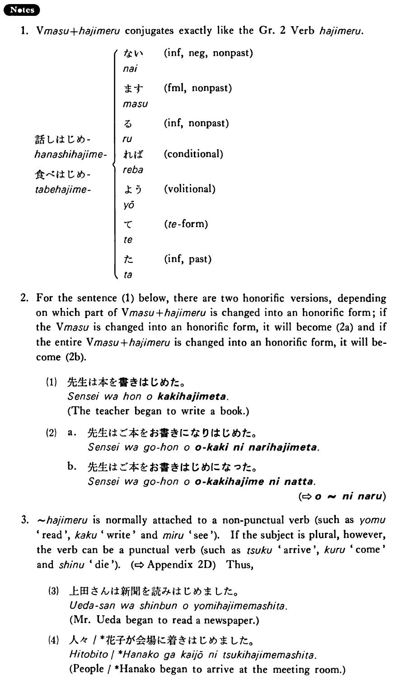

# 始める・はじめる

 
 
 
 
 

## Summary

<table><tr>   <td>Summary</td>   <td>Someone/something begins to do something or begins to be in some state.</td></tr><tr>   <td>English</td>   <td>Begin to</td></tr><tr>   <td>Part of speech</td>   <td>Auxiliary Verb (Group 2)</td></tr><tr>   <td>Related expression</td>   <td>~出す; 来る2</td></tr><tr>   <td>Antonym expression</td>   <td>~終わる</td></tr></table>

## Formation

<table class="table"><tbody><tr class="tr head"><td class="td">Vます</td><td class="td">はじめる</td><td class="td"></td></tr><tr class="tr"><td class="td"></td><td class="td">話しはじめる</td><td class="td">Someone begins to talk</td></tr><tr class="tr"><td class="td"></td><td class="td">食べはじめる</td><td class="td">Someone begins to eat</td></tr></tbody></table>

## Example Sentences

<table><tr>   <td>明日からレポートを書き始める・始めます。</td>   <td>I'll begin to write my paper tomorrow.</td></tr><tr>   <td>私は八月から源氏物語を読み始めました。</td>   <td>I began to read The Tale of Genji in August.</td></tr><tr>   <td>日本の経済は１９６４年の東京オリンピックのころから強くなり始めた。</td>   <td>The Japanese economy began to strengthen about the time of the 1964 Tokyo Olympics.</td></tr><tr>   <td>A:いつから切手を集め始めたんですか。  B:子供の時から集め始めました。</td>   <td>A: When did you start to collect stamps?&emsp;&emsp;B: I started to collect them (literally: since) I was a child.</td></tr></table>

## Explanation

1. Verbます始める conjugates exactly like the Group 2 Verb 始める.
  <table class="table"> <tbody> <tr class="tr"> <td class="td"></td> <td class="td">ない</td> <td class="td">informal, negative, nonpast</td> </tr> <tr class="tr"> <td class="td"></td> <td class="td">ます</td> <td class="td">formal, nonpast</td> </tr> <tr class="tr"> <td class="td">話しはじめ</td> <td class="td">る</td> <td class="td">informal, nonpast</td> </tr> <tr class="tr"> <td class="td">食べはじめ</td> <td class="td">れば</td> <td class="td">conditional</td> </tr> <tr class="tr"> <td class="td"></td> <td class="td">よう</td> <td class="td">volitional</td> </tr> <tr class="tr"> <td class="td"></td> <td class="td">た</td> <td class="td">て form</td> </tr> <tr class="tr"> <td class="td"></td> <td class="td">た</td> <td class="td">informal, past</td> </tr> </tbody> </table>  
2. For the sentence (1) below, there are two honorific versions, depending on which part of Verbます始める is changed into an honorific form; if the Verbます is changed into an honorific form, it will become (2a) and if the entire Verbます始める is changed into an honorific form, it will become (2b).
  <ul>(1) <li>先生は本を書きはじめた。</li> <li>The teacher began to write a book.</li> </ul>  <ul>(2) <li>a. 先生はご本をお書きになりはじめた。</li> 

 <li>b. 先生はご本をお書きはじめになった。</li> </ul>  
(⇨ <a href="#㊦ お～になる">お~になる</a>)
  
3. 始める is normally attached to a non punctual verb (such as 読む 'read', 書く 'write' and 見る 'see'). If the subject is plural, however, the verb can be a punctual verb (such as 着く 'arrive', 来る 'come' and 死ぬ 'die'). Thus,
  <ul>(3) <li>上田さんは新間を読みはじめました。</li> <li>Mr. Ueda began to read a newspaper.</li> </ul>  <ul>(4) <li>人々/*花子が会場に着きはじめました。</li> <li>People/*Hanako began to arrive at the meeting room.</li> </ul>

## Grammar Book Page

