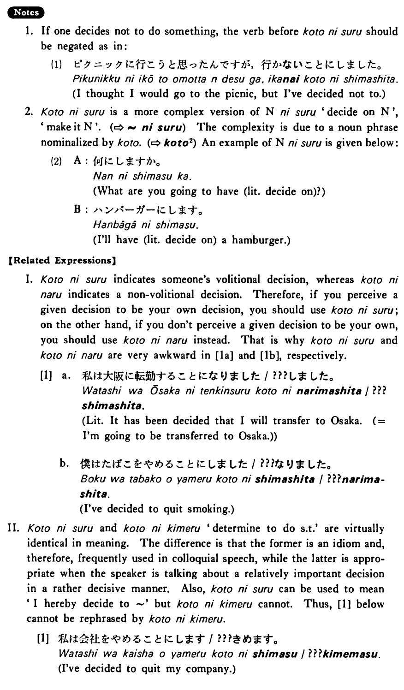

# ことにする

[1. Summary](#summary) 
[2. Formation](#formation) 
[3. Example Sentences](#example-sentences) 
[4. Explanation](#explanation) 
[5. Grammar Book Page](#grammar-book-page) 

## Summary

<table><tr>   <td>Summary</td>   <td>A volitional decision to do something is made.</td></tr><tr>   <td>English</td>   <td>Decide to</td></tr><tr>   <td>Part of speech</td>   <td>Phrase</td></tr><tr>   <td>Related expression</td>   <td>ことに決める; ことになる</td></tr></table>

## Formation

<table class="table"> <tbody><tr class="tr head"> <td class="td">(i)  Vinformal nonpast</td> <td class="td">ことに{しる/した} </td> <td class="td">&nbsp;</td> </tr> <tr class="tr"> <td class="td">&nbsp;</td> <td class="td">話すことに{しる/した} </td> <td class="td">Someone    decides/has decided to talk</td> </tr> <tr class="tr"> <td class="td">&nbsp;</td> <td class="td">食べることに{しる/した} </td> <td class="td">Someone    decides/has decided to eat</td> </tr></tbody></table>

## Example Sentences

<table><tr>   <td>私は会社を辞めることにした・しました。</td>   <td>I decided to quit my company.</td></tr><tr>   <td>私は毎日三十分ぐらい運動をすることにしている・います。</td>   <td>I made it a rule to exercise for about 30 minutes every day.</td></tr><tr>   <td>今年の夏は北海道を旅行することにしました。</td>   <td>I've decided to make a trip to Hokkaido this summer.</td></tr><tr>   <td>京都までバスで行くことにしましょう。</td>   <td>Let's (lit. decide to) go as far as Kyoto by bus.</td></tr><tr>   <td>毎日漢字を十覚えることにしました。</td>   <td>I've decided to memorize ten kanji every day.</td></tr><tr>   <td>私は肉をあまり食べないことにしている。</td>   <td>I make it a rule not to eat very much meat.</td></tr></table>

## Explanation

1. If one decides not to do something, the verb before ことにする should be negated as in:
  <ul>(1) <li>ピクニックに行こうと思ったんですが，行かないことにしました。</li> <li>I thought I would go to the picnic, but I've decided not to.</li> </ul>  
2. ことにする is a more complex version of Nounにする 'decide on Noun', 'make it Noun'. (⇨ <a href="#㊦ にする">にする</a>) The complexity is due to a noun phrase nominalized by こと. (⇨ <a href="#㊦ こと (2)">こと2</a>) An example of Nounにする is given below:
  <ul>(2) <li>A: 何にしますか。</li> <li>What are you going to have (literally: decide on)?</li> 

 <li>B: ハンバーガーにします。</li> <li>I'll have (literally: decide on) a hamburger.</li> </ul>  
【Related Expressions】
  I. ことにする indicates someone's volitional decision, whereas ことになる indicates a non-volitional decision. Therefore, if you perceive a given decision to be your own decision, you should use ことにする; on the other hand, if you don't perceive a given decision to be your own, you should use ことになる instead. That is why ことにする and ことになる are very awkward in [1a] and [1b], respectively.
  
[1]
  <ul> <li>a. 私は大阪に転勤することになりました/???しました。</li> <li>Literally: It has been decided that I will transfer to Osaka. (= I'm going to be transferred to Osaka.)</li> 

 <li>b. 僕はたばこをやめることにしました/???なりました。</li> <li>I've decided to quit smoking.</li> </ul>  
II. ことにする and ことに決める 'determine to do something' are virtually identical in meaning. The difference is that the former is an idiom and, therefore, frequently used in colloquial speech, while the latter is appropriate when the speaker is talking about a relatively important decision in a rather decisive manner. Also, ことにする can be used to mean 'I hereby decide to ~' but ことに決める cannot- Thus, [1] below cannot be rephrased by ことに決める.
  
[1]
  <ul> <li>私は会社をやめることにします/???決めます。</li> <li>I've decided to quit my company.</li> </ul>

## Grammar Book Page

