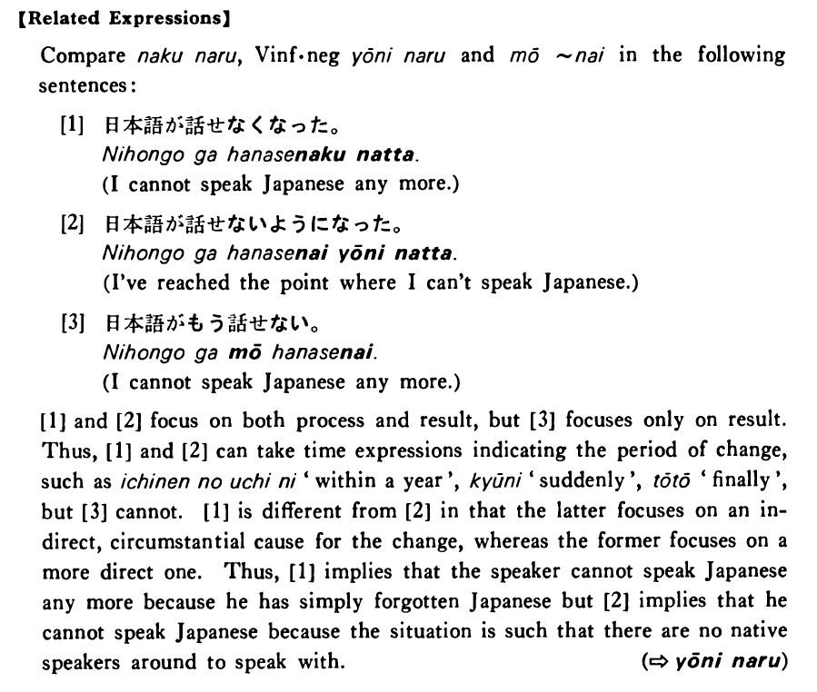

# なくなる

 
 
 
 
 

## Summary

<table><tr>   <td>Summary</td>   <td>It has reached the point where some state or action does not take place anymore.</td></tr><tr>   <td>English</td>   <td>Not ~ any more</td></tr><tr>   <td>Part of speech</td>   <td>Phrase</td></tr><tr>   <td>Related expression</td>   <td>ようになる; もう~ない</td></tr></table>

## Formation

<table class="table"> <tbody><tr class="tr head"> <td class="td">(i)  Vinformal negative</td> <td class="td">なくなる </td> <td class="td">Where    V is often a potential verb</td> </tr> <tr class="tr"> <td class="td">&nbsp;</td> <td class="td">{話さ /話せ} なくなる</td> <td class="td">Someone    doesn’t talk/can’t talk anymore</td> </tr> <tr class="tr"> <td class="td">&nbsp;</td> <td class="td">{食べ /食べられ} なくなる</td> <td class="td">Someone    doesn’t/can’t eat any more</td> </tr> <tr class="tr head"> <td class="td">(ii)  Adjective い stem</td> <td class="td">くなくなる </td> <td class="td">&nbsp;</td> </tr> <tr class="tr"> <td class="td">&nbsp;</td> <td class="td">高くなくなる </td> <td class="td">Something    isn’t expensive any more</td> </tr> <tr class="tr head"> <td class="td">(iii)  {Adjective な stem/   Noun}</td> <td class="td">{では/じゃ} なくなる</td> <td class="td">&nbsp;</td> </tr> <tr class="tr"> <td class="td">&nbsp;</td> <td class="td">{静かでは/静かじゃ} なくなる</td> <td class="td">Something    isn’t quiet any more</td> </tr> <tr class="tr"> <td class="td">&nbsp;</td> <td class="td">{先生では/先生じゃ} なくなる</td> <td class="td">Someone    isn’t a teacher any more</td> </tr></tbody></table>

## Example Sentences

<table><tr>   <td>易しい漢字も書けなくなった・なりました。</td>   <td>I cannot even write easy kanji any more.</td></tr><tr>   <td>前は酒をよく飲んでいたが、この頃は飲まなくなりました。</td>   <td>I used to drink sake a lot, but now I don't drink any more.</td></tr><tr>   <td>彼は前よく電話をかけて来ましたが、もうかけて来なくなりました。</td>   <td>He used to call me frequently, but he doesn't call me any more.</td></tr><tr>   <td>日本語はもう難しくなくなりました。</td>   <td>Japanese isn't difficult for me any more.</td></tr><tr>   <td>この郊外も地下鉄が来て不便ではなくなった。</td>   <td>This suburban area is no longer inconvenient because there is a subway now (literally: the subway has reached here).</td></tr><tr>   <td>やっと大学を出て学生ではなくなりました。</td>   <td>I finally graduated from college and am not a student any longer.</td></tr></table>

## Explanation

【Related Expressions】
  
Compare なくなる, Verb informal negative ようになる and もう~ない in the following sentences:
  
[1]
  <ul> <li>日本語が話せなくなった。</li> <li>I cannot speak Japanese any more.</li> </ul>  
[2]
  <ul> <li>日本語が話せないようになった。</li> <li>I've reached the point where I can't speak Japanese.</li> </ul>  
[3]
  <ul> <li>日本語がもう話せない。</li> <li>I cannot speak Japanese any more.</li> </ul>  
[1] and [2] focus on both process and result, but [3] focuses only on result. Thus, [1] and [2] can take time expressions indicating the period of change, such as 一年のうちに 'within a year',  急に 'suddenly', とうとう 'finally', but [3] cannot. [1] is different from [2] in that the latter focuses on an indirect, circumstantial cause for the change, whereas the former focuses on a more direct one. Thus, [1] implies that the speaker cannot speak Japanese any more because he has simply forgotten Japanese but [2] implies that he cannot speak Japanese because the situation is such that there are no native speakers around to speak with.
  
(⇨ <a href="#㊦ ようになる">ようになる</a>)

## Grammar Book Page

