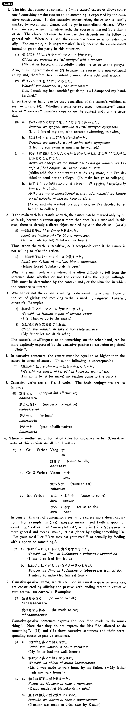

# させる

[1. Summary](#summary) 
[2. Formation](#formation) 
[3. Example Sentences](#example-sentences) 
[4. Explanation](#explanation) 
 

## Summary

<table><tr>   <td>Summary</td>   <td>Cause someone/something to do something or cause something to change its state.</td></tr><tr>   <td>English</td>   <td>Make someone/something do something; cause someone/something to do something; let someone/something do something; allow someone/something to do something; have someone/something do something; get someone/something to do something.</td></tr><tr>   <td>Part of speech</td>   <td>Auxiliary Verb (Group 2)</td></tr></table>

## Formation

<table class="table"> <tbody><tr class="tr head"> <td class="td">(i)  Group 1 verbs</td> <td class="td">Vnegative せる</td> <td class="td">&nbsp;</td> </tr> <tr class="tr"> <td class="td">&nbsp;</td> <td class="td">話させる </td> <td class="td">Cause    to talk</td> </tr> <tr class="tr head"> <td class="td">(ii)  Group 2 verbs</td> <td class="td">Vstem させる</td> <td class="td">&nbsp;</td> </tr> <tr class="tr"> <td class="td">&nbsp;</td> <td class="td">食べさせる </td> <td class="td">Cause    to eat</td> </tr> <tr class="tr head"> <td class="td">(iii)  Irregular verbs</td> <td class="td">来る→来させる</td> <td class="td">Cause    to come</td> </tr> <tr class="tr"> <td class="td">&nbsp;</td> <td class="td">する→させる</td> <td class="td">Cause    to do</td> </tr></tbody></table>

## Example Sentences

<table><tr>   <td>鈴木さんは娘を・に大学へ行かせた・行かせました。</td>   <td>Mr. Suzuki made/let his daughter go to college.</td></tr><tr>   <td>父は妹にピアノを習わせた・習わせました。</td>   <td>My father made (or let) my younger sister learn to play the piano.</td></tr><tr>   <td>久子は私を困らせた。</td>   <td>Hisako made me have trouble. / Hisako caused me trouble.</td></tr><tr>   <td>このゲームはジムに勝たせようと思う。</td>   <td>I think I'll let Jim win this game.</td></tr><tr>   <td>友達は私にチップを払わせた。</td>   <td>My friend made me leave (lit pay) a tip.</td></tr><tr>   <td>アンダーソンさんは子供達に好きなだけアイスクリームを食べさせた。</td>   <td>Mr. Anderson let his children eat as much ice cream as they liked.</td></tr><tr>   <td>私は冷蔵庫でミルクを凍らせた。</td>   <td>I made milk freeze (I froze milk) in the refrigerator.</td></tr><tr>   <td>それは私にさせてください。</td>   <td>As for that, let me do it.</td></tr></table>

## Explanation

1. The idea that someone/something (= the causer) causes or allows someone/something (= the causee) to do something is expressed by the causative construction. In the causative construction, the causer is usually marked by は in main clauses and by が in subordinate clauses. When the main verb is an intransitive verb, the causee is marked by either を or に. The choice between the two particles depends on the following general rule. When に is used, the causee has taken an action intentionally. For example, に is ungrammatical in (1) because the causee didn't intend to go to the party in this situation.
  <ul>(1) <li>父は私を/*にむりやりパーティ一へ行かせた。</li> <li>My father forced (literally: forcefully made) me to go to the party.</li> </ul>  
Also, に is ungrammatical in (2) because the causee is a non-volitional entity and, therefore, has no intent (cannot take a volitional action).
  <ul>(2) <li>私はハンカチを/*に湿らせた。</li> <li>Literally: I made my handkerchief get damp. (= I dampened my handkerchief.)</li> </ul>  
を, on the other hand, can be used regardless of the causee's volition, as seen in (3) and (4). Whether a sentence expresses "permissive" causative or "coercive" causative depends on the context and/or the situation.
  <ul>(3) <li>a. 私はいやがるむすこを/*にむりやり泳がせた。</li> <li>Literally: I forced my son, who resisted swimming, to swim.</li> 

 <li>b. 私はむすこを/に好きなだけ泳がせた。</li> <li>I let my son swim as much as he wanted.</li> </ul>  <ul>(4) <li>a. 秋子は勉強はもうしたくないと言ったが私は彼女を/*に大学に行かせることにした。</li> <li>Akiko said she didn't want to study any more, but I've decided to send her to college, (literally: make her go to college.)</li> 

 <li>b. 秋子はもっと勉強したいと言ったので, 私は彼女を/に大学に行かせることにした。</li> <li>Akiko said she wanted to study more, so I've decided to let her go to college.</li> </ul>  
2. If the main verb is a transitive verb, the causee can be marked only by に as in (5), because を cannot appear more than once in a clause and, in this case, there is already a direct object marked by を in the clause. (⇨ <a href="#㊦ を (1)">を1</a>)
  <ul>(5) <li>一郎は雪子に/*をビールを飲ませた。</li> <li>Ichiro made (or let) Yukiko drink beer.</li> </ul>  
Thus, when the verb is transitive, に is acceptable even if the causee is not willing to take the action.
  <ul>(6) <li>—郎は雪子にむりやりビールを飲ませた。</li> <li>Ichiro forced Yukiko to drink beer.</li> </ul>  
When the main verb is transitive, it is often difficult to tell from the sentence alone whether or not the causee takes the action willingly. This must be determined by the context and/or the situation in which the sentence is uttered.
  
3. Whether or not the causee is willing to do something is clear if one of the set of giving and receiving verbs is used. (⇨ <a href="#㊦ あげる (2)">あげる2</a>; <a href="#㊦ 呉れる・くれる (2)">くれる2</a>; <a href="#㊦ もらう (2)">もらう2</a>) Examples:
  <ul>(7) <li>私は春子をパーティ一に行かせてやった。</li> <li>I let Haruko go to the party.</li> </ul>  <ul>(8) <li>父は私に酒を飲ませてくれた。</li> <li>My father let me drink sake.</li> </ul>  
The causee's unwillingness to do something, on the other hand, can be more explicitly expressed by the causative-passive construction explained in Note 7.
  
4. In causative sentences, the causer must be equal to or higher than the causee in terms of status. Thus, the following is unacceptable:
  <ul>(9) <li>*私は先生に/をパーティーに来させるつもりだ。</li> <li>I'm going to let (or make) my teacher come to the party.</li> </ul>  
5. Causative verbs are all Group 2 verbs. The basic conjugations are as follows:
  <ul>(10)</ul>  <table class="table"> <tbody> <tr class="tr"> <td class="td">話させる</td> <td class="td">nonpast informal affirmative</td> </tr> <tr class="tr"> <td class="td">話させない</td> <td class="td">nonpast informal negative</td> </tr> <tr class="tr"> <td class="td">話させて</td> <td class="td">て form</td> </tr> <tr class="tr"> <td class="td">話させた</td> <td class="td">past informal affirmative</td> </tr> </tbody> </table>  
6. There is another set of formation rules for causative verbs, (Causative verbs of tnis version are all Gr.1 verbs.)
  <ul>(11)</ul>  <table class="table"> <tbody> <tr class="tr"> <td class="td">a.</td> <td class="td">Group 1 Verbs:</td> <td class="td">Verb negative す</td> <td class="td"></td> </tr> <tr class="tr"> <td class="td"></td> <td class="td"></td> <td class="td">話さす</td> <td class="td">cause to talk</td> </tr> <tr class="tr"> <td class="td">b.</td> <td class="td">Group 2 Verbs:</td> <td class="td">Verb stem さす</td> <td class="td"></td> </tr> <tr class="tr"> <td class="td"></td> <td class="td"></td> <td class="td">食べさす</td> <td class="td">cause to eat</td> </tr> <tr class="tr"> <td class="td">c.</td> <td class="td">Irregular Verbs:</td> <td class="td">来る&nbsp;&nbsp;→&nbsp;&nbsp;来さす</td> <td class="td">cause to come</td> </tr> <tr class="tr"> <td class="td"></td> <td class="td"></td> <td class="td">する&nbsp;&nbsp;→&nbsp;&nbsp;さす</td> <td class="td">cause to do</td> </tr> </tbody> </table>  
In general, this set of conjugations seems to express more direct causation. For example, in (12a) 食べさす means 'feed (with a spoon or something)' rather than 'make/let eat', while in (12b) 食べさせる is more general and means 'make/let eat (either by saying something like "Eat your meal" or "You may eat your meal" or actually by feeding with a spoon or sometning)'.
  <ul>(12) <li>a. 私はジムに果物を食べさすつもりだ。</li> <li>I intend to feed Jim fruit.</li> 

 <li>b. 私はジムに果物を食べさせるつもりだ。</li> <li>I intend to make/let Jim eat fruit.</li> </ul>  
7. Causative-passive verbs, which are used in causative-passive sentences, are constructed by affixing the passive verb ending られる to causative verb stems. (⇨ <a href="#㊦ られる (1)">られる1</a>) Examples:
  <ul>(13) <li>話させられる&nbsp;&nbsp;be made to talk</li> 

 <li>食べさせられる&nbsp;&nbsp;be made to eat</li> </ul>  
Causative-passive sentences express the idea "be made to do something". Note that they do not express the idea "be allowed to do something". (14) and (15) show causative sentences and their corresponding causative-passive sentences.
  <ul>(14) <li>a. 父は私を歩いて帰らせた。</li> <li>My father had me walk home.</li> 

 <li>b. 私は父に歩いて帰らせられた。</li> <li>Literally: I was made to walk home by my father. (= My father made me walk home.)</li> </ul>  <ul>(15)  <li>a. 和夫は夏子に酒を飲ませた。</li> <li>Kazuo made/let Natsuko drink sake.</li> 

 <li>b. 夏子は和夫に酒を飲ませられた。</li> <li>Natsuko was made to drink sake by Kazuo.</li> </ul>

## Grammar Book Page

