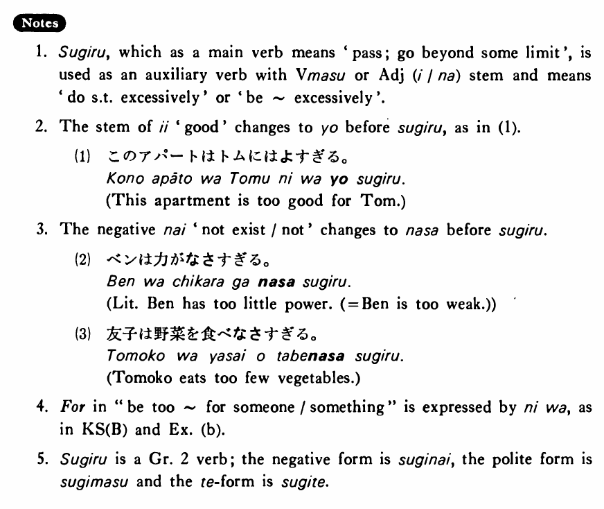

# 過ぎる・すぎる

[1. Summary](#summary) 
[2. Formation](#formation) 
[3. Example Sentences](#example-sentences) 
[4. Explanation](#explanation) 
 

## Summary

<table><tr>   <td>Summary</td>   <td>Someone/something does something excessively or is in a state excessively.</td></tr><tr>   <td>English</td>   <td>Too; do something too much/often; over-</td></tr><tr>   <td>Part of speech</td>   <td>Auxiliary Verb (Group 2)</td></tr></table>

## Formation

<table class="table"> <tbody><tr class="tr head"> <td class="td">(i)  Vます</td> <td class="td">過ぎる </td> <td class="td">&nbsp;</td> </tr> <tr class="tr"> <td class="td">&nbsp;</td> <td class="td">話し過ぎる </td> <td class="td">Talk    too much</td> </tr> <tr class="tr"> <td class="td">&nbsp;</td> <td class="td">食べ過ぎる </td> <td class="td">Eat    too much</td> </tr> <tr class="tr head"> <td class="td">(ii)  Adjective {い/な} stem</td> <td class="td">過ぎる </td> <td class="td">&nbsp;</td> </tr> <tr class="tr"> <td class="td">&nbsp;</td> <td class="td">高過ぎる </td> <td class="td">Too    expensive</td> </tr> <tr class="tr"> <td class="td">&nbsp;</td> <td class="td">静か過ぎる </td> <td class="td">Too    quiet</td> </tr></tbody></table>

## Example Sentences

<table><tr>   <td>ウィルソンは肉を食べ過ぎる・過ぎます。</td>   <td>Mr. Wilson eats too much meat.</td></tr><tr>   <td>このアパートは私達には高過ぎる・過ぎます。</td>   <td>This apartment is too expensive for us.</td></tr><tr>   <td>私は今朝寝過ぎて学校に遅れた。</td>   <td>I overslept this morning and was late for school.</td></tr><tr>   <td>この机は私の部屋には大き過ぎる。</td>   <td>This desk is too big for my room.</td></tr><tr>   <td>田中先生の授業は大変過ぎるので辞めました。</td>   <td>I dropped Professor Tanaka's class because it was too demanding.</td></tr><tr>   <td>森さんは太り過ぎている。</td>   <td>Mr. Mori is too fat.</td></tr></table>

## Explanation

1. 過ぎる, which as a main verb means 'pass; go beyond some limit', is used as an auxiliary verb with Verbます or Adjective い/な stem and means 'do something excessively' or 'be ~ excessively'
  
2. The stem of いい 'good' changes to よ before 過ぎる, as in (1).
  <ul>(1) <li>このアパートはトムにはよすぎる。</li> <li>This apartment is too good for Tom.</li> </ul>  
3. The negative ない 'not exist/not' changes to なさ before 過ぎる.
  <ul>(2) <li>ベンは力がなさすぎる。</li> <li>Literally: Ben has too little power. (= Ben is too weak.)</li> </ul>  <ul>(3) <li>友子は野菜を食べなさすぎる。</li> <li>Tomoko eats too few vegetables.</li> </ul>  
4. For in "be too ~ for someone/something" is expressed by には, as in Key Sentence (B) and Example (b).
  
5. 過ぎる is a Group 2 verb; the negative form is 過ぎない, the polite form is 過ぎます and the て form is 過ぎて.

## Grammar Book Page

