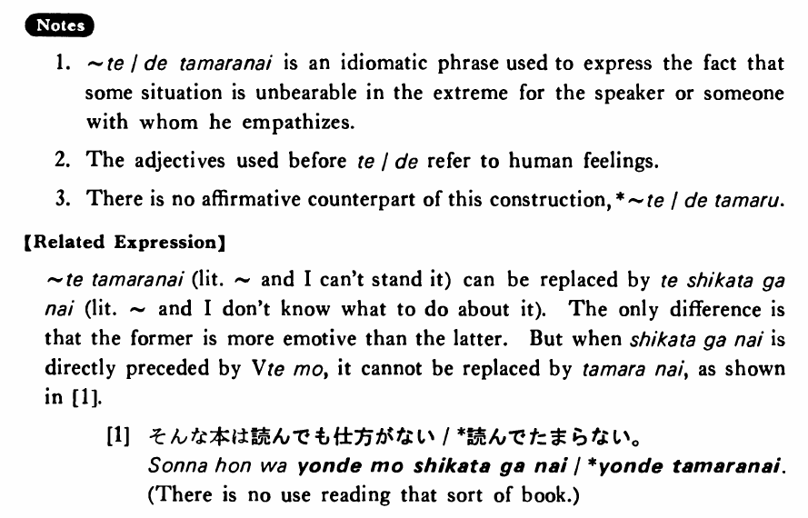

# 堪らない・たまらない

[1. Summary](#summary) 
[2. Formation](#formation) 
[3. Example Sentences](#example-sentences) 
[4. Explanation](#explanation) 
 

## Summary

<table><tr>   <td>Summary</td>   <td>The speaker or whomever he empathises with cannot cope with a situation expressed by the て phrase.</td></tr><tr>   <td>English</td>   <td>Unbearably ~; extremely; be dying to do ~</td></tr><tr>   <td>Part of speech</td>   <td>Phrase</td></tr><tr>   <td>Related expression</td>   <td>しかがない</td></tr></table>

## Formation

<table class="table"> <tbody><tr class="tr head"> <td class="td">Adjective い stem</td> <td class="td">くて堪らない </td> <td class="td">&nbsp;</td> </tr> <tr class="tr"> <td class="td">&nbsp;</td> <td class="td">寒くて堪らない </td> <td class="td">Something    is unbearable cold</td> </tr> <tr class="tr head"> <td class="td">Adjective な stem</td> <td class="td">で堪らない </td> <td class="td">&nbsp;</td> </tr> <tr class="tr"> <td class="td">&nbsp;</td> <td class="td">不便で堪らない </td> <td class="td">Something    is unbearable inconvenient</td> </tr></tbody></table>

## Example Sentences

<table><tr>   <td>今日は暑くて堪らない・堪りません。</td>   <td>It is unbearably hot today.</td></tr><tr>   <td>数学が嫌いで堪らない・堪りません。</td>   <td>I really hate math.</td></tr><tr>   <td>この本は面白くて堪りません。</td>   <td>This book is extremely interesting.</td></tr><tr>   <td>父が死んで、悲しくて堪りません。</td>   <td>My father died and I'm awfully sad.</td></tr><tr>   <td>美味しい魚が食べたくて堪りません。</td>   <td>I'm dying to eat some good fish.</td></tr><tr>   <td>僕はあの子が好きで堪らない。</td>   <td>I just love that girl.</td></tr><tr>   <td>兄は田中先生の授業が嫌で堪らなかった。</td>   <td>My older brother really hated Mr. Tanaka's class.</td></tr></table>

## Explanation

1. て/で堪らない is an idiomatic phrase used to express the fact that some situation is unbearable in the extreme for the speaker or someone with whom he empathizes.
  
2. The adjectives used before て/で refer to human feelings.
  
3. There is no affirmative counterpart of this construction, * ~て/でたまる.
  
【Related Expression】
  
て堪らない (literally: ~ and I can't stand it) can be replaced by て仕方がない (literally: ~ and I don't know what to do about it). The only difference is that the former is more emotive than the latter. But when て仕方がない is directly preceded by Vebても, it cannot be replaced by 堪らない, as shown in [1].
  
[1]
  <ul> <li>そんな本は読んでも仕方がない/*読んでたまらない。</li> <li>There is no use reading that sort of book.</li> </ul>

## Grammar Book Page

