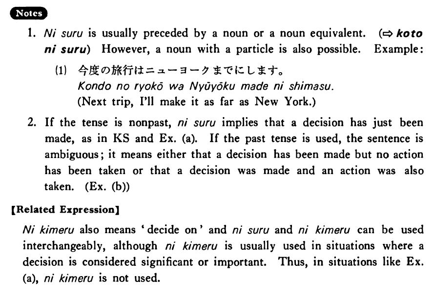

# にする

[1. Summary](#summary) 
[2. Example Sentences](#example-sentences) 
[3. Explanation](#explanation) 
[4. Grammar Book Page](#grammar-book-page) 

## Summary

<table><tr>   <td>Summary</td>   <td>Someone has decided on something.</td></tr><tr>   <td>English</td>   <td>Decide on ~; make it ~</td></tr><tr>   <td>Part of speech</td>   <td>Phrase</td></tr><tr>   <td>Related expression</td>   <td>に決める</td></tr></table>

## Example Sentences

<table><tr>   <td>私はこのアパートにする・します。</td>   <td>I've decided on this apartment.</td></tr><tr>   <td>A:あなたは何にしますか。  B:私はステーキにします。</td>   <td>A: What have you decided on?&emsp;&emsp;B: I've decided on steak.</td></tr><tr>   <td>岡田さんはアメリカの車にしました。</td>   <td>Mr. Okada (has) decided on an American car.</td></tr></table>

## Explanation

1. にする is usually preceded by a noun or a noun equivalent. (⇨ <a href="#㊦ ことにする">ことにする</a>) However, a noun with a particle is also possible. Example:
  <ul>(1) <li>今度の旅行はニューヨークまでにします。</li> <li>Next trip, I'll make it as far as New York.</li> </ul>  
If the tense is nonpast, にする implies that a decision has just been made, as in Key Sentence and Example (a). If the past tense is used, the sentence is ambiguous; it means either that a decision has been made but no action has been taken or that a decision was made and an action was also taken. (Example (b))
  
【Related Expression】
  
に決める also means 'decide on' and にする and に決める can be used interchangeably, although に決める is usually used in situations where a decision is considered significant or important. Thus, in situations like Example (a), に決める is not used.

## Grammar Book Page

