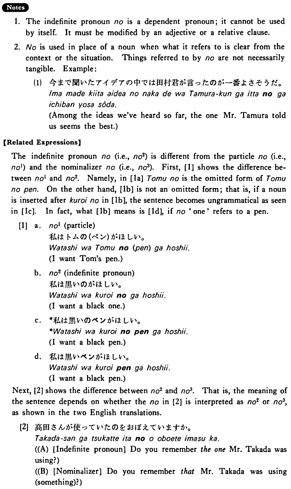

# の (2)

 
 
 
 
 

## Summary

<table><tr>   <td>Summary</td>   <td>A dependent indefinite pronoun.</td></tr><tr>   <td>English</td>   <td>One</td></tr><tr>   <td>Part of speech</td>   <td>Pronoun</td></tr><tr>   <td>Related expression</td>   <td>の1; の3</td></tr></table>

## Formation

<table class="table"> <tbody><tr class="tr head"> <td class="td">(i)  Adjective い informal    nonpast の</td> <td class="td">高いの </td> <td class="td">Expensive    one</td> </tr> <tr class="tr head"> <td class="td">(ii)  Adjective な stem なの</td> <td class="td">丈夫なの </td> <td class="td">Durable    one</td> </tr></tbody></table>

## Example Sentences

<table><tr>   <td>私は大きいのを買った・買いました。</td>   <td>I bought a big one.</td></tr><tr>   <td>私は去年買ったのを使った・使いました。</td>   <td>I used the one I bought last year.</td></tr><tr>   <td>A:どんな車が欲しいですか。  B:小さいのが欲しいです。</td>   <td>A: What kind of car do you want?&emsp;&emsp;B: I want a small one.</td></tr><tr>   <td>友達がワインを飲みたがったので昨日買ったのを出した。</td>   <td>My friend wanted to drink wine, so I served the one I bought yesterday.</td></tr></table>

## Explanation

1. The indefinite pronoun の is a dependent pronoun; it cannot be used by itself. It must be modified by an adjective or a relative clause.
  
2. の is used in place of a noun when what it refers to is clear from the context or the situation. Things referred to by の are not necessarily tangible. Example:
  <ul>(1) <li>今まで聞いたアイデアの中では田村君が言ったのが一番よさそうだ。</li> <li>Among the ideas we've heard so far, the one Mr. Tamura told us seems the best.</li> </ul>  
【Related Expressions】
  
The indefinite pronoun の (i.e., の2) is different from the particle の (i.e., の1) and the nominalizer の (i.e., の3). First, [1] shows the difference between の1 and の2. Namely, in [1a] トムの is the omitted form of トムのペン. On the other hand, [1b] is not an omitted form; that is, if a noun is inserted after 黒いの in [1b], the sentence becomes ungrammatical as seen in [1c]. In fact, what [1b] means is [1d], if の 'one' refers to a pen.
    
[1]
  <ul> <li>a. の1 [particle]</li> <li>私はトムの(ペン)が欲しい。</li> <li>I want Tom's pen.</li> 

 <li>b. の2 [indenmte pronoun]</li> <li>私は黒いのが欲しい。</li> <li>I want a black one.</li> 

 <li>c. *私は黒いのペンが欲しい。</li> <li>I want a black pen.</li> 

 <li>d. 私は黒いペンが欲しい。</li> <li>I want a black pen.</li> </ul>  
Next, [2] shows the difference between の2 and の3. That is, the meaning of the sentence depends on whether the の in [2] is interpreted as の2 or の3, as shown in the two English translations.
  
[2]
  <ul> <li>高田さんが使っていたのを覚えていますか。</li> 

 <li>(A) [Indefinite pronoun] Do you remember the one Mr. Takada was using?</li> 

 <li>(B) [Nominalizer] Do you remember that Mr. Takada was using (something)?</li> </ul>

## Grammar Book Page

