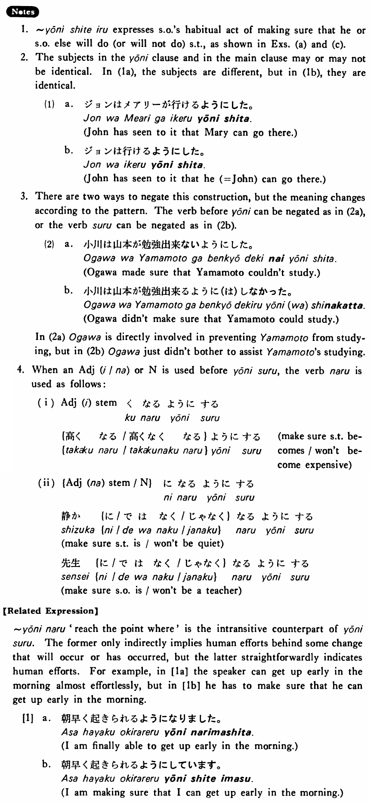

# ようにする

[1. Summary](#summary) 
[2. Formation](#formation) 
[3. Example Sentences](#example-sentences) 
[4. Explanation](#explanation) 
 

## Summary

<table><tr>   <td>Summary</td>   <td>Someone causes some circumstantial or behavioural change to take place.</td></tr><tr>   <td>English</td>   <td>Do ~ in such a way that ~; see to it that ~; make sure that ~; bring it about that ~</td></tr><tr>   <td>Part of speech</td>   <td>Phrase</td></tr><tr>   <td>Related expression</td>   <td>ようになる</td></tr></table>

## Formation

<table class="table"> <tbody><tr class="tr head"> <td class="td">Vinformal nonpast</td> <td class="td">ようにする </td> <td class="td">&nbsp;</td> </tr> <tr class="tr"> <td class="td">&nbsp;</td> <td class="td">{話す /話さない}ようにする</td> <td class="td">Someone    makes sure that he/someone else talks/doesn’t talk</td> </tr> <tr class="tr"> <td class="td">&nbsp;</td> <td class="td">{食べる /食べない}ようにする</td> <td class="td">Someone    makes sure that he/someone else eats/doesn’t eat</td> </tr></tbody></table>

## Example Sentences

<table><tr>   <td>私は毎日運動するようにする・します。</td>   <td>I'll make sure that I do exercises everyday.</td></tr><tr>   <td>出来るだけ日本語で話すようにしています。</td>   <td>I'm making sure I speak Japanese as much as possible.</td></tr><tr>   <td>山川には会わないようにした。</td>   <td>I've made sure that I won't see Yamakawa.</td></tr><tr>   <td>分からないことは先生に聞くようにしている。</td>   <td>I made a point of asking my teacher about the things I don't understand.</td></tr><tr>   <td>毎朝八時に来るようにして下さい。</td>   <td>Please make sure that you come at eight every morning.</td></tr><tr>   <td>後ろからもよく見えるようにしました。</td>   <td>I've seen to it that people can see from the rear seats, too.</td></tr><tr>   <td>成績がよくなるようにした。</td>   <td>I’ve made sure that my grades will improve.</td></tr></table>

## Explanation

1. ようにしてる expresses someone's habitual act of making sure that he or someone else will do (or will not do) something, as shown in Examples (a) and (c).
  
2. The subjects in the ように clause and in the main clause may or may not be identical. In (1a), the subjects are different, but in (1b), they are identical.
  <ul>(1) <li>a. ジョンはメアリ一が行けるようにした。</li> <li>John has seen to it that Mary can go there.</li> 

 <li>b. ジョンは行けるようにした。</li> <li>John has seen to it that he (= John) can go there.</li> </ul>  
3. There are two ways to negate this construction, but the meaning changes according to the pattern. The verb before ように can be negated as in (2a), or the verb する can be negated as in (2b).
  (2)  <ul> <li>a. 小川は山本が勉強出来ないようにした。</li> <li>Ogawa made sure that Yamamoto couldn’t study.</li> 

 <li>b. 小川は山本が勉強出来るように(は)しなかった。</li> <li>Ogawa didn't make sure that Yamamoto could study.</li> </ul>  
In (2a) Ogawa is directly involved in preventing Yamamoto from studying, but in (2b) Ogawa just didn't bother to assist Yamamoto's studying.
  
4. When an Adjective (い/な) or Noun is used before ようにする, the verb なる is used as follows:
  
(i)
  <table class="table"> <tbody> <tr class="tr"> <td class="td">Adjectiveいstemくなる</td> <td class="td">ようにする</td> <td class="td"></td> </tr> <tr class="tr"> <td class="td">{高くなる/高くなくなる}</td> <td class="td">ようにする</td> <td class="td">make sure something becomes/won't become expensive</td> </tr> </tbody> </table>  
(ii)
  <table class="table"> <tbody> <tr class="tr"> <td class="td">{Adjectiveなstem/Noun}になる</td> <td class="td">ようにする</td> <td class="td"></td> </tr> <tr class="tr"> <td class="td">静か{に/ではなく/じゃなく}なる</td> <td class="td">ようにする</td> <td class="td">make sure something is/won't be quiet</td> </tr> <tr class="tr"> <td class="td">先生{に/ではなく/じゃなく}なる</td> <td class="td">ようにする</td> <td class="td">make sure someone is/won't be a teacher</td> </tr> </tbody> </table>  
【Related Expression】
  
ようになる 'reach the point where' is the intransitive counterpart of ようにする. The former only indirectly implies human efforts behind some change that will occur or has occurred, but the latter straightforwardly indicates human efforts. For example, in [1a] the speaker can get up early in the morning almost effortlessly, but in [1b] he has to make sure that he can get up early in the morning.
  
[1]
  <ul> <li>a. 朝早く起きられるようになリました。</li> <li>I am finally able to get up early in the morning.</li> 

 <li>b. 朝早く起きられるようにしています。</li> <li>I am making sure that I can get up early in the morning.</li> </ul>

## Grammar Book Page

