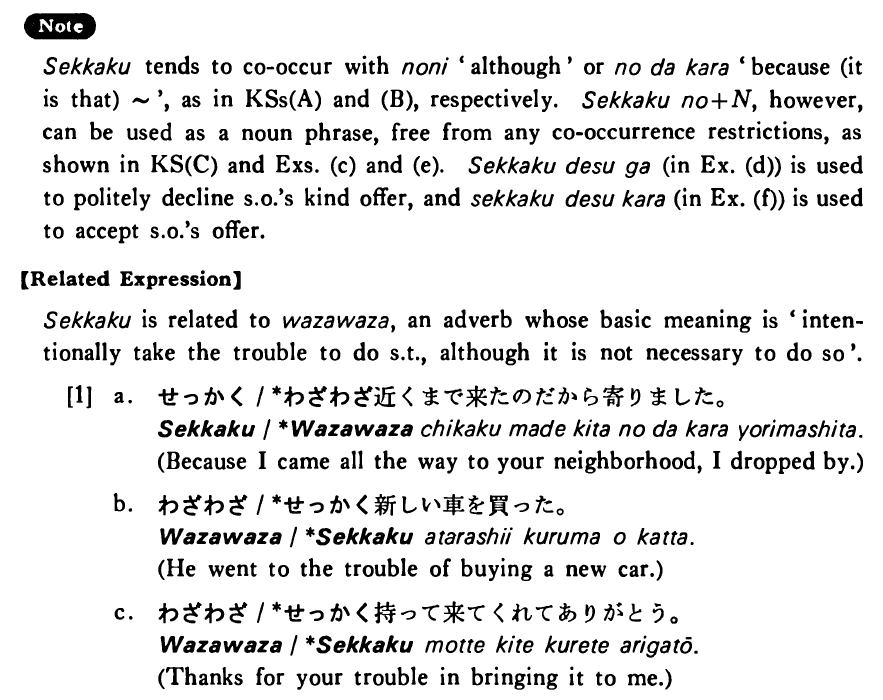

# せっかく

[1. Summary](#summary) 
[2. Example Sentences](#example-sentences) 
[3. Explanation](#explanation) 
[4. Grammar Book Page](#grammar-book-page) 

## Summary

<table><tr>   <td>Summary</td>   <td>Some situation which seldom occurs has now occurred and one can either make use of it or, to one’s regret, cannot make use of it.</td></tr><tr>   <td>Equivalent</td>   <td>With effort; at great pain; take the trouble to do ~</td></tr><tr>   <td>Part of speech</td>   <td>Adverb</td></tr><tr>   <td>Related expression</td>   <td>わざわざ</td></tr></table>

## Example Sentences

<table><tr>   <td>せっかく会いに行ったのに友達はいなかった・いませんでした。</td>   <td>I took the trouble to go see my friend, but he wasn't at home.</td></tr><tr>   <td>せっかくいい大学に入ったのだからよく勉強するつもりだ・です。</td>   <td>I entered a good college with great effort, so I intend to study hard.</td></tr><tr>   <td>せっかくの日曜日なのに働いた・働きました。</td>   <td>Although Sunday is precious (to me), I worked (all day long).</td></tr><tr>   <td>せっかくアメリカまで行ったのにニューヨークに行けなくて残念だった。</td>   <td>I went as far as America at great expense, but, to my regret, I couldn't make it to New York.</td></tr><tr>   <td>せっかく日本語を三年間も勉強したのだから、是非一度日本へ行ってみたいと思います。</td>   <td>Because I studied Japanese for (as many as) three years, I would love to go to Japan once.</td></tr><tr>   <td>せっかくの旅行が病気で駄目になりました。</td>   <td>My long awaited trip had to be canceled because of my illness.</td></tr><tr>   <td>せっかくですが今日は忙しくて行けません。</td>   <td>I appreciate your most kind offer, but I'm too busy to go there today.</td></tr><tr>   <td>せっかくのチャンスだからデートしたらどうですか。</td>   <td>It's a good chance, so why don't you date her?</td></tr><tr>   <td>せっかくですから遠慮なくいただきます。</td>   <td>Since you took the trouble to bring it to me, I’ll take it without hesitation.</td></tr></table>

## Explanation

せっかく tends to co-occur with のに 'although' or のだから 'because (it is that) ~', as in Key Sentence (A) and (B), respectively. せっかくの+Noun, however, can be used as a noun phrase, free from any co-occurrence restrictions, as shown in Key Sentence (C) and Examples (c) and (e). せっかくですが (in Example (d)) is used to politely decline someone's kind offer, and せっかくですから (in Example (f)) is used to accept someone's offer.
  
【Related Expression】
  
せっかく is related to わざわざ, an adverb whose basic meaning is 'intentionally take the trouble to do something, although it is not necessary to do so'. 
  
[1]
 <ul> <li>a. せっかく/*わざわざ近くまで来たのだから寄りました。</li> <li>Because I came all the way to your neighborhood, I dropped by.</li> 

 <li>b. わざわざ/*せっかく新しい車を買った。</li> <li>He went to the trouble of buying a new car.</li> 

 <li>c. わざわざ/*せっかく持って来てくれてありがとう。</li> <li>Thanks for your trouble in bringing it to me.</li> </ul>

## Grammar Book Page

