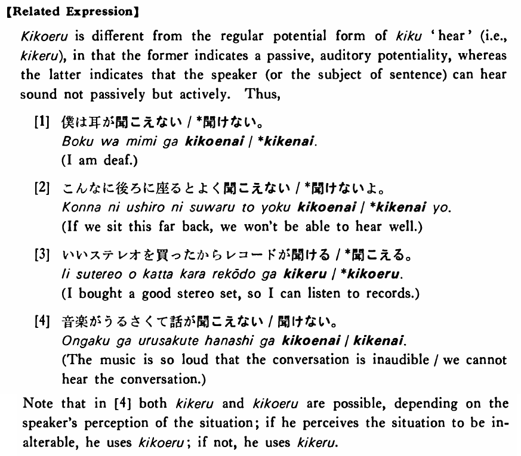

# 聞こえる・きこえる

[1. Summary](#summary) 
[2. Example Sentences](#example-sentences) 
[3. Explanation](#explanation) 
 

## Summary

<table><tr>   <td>Summary</td>   <td>Something is passively and spontaneously audiable.</td></tr><tr>   <td>English</td>   <td>Audible; (can) hear; it sounds</td></tr><tr>   <td>Part of speech</td>   <td>Verb (Group 2)</td></tr><tr>   <td>Related expression</td>   <td>聞ける</td></tr></table>

## Example Sentences

<table><tr>   <td>私（に）は鶯の声がよく聞こえる・聞こえます。</td>   <td>To me the cries of a nightingale are clearly audible. / I can clearly hear the cries of a nightingale.</td></tr><tr>   <td>その音は小さ過ぎて聞こえない。</td>   <td>That sound is too weak and is not audible.</td></tr><tr>   <td>大山さんの声は大きいので隣の部屋の人にもよく聞こえる。</td>   <td>Mr. Oyama's voice is so loud that people in the neighbouring rooms can hear him.</td></tr><tr>   <td>私にはお寺の鐘の音が聞こえたが、弟には聞こえなかった。</td>   <td>I could hear the sound of the temple bell, but my younger brother couldn't.</td></tr><tr>   <td>テーラーさんの作った文は変に聞こえる。</td>   <td>The sentences which Mr. Taylor made sound strange.</td></tr></table>

## Explanation

【Related Expression】
  
聞こえる is different from the regular potential form of 聞く 'hear' (i.e., 聞ける) in that the former indicates a passive, auditory potentiality, whereas the latter indicates that the speaker (or the subject of sentence) can hear sound not passively but actively. Thus,
  
[1]
  <ul> <li>僕は耳が聞こえない/*聞けない。</li> <li>I am deaf.</li> </ul>  
[2]
  <ul> <li>こんなに後ろに座るとよく聞こえない/*聞けないよ。</li> <li>If we sit this far back, we won't be able to hear well.</li> </ul>  
[3]
  <ul> <li>いいステレオを買ったからレコ一ドが聞ける/*聞こえる。</li> <li>I bought a good stereo set, so I can listen to records.</li> </ul>  
[4]
  <ul> <li>音楽がうるさくて話が聞こえない/聞けない。</li> <li>The music is so loud that the conversation is inaudible/we cannot hear the conversation.</li> </ul>  
Note that in [4] both 聞ける and 聞こえる are possible, depending on the speaker's perception of the situation; if he perceives the situation to be inalterable, he uses 聞こえる; if not, he uses 聞ける.

## Grammar Book Page

