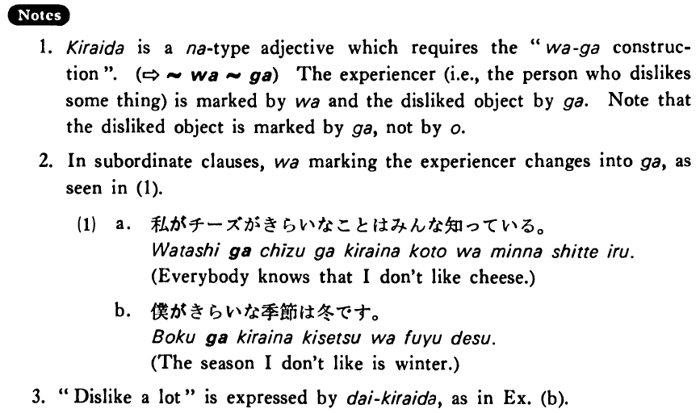

# 嫌いだ・きらいだ

[1. Summary](#summary) 
[2. Example Sentences](#example-sentences) 
[3. Explanation](#explanation) 
[4. Grammar Book Page](#grammar-book-page) 

## Summary

<table><tr>   <td>Summary</td>   <td>Something or someone is what someone does not like.</td></tr><tr>   <td>English</td>   <td>Don’t like; dislike</td></tr><tr>   <td>Part of speech</td>   <td>Adjective (な)</td></tr><tr>   <td>Related expression</td>   <td>好きだ</td></tr></table>

## Example Sentences

<table><tr>   <td>私はチーズが嫌いだ・嫌いです。</td>   <td>I don't like cheese.</td></tr><tr>   <td>僕は冬が嫌いだ。</td>   <td>I dislike winter.</td></tr><tr>   <td>ホワイトさんはフットボールが大嫌いです。</td>   <td>Mr. White hates football.</td></tr></table>

## Explanation

1. 嫌いだ is a な type adjective which requires the "は~が construction". (⇨ <a href="#㊦ は～が">は~が</a>) The experiencer (i.e., the person who dislikes some thing) is marked by は and the disliked object by が. Note that the disliked object is marked by が, not by を.
  
2. In subordinate clauses, は marking the experiencer changes into が, as seen in (1).
  <ul>(1) <li>a. 私がチーズがきらいなことはみんな知っている。</li> <li>Everybody knows that I don't like cheese.</li> 

 <li>b. 僕がきらいな季節は冬です。</li> <li>The season I don't like is winter.</li> <.ul>  
3. "Dislike a lot" is expressed by 大嫌い, as in Example (b).

## Grammar Book Page

