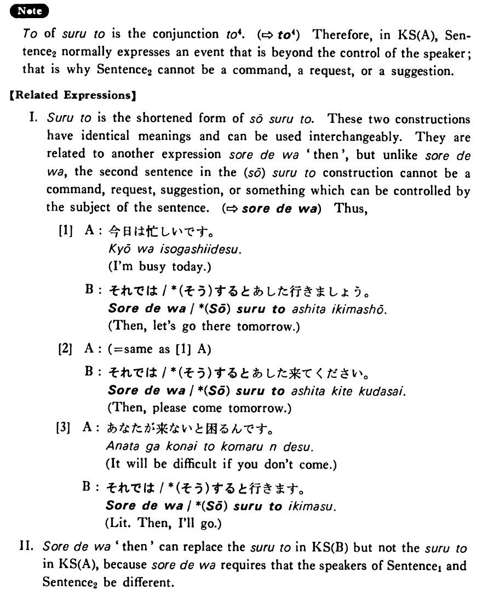

# すると

[1. Summary](#summary) 
[2. Example Sentences](#example-sentences) 
[3. Explanation](#explanation) 
[4. Grammar Book Page](#grammar-book-page) 

## Summary

<table><tr>   <td>Summary</td>   <td>A coordinate conjunction which connects two sentences (the second sentence either describes an event which takes place right after the event described in the first sentence or it expresses a logical guess related to the event in the first sentence.)</td></tr><tr>   <td>Equivalent</td>   <td>Thereupon ~; then ~; and ~</td></tr><tr>   <td>Part of speech</td>   <td>Conjunction</td></tr></table>

## Example Sentences

<table><tr>   <td>ジョギングを始めました。するとご飯が美味しくなりました。</td>   <td>I began jogging. Then, I began to have a good appetite.</td></tr><tr>   <td>A:今日は月曜日ですよ。  B:するとあのデパートは休みですね。</td>   <td>A: Today is Monday, you know.&emsp;&emsp;B: Then, that department store is closed, isn't it?</td></tr><tr>   <td>私は自転車を買いました。すると弟も欲しがりました。</td>   <td>I bought a bike. Then, my younger brother wanted one, too.</td></tr><tr>   <td>頭が痛かったのでアスピリンを飲みました。すると痛みがすぐ止まりました。</td>   <td>I took an aspirin because I had a headache. Then, the headache disappeared right away.</td></tr><tr>   <td>A:息子は今高校三年です。  B:すると、来年は大学受験ですね。</td>   <td>A: My son is now a junior at high school.&emsp;&emsp;B: Then, he is going to take a college entrance examination next year, isn't he?</td></tr></table>

## Explanation

と of すると is the conjunction と4. (⇨ <a href="#㊦ と (4)">と4</a>) Therefore, in Key Sentence (A), Sentence2 normally expresses an event that is beyond the control of the speaker; that is why Sentence2 cannot be a command, a request, or a suggestion.
  
【Related Expressions】
  
I. すると is the shortened form of そうすると. These two constructions have identical meanings and can be used interchangeably. They are related to another expression それでは 'then', but unlike それでは, the second sentence in the (そう)すると to construction cannot be a command, request, suggestion, or something which can be controlled by the subject of the sentence. (⇨ <a href="#㊦ それでは">それでは</a>) Thus,
  <ul>[1] <li>A: 今日は忙しいです。</li> <li>I’m busy today.</li> 

 <li>B: それでは/(そう)するとあした行きましょう。</li> <li>Then, let’s go there tomorrow.</li> </ul>  <ul>[2] <li>A : (= same as [1] A)</li> 

 <li>B: それでは/*(そう)するとあした来てください。</li> <li>Then, please come tomorrow.</li> </ul>  <ul>[3] <li>A: あなたが来ないと困るんです。</li> <li>It will be difficult if you don’t come.</li> 

 <li>B: それでは/*(そう)すると行きます。</li> <li>Literally: Then, I’ll go.</li> </ul>  
II. それでは 'then' can replace the すると in Key Sentence (B) but not the すると in Key Sentence (A), because それでは requires that the speakers of Sentence1 and Sentence2 be different.

## Grammar Book Page

