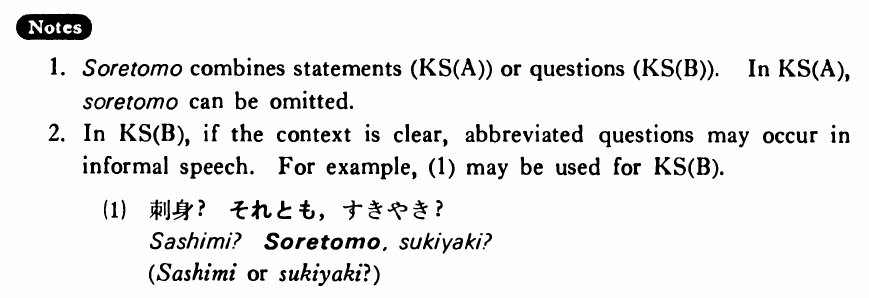

# それとも

[1. Summary](#summary) 
[2. Example Sentences](#example-sentences) 
[3. Explanation](#explanation) 
 

## Summary

<table><tr>   <td>Summary</td>   <td>A coordinate conjunction which connects two alternatives expressed by sentences.</td></tr><tr>   <td>English</td>   <td>Or; either ~ or ~</td></tr><tr>   <td>Part of speech</td>   <td>Conjunction</td></tr><tr>   <td>Related expression</td>   <td>か1</td></tr></table>

## Example Sentences

<table><tr>   <td>この本が間違っているか（それとも）私が間違っているかどちらだ・です。</td>   <td>It's either that this book is wrong or that I am wrong.</td></tr><tr>   <td>刺身を食べますか。それともすき焼きにしますか。</td>   <td>Will you have sashimi, or will you have sukiyaki?</td></tr><tr>   <td>僕が来るか（それとも）村井さんが来るかどちらかです。</td>   <td>Either I will come or Mr. Murai will come.</td></tr><tr>   <td>あの人は先生ですか。それとも医者ですか。</td>   <td>Is he a teacher or a doctor?</td></tr></table>

## Explanation

1. それともそれとも(1) <li>刺身？それとも</span，すきやき？</li> <li>Sashimi or sukiyaki?</li> </ul>

## Grammar Book Page

