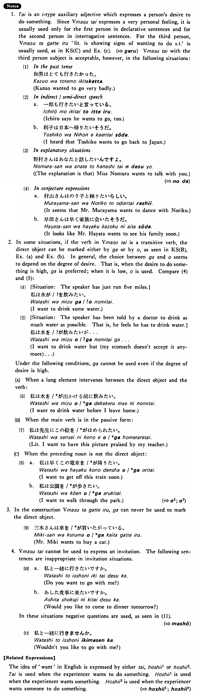

# たい

[1. Summary](#summary) 
[2. Formation](#formation) 
[3. Example Sentences](#example-sentences) 
[4. Explanation](#explanation) 
[5. Grammar Book Page](#grammar-book-page) 

## Summary

<table><tr>   <td>Summary</td>   <td>An auxiliary adjective which expresses a desire to do something.</td></tr><tr>   <td>Equivalent</td>   <td>Want (to do something); would like (to do something)</td></tr><tr>   <td>Part of speech</td>   <td>Auxiliary Adjective (い)</td></tr><tr>   <td>Related expression</td>   <td>欲しい1; 欲しい2</td></tr></table>

## Formation

<table class="table"> <tbody><tr class="tr head"> <td class="td">Vます</td> <td class="td">たい </td> <td class="td">&nbsp;</td> </tr> <tr class="tr"> <td class="td">&nbsp;</td> <td class="td">話したい </td> <td class="td">Want    to talk</td> </tr> <tr class="tr"> <td class="td">&nbsp;</td> <td class="td">食べたい </td> <td class="td">Want    to eat</td> </tr></tbody></table>

## Example Sentences

<table><tr>   <td>私は日本へ行きたい・たいです。</td>   <td>I want to go to Japan.</td></tr><tr>   <td>僕は今ピザを・が食べたい・たいです。</td>   <td>I want to eat pizza now.</td></tr><tr>   <td>鈴木さんはアメリカへ行きたがっている・います。</td>   <td>Mr. Suzuki is showing signs of wanting to go to America. / Mr. Suzuki wants to go to America.</td></tr><tr>   <td>僕は冷たいビールを・が飲みたい。</td>   <td>I want to drink a cold beer.</td></tr><tr>   <td>今日は何を・が食べたいですか。</td>   <td>What do you want to eat today?</td></tr><tr>   <td>三木さんは車を買いたがっている。</td>   <td>Mr. Miki wants to buy a car.</td></tr></table>

## Explanation

1.たい is an い type auxiliary adjective which expresses a person's desire to do something. Since Verbますたい expresses a very personal feeling, it is usually used only for the first person in declarative sentences and for the second person in interrogative sentences. For the third person, Verbますがっている 'literally: is showing signs of wanting to do something' is usually used, as in Key Sentence (C) and Example (c). (⇨ <a href="#㊦ がる">がる</a>) Verbますたい with the third person subject is acceptable, however, in the following situations:
  <ul>(1) In the past tense 

 <li>和男はとても行きたかった。</li> <li>Kazuo wanted to go very badly.</li> </ul>  <ul>(2) In indirect/semi-direct speech 

 <li>a. 一郎も行きたいと言っている。</li> <li>Ichiro says he wants to go, too.</li> 

 <li>b. 利子は日本へ帰りたいそうだ。</li> <li>I heard that Toshiko wants to go back to Japan.</li> </ul>  <ul>(3) In explanatory situations 

 <li>野村さんはあなたと話したいんですよ。</li> <li>(The explanation is that) Miss Nomura wants to talk with you.</li> </ul>  
(⇨ <a href="#㊦ のだ">のだ</a>)
  <ul>(4) In conjecture expressions <li>村山さんはのり子と踊りたいらしい。</li> <li>It seems that Mr. Murayama wants to dance with Noriko.</li> 

 <li>b. 早田さんは早く家族に会いたそうだ。</li> <li>It looks like Mr. Hayata wants to see his family soon.</li> </ul>  
2. In some situations, if the verb in Verbますたい is a transitive verb, the direct object can be marked either by が or by を, as seen in Key Sentence (B), Examples (a) and (b). In general, the choice between が and を seems to depend on the degree of desire. That ist when the desire to do something is high, が is preferred; when it is low, を is used. Compare (4) and (5):
   <ul>(4) [Situation: The speaker has just run five miles.] 

 <li>私は水が/?を飲みたい。</li> <li>I want to drink some water.</li> </ul>  <ul>(5) [Situation: The speaker has been told by a doctor to drink as much water as possible. That is, he feels he has to drink water.] 

 <li>私は水を/?が飲みたいが…</li> <li>I want to drink water but (my stomach doesn't accept it anymore)...</li> </ul>  
Under the following conditions, が cannot be used even if the degree of desire is high.
  
(A) When a long element intervenes between the direct object and the verb:
  <ul>(6) <li>私は水を/*が出かける前に飲みたい。</li> <li>I want to drink water before I leave home.</li> </ul>  
(B) When the main verb is in the passive form:
  <ul>(7) <li>私は先生にこの絵を/*がほめられたい。</li> <li>Literally: I want to have this picture praised by my teacher.</li> </ul>  
(C) When the preceding noun is not the direct object:
  <ul>(8)  <li>a. 私は早くこの電車を/*が降りたい。</li> <li>I want to get off this train soon.</li> 

 <li>b. 私は公園を/*が歩きたい。</li> <li>I want to walk through the park.</li> </ul>  
(⇨ <a href="#㊦ を (2)">を2</a>; <a href="#㊦ を (3)">を3</a>)
  
3. In the construction Verbますたがっている, が can never be used to mark the direct object.
  <ul>(9) <li>三木さんは車を/*が買いたがっている。</li> <li>Mr. Miki wants to buy a car.</li> </ul>  
4. Verbますたい cannot be used to express an invitation. The following sentences are inappropriate in invitation situations.
  <ul>(10) <li>a. 私と一緒に行きたいですか。</li> <li>Do you want to go with me?</li> 

 <li>b. あした食事に来たいですか。</li> <li>Would you like to come to dinner tomorrow?</li> </ul>  
In these situations negative questions are used, as seen in (11).
  
(⇨ <a href="#㊦ ましょう">ましょう</a>)
  <ul>(11) <li>私と一緒に行きませんか。</li> <li>Wouldn't you like to go with me?</li> </ul>  
【Related Expressions】
  
The idea of 'want' in English is expressed by either たい, 欲しい1 or 欲しい2. たい is used when the experiencer wants to do something. 欲しい1 is used when the experiencer wants something. 欲しい2 is used when the experiencer wants someone to do something.
   
(⇨ <a href="#㊦ 欲しい・ほしい (1)">欲しい1</a>; <a href="#㊦ 欲しい・ほしい (2)">欲しい2</a>)

## Grammar Book Page

