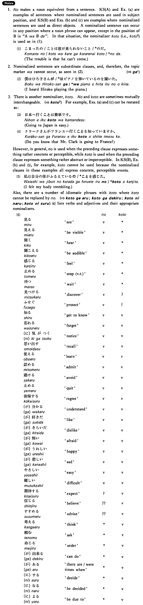

# の (3)

 
 
 
 
 

## Summary

<table><tr>   <td>Summary</td>   <td>A nominaliser which is used when the nominalised sentence expresses a directly perceptible event.</td></tr><tr>   <td>English</td>   <td>That ~; to do something; doing something</td></tr><tr>   <td>Part of speech</td>   <td>Nominaliser</td></tr><tr>   <td>Related expression</td>   <td>こと2; の2</td></tr></table>

## Formation

<table class="table"> <tbody><tr class="tr head"> <td class="td">(i)  {V/Adjective い}    informal</td> <td class="td">の </td> <td class="td">&nbsp;</td> </tr> <tr class="tr"> <td class="td">&nbsp;</td> <td class="td">{話す /話した} の</td> <td class="td">Someone    (will) talk/talked</td> </tr> <tr class="tr"> <td class="td">&nbsp;</td> <td class="td">{高い /高かった} の</td> <td class="td">Something    is/was expensive</td> </tr> <tr class="tr head"> <td class="td">(ii)  {Adjective な/N}</td> <td class="td">{な/だった} の</td> <td class="td">&nbsp;</td> </tr> <tr class="tr"> <td class="td">&nbsp;</td> <td class="td">{静かな/静かだった} の</td> <td class="td">Something    is/was quiet</td> </tr> <tr class="tr"> <td class="td">&nbsp;</td> <td class="td">{先生な/先生だった} の</td> <td class="td">Someone    is/was a teacher</td> </tr></tbody></table>

## Example Sentences

<table><tr>   <td>日本語を教えるのは難しい・難しいです。</td>   <td>Teaching Japanese is difficult.</td></tr><tr>   <td>私は雪子さんがビールを飲むのを見た・見ました。</td>   <td>I saw Yukiko drink beer.</td></tr><tr>   <td>日本へ行くのは簡単です。</td>   <td>Going to Japan is easy.</td></tr><tr>   <td>私は小林さんがピアノを弾いているのを聞いた。</td>   <td>I heard Ms. Kobayashi playing the piano.</td></tr><tr>   <td>クラークさんがフランスへ行くのを知っていますか。</td>   <td>Do you know that Mr. Clark is going to France?</td></tr></table>

## Explanation

1. の makes a noun equivalent from a sentence. Key Sentence (A) and Example (a) are examples of sentences where nominalized sentences are used in subject position, and Key Sentence (B) and Examples (b) and (c) are examples where nominalized sentences are used as direct objects. A nominalized sentence can occur in any position where a noun phrase can appear, except in the position of B in "AはBだ". In that situation, the nominalizer こと (i.e., <a href="#㊦ こと (2)">こと2</a>) is used as in (1).
  <ul>(1) <li>困ったの/ことは彼が来られないこと/*のだ。</li> <li>The trouble is that he can't come.</li> </ul>  
2. Nominalized sentences are subordinate clauses, and, therefore, the topic marker は cannot occur, as seen in (2).
  
(⇨ <a href="#㊦ が (1)">が1</a>)
  <ul>(2) <li>僕はひろ子さんが/*はピアノを弾いているのを聞いた。</li> <li>I heard Hiroko playing the piano.</li> </ul>  
3. There is another nominalizer, こと. の and こと are sometimes mutually interchangeable. (⇨ <a href="#㊦ こと (1)">こと1</a>) For example, Examples (a) and (c) can be restated as:
  <ul>(3) <li>日本へ行くことは簡単です。</li> <li>Going to Japan is easy.</li> </ul>  (4) <li>クラークさんがフランスへ行くことを知っていますか。</li> <li>Do you know that Mr. Clark is going to France?</li> </ul>  
However, in general, の is used when the preceding clause expresses something rather concrete or perceptible, while こと is used when the preceding clause expresses something rather abstract or imperceptible. In Key Sentence (B), Example (b) and (5), for example, こと cannot be used because the nominalized clauses in these examples all express concrete, perceptible events.
  <ul>(5) <li>私は自分の体がふるえているの/*ことを感じた。</li> <li>I felt my body trembling.</li> </ul>  
Also, there are a number of idiomatic phrases with こと where こと cannot be replaced by の.   
(⇨ <a href="#㊦ ことがある (1)">ことがある</a>; <a href="#㊦ ことが出来る・できる">ことが出来る</a>; <a href="#㊦ ことになる">ことになる</a>; <a href="#㊦ ことにする">ことにする</a>)
  
(6) lists verbs and adjectives and their appropriate nominalizers.
  <ul>(6)</ul>  <table class="table"> <tbody> <tr class="tr"> <td class="td"></td> <td class="td"></td> <td class="td">の</td> <td class="td">こと</td> </tr> <tr class="tr"> <td class="td">見る</td> <td class="td">see</td> <td class="td">V</td> <td class="td">*</td> </tr> <tr class="tr"> <td class="td">見える</td> <td class="td">be visible</td> <td class="td">V</td> <td class="td">*</td> </tr> <tr class="tr"> <td class="td">聞く</td> <td class="td">hear</td> <td class="td">V</td> <td class="td">*</td> </tr> <tr class="tr"> <td class="td">聞こえる</td> <td class="td">be audible</td> <td class="td">V</td> <td class="td">*</td> </tr> <tr class="tr"> <td class="td"><感じる/td> <td class="td">feel</td> <td class="td">V</td> <td class="td">*</td> </tr> <tr class="tr"> <td class="td">止める</td> <td class="td">stop (verb, transitive)</td> <td class="td">V</td> <td class="td">*</td> </tr> <tr class="tr"> <td class="td">待つ</td> <td class="td">wait</td> <td class="td">V</td> <td class="td">*</td> </tr> <tr class="tr"> <td class="td">見つける</td> <td class="td">discover</td> <td class="td">V</td> <td class="td">?</td> </tr> <tr class="tr"> <td class="td">防ぐ</td> <td class="td">protect</td> <td class="td">V</td> <td class="td">?</td> </tr> <tr class="tr"> <td class="td">知る</td> <td class="td">get to know</td> <td class="td">V</td> <td class="td">V</td> </tr> <tr class="tr"> <td class="td">忘れる</td> <td class="td">forget</td> <td class="td">V</td> <td class="td">V</td> </tr> <tr class="tr"> <td class="td">(に)気がつく</td> <td class="td">notice</td> <td class="td">V</td> <td class="td">V</td> </tr> <tr class="tr"> <td class="td">思い出す</td> <td class="td">recall</td> <td class="td">V</td> <td class="td">V</td> </tr> <tr class="tr"> <td class="td">覚える</td> <td class="td">learn</td> <td class="td">V</td> <td class="td">V</td> </tr> <tr class="tr"> <td class="td">認める</td> <td class="td">admit</td> <td class="td">V</td> <td class="td">V</td> </tr> <tr class="tr"> <td class="td">避ける</td> <td class="td">avoid</td> <td class="td">V</td> <td class="td">V</td> </tr> <tr class="tr"> <td class="td">止める</td> <td class="td">quit</td> <td class="td">V</td> <td class="td">V</td> </tr> <tr class="tr"> <td class="td">後悔する</td> <td class="td">regret</td> <td class="td">V</td> <td class="td">V</td> </tr> <tr class="tr"> <td class="td">(が)分かる</td> <td class="td">understand</td> <td class="td">V</td> <td class="td">V</td> </tr> <tr class="tr"> <td class="td">(が)好き</td> <td class="td">like</td> <td class="td">V</td> <td class="td">V</td> </tr> <tr class="tr"> <td class="td">(が)嫌い</td> <td class="td">dislike</td> <td class="td">V</td> <td class="td">V</td> </tr> <tr class="tr"> <td class="td">(が)怖い</td> <td class="td">afraid</td> <td class="td">V</td> <td class="td">V</td> </tr> <tr class="tr"> <td class="td">(が)嬉しい</td> <td class="td">happy</td> <td class="td">V</td> <td class="td">V</td> </tr> <tr class="tr"> <td class="td">(が)悲しい</td> <td class="td">sad</td> <td class="td">V</td> <td class="td">V</td> </tr> <tr class="tr"> <td class="td">易しい</td> <td class="td">easy</td> <td class="td">V</td> <td class="td">V</td> </tr> <tr class="tr"> <td class="td">難しい</td> <td class="td">difficult</td> <td class="td">V</td> <td class="td">V</td> </tr> <tr class="tr"> <td class="td">期待する</td> <td class="td">expect</td> <td class="td">?</td> <td class="td">V</td> </tr> <tr class="tr"> <td class="td">信じる</td> <td class="td">believe</td> <td class="td">??</td> <td class="td">V</td> </tr> <tr class="tr"> <td class="td">勧める</td> <td class="td">advise</td> <td class="td">??</td> <td class="td">V</td> </tr> <tr class="tr"> <td class="td">考える</td> <td class="td">think</td> <td class="td">*</td> <td class="td">V</td> </tr> <tr class="tr"> <td class="td">頼む</td> <td class="td">ask</td> <td class="td">*</td> <td class="td">V</td> </tr> <tr class="tr"> <td class="td">命じる</td> <td class="td">order</td> <td class="td">*</td> <td class="td">V</td> </tr> <tr class="tr"> <td class="td">(が)出来る</td> <td class="td">can do</td> <td class="td">*</td> <td class="td">V</td> </tr> <tr class="tr"> <td class="td">(が)ある</td> <td class="td">there are/were times when</td> <td class="td">*</td> <td class="td">V</td> </tr> <tr class="tr"> <td class="td">(に)する</td> <td class="td">decide</td> <td class="td">*</td> <td class="td">V</td> </tr> <tr class="tr"> <td class="td">(に)なる</td> <td class="td">be decided</td> <td class="td">*</td> <td class="td">V</td> </tr> <tr class="tr"> <td class="td">(に)よる</td> <td class="td">be due to</td> <td class="td">*</td> <td class="td">V</td> </tr> </tbody> </table>

## Grammar Book Page

