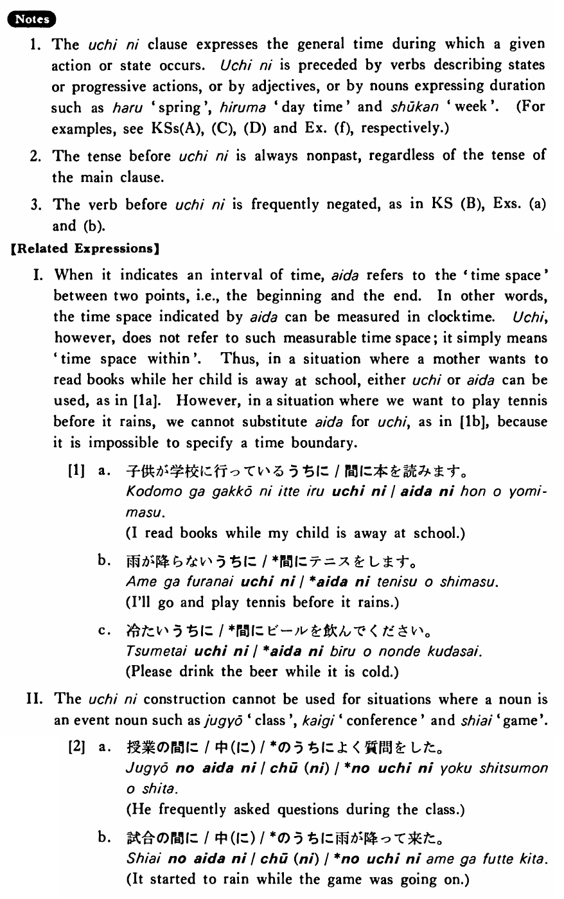

# うちに

[1. Summary](#summary) 
[2. Formation](#formation) 
[3. Example Sentences](#example-sentences) 
[4. Explanation](#explanation) 
[5. Grammar Book Page](#grammar-book-page) 

## Summary

<table><tr>   <td>Summary</td>   <td>During a period when a certain situation remains in effect.</td></tr><tr>   <td>Equivalent</td>   <td>While; before; during</td></tr><tr>   <td>Part of speech</td>   <td>Conjunction</td></tr><tr>   <td>Related expression</td>   <td>間(に); 前に; 中(に)</td></tr></table>

## Formation

<table class="table"> <tbody><tr class="tr head"> <td class="td">(i)  Vinformal nonpast</td> <td class="td">うちに </td> <td class="td">(Verb:    stative) </td> </tr> <tr class="tr"> <td class="td">&nbsp;</td> <td class="td">いるうちに </td> <td class="td">While    someone is there</td> </tr> <tr class="tr"> <td class="td">&nbsp;</td> <td class="td">話せるうちに </td> <td class="td">While    someone can talk</td> </tr> <tr class="tr"> <td class="td">&nbsp;</td> <td class="td">&nbsp;</td> <td class="td">&nbsp;</td> </tr> <tr class="tr head"> <td class="td">(ii)  Vinformal negative nonpast</td> <td class="td">うちに </td> <td class="td">&nbsp;</td> </tr> <tr class="tr"> <td class="td">&nbsp;</td> <td class="td">話さないうちに </td> <td class="td">Before    someone talks</td> </tr> <tr class="tr"> <td class="td">&nbsp;</td> <td class="td">食べないうちに </td> <td class="td">Before    someone eats</td> </tr> <tr class="tr head"> <td class="td">(iii)  Vている</td> <td class="td">うちに </td> <td class="td">&nbsp;</td> </tr> <tr class="tr"> <td class="td">&nbsp;</td> <td class="td">話しているうちに </td> <td class="td">While    someone is talking</td> </tr> <tr class="tr"> <td class="td">&nbsp;</td> <td class="td">食べているうちに </td> <td class="td">While    someone is eating</td> </tr> <tr class="tr head"> <td class="td">(iv) Adjective い informal    nonpast </td> <td class="td">うちに </td> <td class="td">&nbsp;</td> </tr> <tr class="tr"> <td class="td">&nbsp;</td> <td class="td">高いうちに </td> <td class="td">While    something is expensive</td> </tr> <tr class="tr head"> <td class="td">(v)  Adjective な stem</td> <td class="td">なうちに </td> <td class="td">&nbsp;</td> </tr> <tr class="tr"> <td class="td">&nbsp;</td> <td class="td">静かなうちに </td> <td class="td">While    something is quiet</td> </tr> <tr class="tr head"> <td class="td">(vi)  Noun の</td> <td class="td">のうちに </td> <td class="td">&nbsp;</td> </tr> <tr class="tr"> <td class="td">&nbsp;</td> <td class="td">休みのうちに </td> <td class="td">During    the vaction</td> </tr></tbody></table>

## Example Sentences

<table><tr>   <td>前田さんはアメリカにいるうちに英語が上手なった・なりました。</td>   <td>Mr. Maeda's English improved while he was in America.</td></tr><tr>   <td>何もしないうちに今年も終わった・終わりました。</td>   <td>Before I've achieved anything, this year is over.</td></tr><tr>   <td>走っているうちにお腹が痛くなった・なりました。</td>   <td>My stomach started to ache while I was running.</td></tr><tr>   <td>若いうちに本を沢山読みなさい。</td>   <td>Read many books while you're young.</td></tr><tr>   <td>雨が降らないうちにテニスをして来ます。</td>   <td>I'll go and play tennis (and come back) before it rains.</td></tr><tr>   <td>忘れないうちに言っておきたいことがある。</td>   <td>There is something I want to tell you before I forget.</td></tr><tr>   <td>考えているうちに分からなくなった。</td>   <td>While thinking about it, I got lost.</td></tr><tr>   <td>働けるうちに出来るだけ働きたい。</td>   <td>I'd like to work as much as possible while I can work.</td></tr><tr>   <td>温かいうちに飲んで下さい。</td>   <td>Please drink it while it is warm.</td></tr><tr>   <td>休みのうちによく寝ておきます。</td>   <td>I’ll sleep a lot during the vacation.</td></tr></table>

## Explanation

1. The うちに clause expresses the general time during which a given action or state occurs. うちに is preceded by verbs describing states or progressive actions, or by adjectives, or by nouns expressing duration such as 春 'spring', 昼間 'day time' and 週刊 'week'. (For examples, see Key Sentence (A), (C), (D) and Example (f), respectively.)
  
2. The tense before うちに is always nonpast, regardless of the tense of the main clause.
  
3. The verb before うちに is frequently negated, as in Key Sentence (B), Examples (a) and (b).
  
【Related Expressions】
  
I. When it indicates an interval of time, 間 refers to the 'time space' between two points, i.e., the beginning and the end. In other words, the time space indicated by 間 can be measured in clocktime. うち, however, does not refer to such measurable time space; it simply means 'time space within'. Thus, in a situation where a mother wants to read books while her child is away at school, either うち or 間 can be used, as in [1a]. However, in a situation where we want to play tennis before it rains, we cannot substitute 間 for うち, as in [1b], because it is impossible to specify a time boundary.
  
[1]
  <ul> <li>a. 子供が学校に行っているうちに/間に本を読みます。</li> <li>I read books while my child is away at school.</li> 

 <li>b. 雨が降らないうちに/*間にテニスをします。</li> <li>I'll go and play tennis before it rains.</li> 

 <li>c. 冷たいうちに/*間にビールを飲んでください。</li> <li>Please drink the beer while it is cold.</li> </ul>  
II. The うちに construction cannot be used for situations where a noun is an event noun such as 授業 'class', 会議 'conference' and 試合 'game'.
  
[2] 
  <ul> <li>a. 授業の間に/ちゅう(に)/*のうちによく質問をした。</li> <li>He frequently asked questions during the class.</li> 

 <li>b. 試合の間に/ちゅう(に)/*のうちに雨が降って来た。</li> <li>It started to rain while the game was going on.</li> </ul>

## Grammar Book Page

