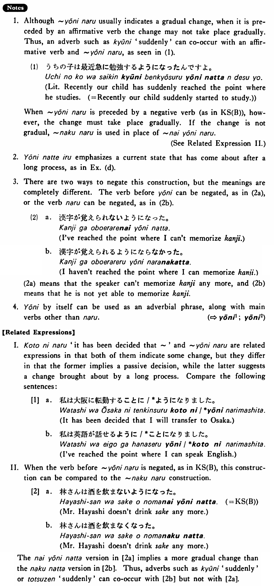

# ようになる

[1. Summary](#summary) 
[2. Formation](#formation) 
[3. Example Sentences](#example-sentences) 
[4. Explanation](#explanation) 
[5. Grammar Book Page](#grammar-book-page) 

## Summary

<table><tr>   <td>Summary</td>   <td>Some change takes place gradually.</td></tr><tr>   <td>English</td>   <td>Reach the point where ~; come to ~; it has come to be that ~; have finally become</td></tr><tr>   <td>Part of speech</td>   <td>Phrase</td></tr><tr>   <td>Related expression</td>   <td>ことになる; なくなる; ようにする</td></tr></table>

## Formation

<table class="table"> <tbody><tr class="tr head"> <td class="td">Vinformal nonpast</td> <td class="td">ようになる </td> <td class="td">&nbsp;</td> </tr> <tr class="tr"> <td class="td">&nbsp;</td> <td class="td">{話す /話さない}ようになる</td> <td class="td">Someone    reaches the where he talks/doesn’t talk</td> </tr> <tr class="tr"> <td class="td">&nbsp;</td> <td class="td">{食べる /食べない}ようになる</td> <td class="td">Someone    reaches the point where he eats/doesn’t eat</td> </tr></tbody></table>

## Example Sentences

<table><tr>   <td>ジャクソンさんは日本語が話せるようになった・なりました。</td>   <td>Mr. Jackson has reached the point where he can speak Japanese.</td></tr><tr>   <td>林さんは酒を飲まないようになった・なりました。</td>   <td>Mr. Hayashi has reached the point where he does not drink sake. / Mr. Hayashi doesn’t drink sake any more.</td></tr><tr>   <td>難しい日本語が読めるようになりました。</td>   <td>I am finally able to read difficult Japanese.</td></tr><tr>   <td>パットは私と話さないようになった。</td>   <td>Pat doesn't talk with me any more.</td></tr><tr>   <td>もうすぐ面白さが分かるようになりますよ。</td>   <td>You'll soon come to understand the fun of it, I tell you.</td></tr><tr>   <td>この道は今通れないようになっている。</td>   <td>This street has reached a point where people cannot pass. / At present we cannot use this street.</td></tr></table>

## Explanation

1. Although ようになる usually indicates a gradual change, when it is preceded by an affirmative verb the change may not take place gradually. Thus, an adverb such as 急に 'suddenly' can co-occur with an affirmative verb and ようになる as seen in (1).
  <ul>(1) <li>うちの子は最近急に勉強するようになったんですよ。</li> <li>Literally: Recently our child has suddenly reached the point where he studies. </li> <li>(= Recently our child suddenly started to study.)</li> </ul>  
When ようになる is preceded by a negative verb (as in Key Sentence (B)), however, the change must take place gradually. If the change is not gradual, なくなる is used in place of ないようになる.
  
(See Related Expression II.)
  
2. ようになっている emphasizes a current state that has come about after a long process, as in Example (d).
  
3. There are two ways to negate this construction, but the meanings are completely different. The verb before ように can be negated, as in (2a), or the verb なる can be negated, as in (2b).
  <ul>(2) <li>a. 漢字が覚えられないようになった。</li> <li>I've reached the point where I can't memorize kanji.</li> 

 <li>b. 漢字が覚えられるようにならなかった。</li> <li>I haven't reached the point where I can memorize kanii.</li> </ul>  
(2a) means that the speaker can't memorize kanji any more, and (2b) means that he is not yet able to memorize kanji.
  
4. ように by itself can be used as an adverbial phrase, along with main verbs other than なる.
   
(⇨ <a href="#㊦ ように (1)">ように1</a>; <a href="#㊦ ように (2)">ように2</a>)
  
【Related Expressions】
  
I. ことになる 'it has been decided that ~' and ようになる are related expressions in that both of them indicate some change, but they differ in that the former implies a passive decision, while the latter suggests a change brought about by a long process. Compare the following sentences:
  
[1]
  <ul> <li>a. 私は大阪に転勤することに/*ようになりました。</li> <li>It has been decided that I will transfer to Osaka.</li> 

 <li>b. 私は英語が話せるように/*ことになりました。</li> <li>I've reached the point where I can speak English.</li> </ul>  
II. When the verb before ようになる is negated, as in Key Sentence (B), this construction can be compared to the なくなる construction.
  
[2]
  <ul> <li>a. 林さんは酒を飲まないようになった。(= Key Sentence (B))</li> <li>Mr. Hayashi doesn't drink sake any more.</li> 

 <li>b. 林さんは酒を飲まなくなった。</li> <li>Mr. Hayashi doesn't drink sake any more.</li> </ul>  
The ないようになった version in [2a] implies a more gradual change than the なくなった version in [2b]. Thus, adverbs such as 急に 'suddenly' or 突然 'suddenly' can co-occur with [2b] but not with [2a].

## Grammar Book Page

