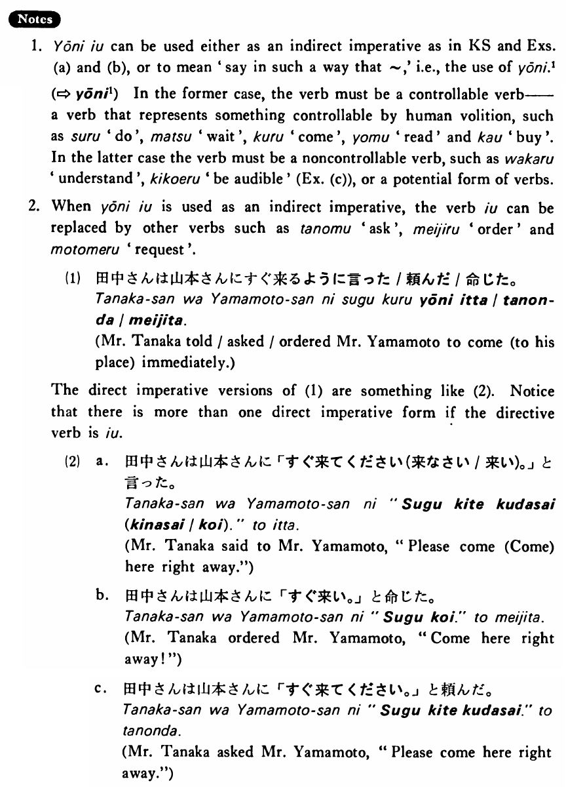

# ように言う

 
 
 
 
 

## Summary

<table><tr>   <td>Summary</td>   <td>Tell someone in such a way that he will do something.</td></tr><tr>   <td>English</td>   <td>Tell ~ to ~; say ~ in such a way</td></tr><tr>   <td>Part of speech</td>   <td>Phrase</td></tr></table>

## Formation

<table class="table"> <tbody><tr class="tr head"> <td class="td">Vinformal nonpast</td> <td class="td">ように言う </td> <td class="td">&nbsp;</td> </tr> <tr class="tr"> <td class="td">&nbsp;</td> <td class="td">話すように言う </td> <td class="td">Tell    someone to talk</td> </tr> <tr class="tr"> <td class="td">&nbsp;</td> <td class="td">食べるように言う </td> <td class="td">Tell    someone to eat</td> </tr></tbody></table>

## Example Sentences

<table><tr>   <td>先生は学生に宿題をするように言った・言いました。</td>   <td>The teacher told his students to do homework.</td></tr><tr>   <td>坂本さんは雪江に図書館の前で待っているように言いった。</td>   <td>Mr. Sakamoto told Yukie to be waiting in front of the library.</td></tr><tr>   <td>すみませんが、小林さんに明日朝九時にここへ来るように言って下くださいませんか。</td>   <td>I'm sorry, but could you please tell Mr. Kobayashi to come here at 9 o'clock tomorrow morning?</td></tr><tr>   <td>私は聞こえるようにはっきり言ったんですが…</td>   <td>I said it in such a way that it was clearly audible, but...</td></tr></table>

## Explanation

1. ように言う can be used either as an indirect imperative as in Key Sentence and Examples (a) and (b), or to mean 'say in such a way that ~,' i.e., the use of ように1 (⇨ <a href="#㊦ ように (1)">ように1</a>) In the former case, the verb must be a controllable verb a verb that represents something controllable by human volition, such as する 'do', 待つ 'wait', 来る 'come', 読む 'read' and 買う 'buy'. In the latter case the verb must be a noncontrollable verb, such as 分かる 'understand', 聞こえる 'be audible' (Example (c)), or a potential form of verbs.
  
2. When ように言う is used as an indirect imperative, the verb 言う can be replaced by other verbs such as 頼む 'ask', 命じる 'order' and 求める 'request'.
  <ul>(1) <li>田中さんは山本さんにすぐ来るように言った/頼んだ/命じた。</li> <li>Mr. Tanaka told/asked/ordered Mr. Yamamoto to come (to his place) immediately.</li> </ul>  
The direct imperative versions of (1) are something like (2). Notice that there is more than one direct imperative form if the directive verb is 言う.
  <ul>(2) <li>a. 田中さんは山本さんに「すぐ来てください(来なさい/来い)。」と言った。</li> <li>Mr. Tanaka said to Mr. Yamamoto, "Please come (Come) here right away."</li> 

 <li>b. 田中さんは山本さんに「すぐ来い。」と命じた。</li> <li>Mr. Tanaka ordered Mr. Yamamoto, "Come here right away!"</li> 

 <li>c. 田中さんは山本さんに「すぐ来てください。」と頼んだ。</li> <li>Mr. Tanaka asked Mr. Yamamoto, "Please come here right away."</li> </ul>

## Grammar Book Page

