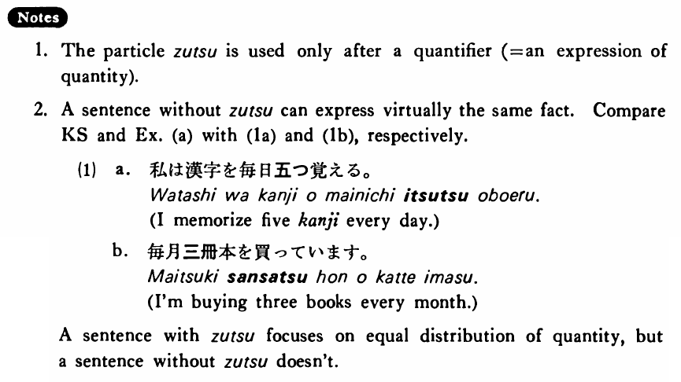

# ずつ

[1. Summary](#summary) 
[2. Example Sentences](#example-sentences) 
[3. Explanation](#explanation) 
[4. Grammar Book Page](#grammar-book-page) 

## Summary

<table><tr>   <td>Summary</td>   <td>A particle that indicates equal distribution of quantity.</td></tr><tr>   <td>Equivalent</td>   <td>By; at a time.</td></tr><tr>   <td>Part of speech</td>   <td>Particle</td></tr></table>

## Example Sentences

<table><tr>   <td>私は漢字を毎日五つずつ覚える・覚えます。</td>   <td>I memorize five kanji every day.</td></tr><tr>   <td>毎月三冊ずつ本を買っています。</td>   <td>I'm buying three books per month.</td></tr><tr>   <td>ゴルフが少しずつ上手になって来た。</td>   <td>I have become a better golfer bit by bit.</td></tr><tr>   <td>私は子供達に本を二冊ずつやった。</td>   <td>I gave two books to each of the children.</td></tr><tr>   <td>どのクラスにも女子学生が六人ずついた。</td>   <td>There were six girl students in each class.</td></tr></table>

## Explanation

1. The particle ずつ is used only after a quantifier (= an expression of quantity).
  
2. A sentence without ずつ can express virtually the same fact. Compare Key Sentence and Example (a) with (1a) and (1b), respectively.
  <ul>(1) <li>a. 私は漢字を毎日五つ覚える。</li> <li>I memorize five kanji every day.</li> 

 <li>b. 毎月三冊本を買っています。</li> <li>I'm buying three books every month.</li> </ul>  
A sentence with ずつ focuses on equal distribution of quantity, but a sentence without ずつ doesn't.

## Grammar Book Page

