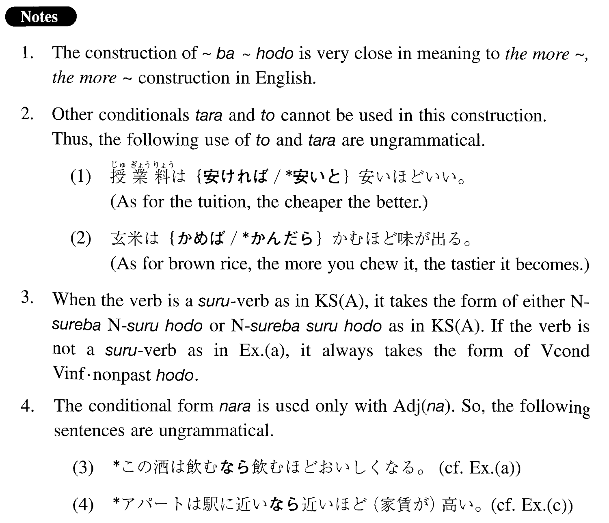

# ~ば~ほど

 
 
 
 
 

## Summary

<table><tr>   <td>Summary</td>   <td>A structure indicating that something happens in proportion to the increase of extent/degree of action or state.</td></tr><tr>   <td>English</td>   <td>The more ~, the more ~</td></tr><tr>   <td>Part of speech</td>   <td>Structure</td></tr><tr>   <td>Related expression</td>   <td>ほど</td></tr></table>

## Formation

<table class="table"> <tbody><tr class="tr head"> <td class="td">(i) V1    Conditional V2 Informal nonpast </td> <td class="td">ほど </td> <td class="td">Where Verb1=Verb2</td> </tr> <tr class="tr"> <td class="td">&nbsp;</td> <td class="td">話せば話すほど </td> <td class="td">The more someone talks, the    more ~</td> </tr> <tr class="tr head"> <td class="td">(ii)  Adjective    い1 conditional Adjective い2    informal nonpast</td> <td class="td">ほど </td> <td class="td">Where Adjective い1 = Adjective い2</td> </tr> <tr class="tr"> <td class="td">&nbsp;</td> <td class="td">高ければ高いほど </td> <td class="td">The more expensive something    is, the more ~</td> </tr> <tr class="tr head"> <td class="td">(iii)  Adjective    な1stem</td> <td class="td">{であるばある / なら Adjective な2 stem な} ほど</td> <td class="td">Where Adjective な1=Adjective な2</td> </tr> <tr class="tr"> <td class="td">&nbsp;</td> <td class="td">{静かであるばある / 静かなら静かな} ほど</td> <td class="td">The quieter    something/someone is, the more ~</td> </tr> </tbody></table>

## Example Sentences

<table><tr>   <td>日本語は勉強すれば（勉強）するほど面白くなります。</td>   <td>The harder you study Japanese, the more interesting it will become.</td></tr><tr>   <td>パーティーは人が多ければ多いほど楽しい。</td>   <td>At a party the more the merrier.</td></tr><tr>   <td>機械は簡単{であればある/なら簡単な}ほど壊れにくい。</td>   <td>A machine is harder to break, the simpler it is.</td></tr><tr>   <td>この酒は飲めば飲むほど美味しくなります。</td>   <td>The more you drink this sake, the tastier it becomes.</td></tr><tr>   <td>大学はよければよいほど入るのが難しいです。</td>   <td>The better the university, the harder it is to get in.</td></tr><tr>   <td>アパートは駅に近ければ近いほど（家賃が）高い。</td>   <td>The closer apartments are to the station, the more expensive they are (to rent).</td></tr><tr>   <td>普段元気なら元気なほど体に気を付けた方がいいですよ。</td>   <td>The healthier you are, the more careful you should be about your health.</td></tr></table>

## Explanation

1. The construction of ば~ほど is very close in meaning to 'the more ~, the more ~' construction in English.
  
2. Other conditionals たら and と cannot be used in this construction. Thus, the following use of と and たら are ungrammatical.
  <ul>(1) <li>授業料は{安ければ/*安いと}安いほどいい。</li> <li>As for the tuition, the cheaper the better.</li> </ul>  <ul>(2) <li>玄米は{かめば/*かんだら}かむほど味が出る。</li> <li>As for brown rice, the more you chew it, the tastier it becomes.</li> </ul>  
3. When the verb is a する verb as in Key Sentence (A), it takes the form of either Noun すれば Noun するほど or Noun すればするほど as in Key Sentence (A). If the verb is not a する verb as in Example (a), it always takes the form of Verb conditional Verb informal nonpast ほど.
  
4. The conditional form なら is used only with Adjective な. So, the following sentences are ungrammatical.
  <ul>(3) <li>*この酒は飲むなら飲むほど美味しくなる。 [Correct formation= Example (a)]</li> </ul>  <ul>(4) <li>*アパートは駅に近いなら近いほど(家賃が)高い。 [Correct formation= Example (c)]</li> </ul>

## Grammar Book Page

