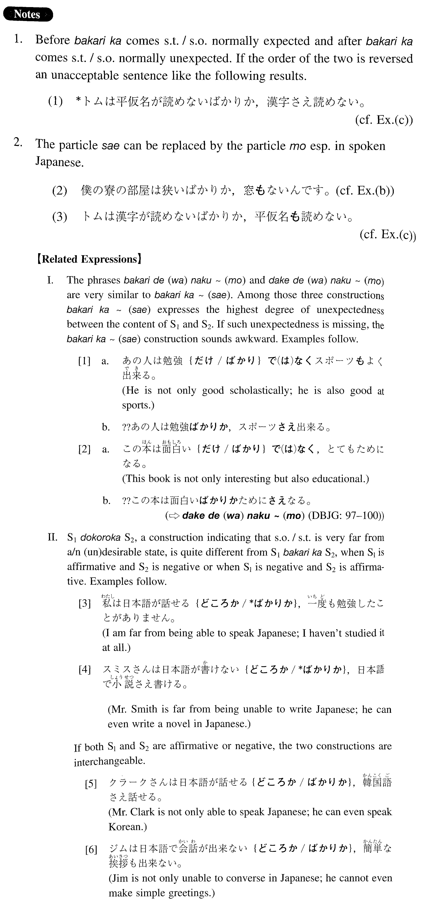

# ~ばかりか~（さえ）

[1. Summary](#summary) 
[2. Formation](#formation) 
[3. Example Sentences](#example-sentences) 
[4. Explanation](#explanation) 
 

## Summary

<table><tr>   <td>Summary</td>   <td>A compound particle/conjunction which is used to connect two nouns or two sentences, the first of which is something normally expected and the second of which is something normally unexpected.</td></tr><tr>   <td>English</td>   <td>Not only ~ but also</td></tr><tr>   <td>Part of speech</td>   <td>Compound Particle/Conjunction</td></tr><tr>   <td>Related expression</td>   <td>ばかりで(は)なく~も; だけで(は)なく~も; どころか</td></tr></table>

## Formation

<table class="table"> <tbody><tr class="tr head"> <td class="td">(i)  {V/   Adjective い} informal</td> <td class="td">ばかりか </td> <td class="td">&nbsp;</td> </tr> <tr class="tr"> <td class="td">&nbsp;</td> <td class="td">{話す/話した} ばかりか</td> <td class="td">Not only does/did someone    speak</td> </tr> <tr class="tr"> <td class="td">&nbsp;</td> <td class="td">{高い/高かった} ばかりか</td> <td class="td">Not only is/was something    high</td> </tr> <tr class="tr head"> <td class="td">(ii)  Adjective    な stem</td> <td class="td">{な/だった} ばかりか</td> <td class="td">&nbsp;</td> </tr> <tr class="tr"> <td class="td">&nbsp;</td> <td class="td">{静かな/静かだった} ばかりか</td> <td class="td">Not only is/was    something/someone quiet</td> </tr> <tr class="tr head"> <td class="td">(iii)  {Noun /Nounだった}</td> <td class="td">ばかりか </td> <td class="td">&nbsp;</td> </tr> <tr class="tr"> <td class="td">&nbsp;</td> <td class="td">{先生/先生だった} ばかりか</td> <td class="td">Not only is/was someone a    teacher</td> </tr> </tbody></table>

## Example Sentences

<table><tr>   <td>日本では子供ばかりか大人さえ漫画を読んでいる。</td>   <td>In Japan not only children but even adults are reading comic books.</td></tr><tr>   <td>あの人は絵を見て楽しむばかりか、自分でも絵を描く。</td>   <td>He not only enjoys looking at pictures; he also draws them.</td></tr><tr>   <td>アメリカでは大学生ばかりか、中学生、高校生さえ日本語を勉強している。</td>   <td>In America not only college students but even junior and senior high school students are studying Japanese.</td></tr><tr>   <td>僕の寮の部屋は狭いばかりか、窓さえないんです。</td>   <td>My room in the dorm is not just small; it doesn't even have a window.</td></tr><tr>   <td>トムは漢字が読めないばかりか、平仮名さえ読めない。</td>   <td>It's not just kanji that Tom cannot read; he cannot read even hiragana.</td></tr><tr>   <td>父は食べるのが大好きなばかりか、料理をするのも大好きです。</td>   <td>My father not only loves to eat, he also loves to cook.</td></tr></table>

## Explanation

1. Before ばかりか comes something/someone normally expected and after ばかりか comes something/someone normally unexpected. If the order of the two is reversed an unacceptable sentence like the following results.
  <ul>(1) <li>*トムは平仮名が読めないばかりか、漢字さえ読めない。</li> 

 <li>[Correct formation= Example (c)]</li> </ul>  
2. The particle さえ can be replaced by the particle も especially in spoken Japanese.
  <ul>(2) <li>僕の寮の部屋は狭いばかりか、窓もないんです。</li> 

 <li>[Correct formation= Example (b)]</li> </ul>  <ul>(3) <li>トムは漢字が読めないばかりか、平仮名も読めない。</li> 

 <li>[Correct formation= Example (c)]</li> </ul>  
【Related Expressions】
  
I. The pnrases ばかりで(は)なく~も and だけで(は)なく~も are very similar to ばかりか~(さえ). Among those three constructions ばかりか~(さえ) expresses the highest degree of unexpectedness between the content of Sentence1 and Sentence2. If such unexpectedness is missing, the ばかりか~(さえ) construction sounds awkward. Examples follow.
  
[1]
  <ul> <li>a. あの人は勉強{だけ/ばかり}で(は)なくスポーツもよく出来る。</li> <li>He is not only good scholastically; he is also good at sports.</li> 

 <li>b. ??あの人は勉強ばかりか、スポーツさえ出来る。</li> </ul>  
[2]
  <ul> <li>a. この本は面白い{だけ/ばかり}で(は)なく、とてもためになる。</li> <li>This book is not only interesting but also educational.</li> 

 <li>b. ??この本は面白いばかりかためにさえなる。</li> </ul>  
(⇨ <a href="http://bunpou.neocities.org/基本basic.html#㊦ だけで(は)なく～(も)">だけで(は)なく~(も)</a>㊦)
  
II. Sentence1 どころか Sentence2, a construction indicating that someone/something is very far from a/n (un)desirable state, is quite different from Sentence1 ばかりか Sentence2, when Sentence1 is affirmative and Sentence2 is negative or when Sentence1 is negative and Sentence2 is affirmative. Examples follow.
  
[3]
  <ul> <li>日本語が話せる{どころか/*ばかりか}、一度も勉強したことがありません。</li> <li>I am far from being able to speak Japanese; I haven't studied it at all.</li> </ul>  
[4]
  <ul> <li>スミスさんは日本語が書けない{どころか/*ばかりか}、日本語で小説さえ書ける。</li> <li>Mr. Smith is far from being unable to write Japanese; he can even write a novel in Japanese.</li> </ul>  
If both Sentence1 and Sentence2 are affirmative or negative, the two constructions are interchangeable.
  
[5]
  <ul> <li>クラークさんは日本語が話せる{どころか/ばかりか}、韓国語さえ話せる。</li> <li>Mr. Clark is not only able to speak Japanese; he can even speak Korean.</li> </ul>  
[6]
  <ul> <li>ジムは日本語で会話が出来ない{どころか/ばかりか}、簡単な挨拶も出来ない。</li> <li>Jim is not only unable to converse in Japanese; he cannot even make simple greetings.</li> </ul>

## Grammar Book Page

