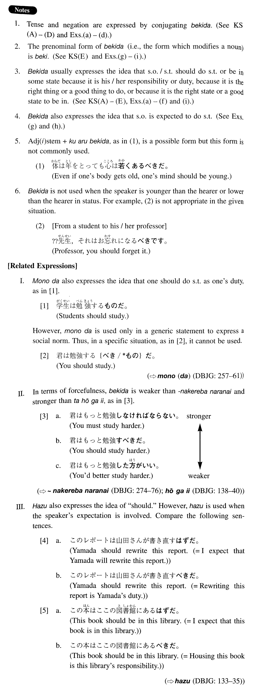

# べきだ

[1. Summary](#summary) 
[2. Formation](#formation) 
[3. Example Sentences](#example-sentences) 
[4. Explanation](#explanation) 
[5. Grammar Book Page](#grammar-book-page) 

## Summary

<table><tr>   <td>Summary</td>   <td>An auxiliary which expresses the speaker's judgment that someone/something should do something or should be in some state.</td></tr><tr>   <td>Equivalent</td>   <td>Should; ought to</td></tr><tr>   <td>Part of speech</td>   <td>Auxiliary</td></tr><tr>   <td>Related expression</td>   <td>はず; 方がいい; ものだ; なければならない</td></tr></table>

## Formation

<table class="table"> <tbody><tr class="tr head"> <td class="td">(i)  Vinformal    nonpast</td> <td class="td">べきだ </td> <td class="td">&nbsp;</td> </tr> <tr class="tr"> <td class="td">&nbsp;</td> <td class="td">行くべきだ </td> <td class="td">Should go</td> </tr> <tr class="tr head"> <td class="td">Exception</td> <td class="td">する→{す/する} べきだ</td> <td class="td">Should do</td> </tr> <tr class="tr head"> <td class="td">(ii)  {Adjective    な stem/Noun}</td> <td class="td">であるべきだ </td> <td class="td">&nbsp;</td> </tr> <tr class="tr"> <td class="td">&nbsp;</td> <td class="td">積極的であるべきだ </td> <td class="td">Someone should be positive</td> </tr> <tr class="tr"> <td class="td">&nbsp;</td> <td class="td">目的であるべきだ </td> <td class="td">Something should be an    objective</td> </tr> </tbody></table>

## Example Sentences

<table><tr>   <td>この論文は書き直すべきだ。</td>   <td>This thesis should be rewritten.</td></tr><tr>   <td>そんなことを人に言うべき{では/じゃ}ありません。</td>   <td>You shouldn't say that kind of thing to people.</td></tr><tr>   <td>君も来るべきでしたよ。</td>   <td>You should have come, too.</td></tr><tr>   <td>山田には話すべき{では/じゃ}なかった。</td>   <td>I shouldn't have told that to Yamada.</td></tr><tr>   <td>話すべきことは全部話しました。</td>   <td>I told you everything I should tell you.</td></tr><tr>   <td>自分のことは自分です（る）べきだ。</td>   <td>You should look after yourself. (literally: You should do your own business by yourself.)</td></tr><tr>   <td>今、家を買うべきじゃないよ。</td>   <td>You shouldn't buy a house now.</td></tr><tr>   <td>それは課長にも言っておくべきだったね。</td>   <td>We should have told that to our boss, too, shouldn't we?</td></tr><tr>   <td>彼は結婚なんかす（る）べきじゃなかったんだ。</td>   <td>He shouldn't have married.</td></tr><tr>   <td>我々はもっと創造的であるべきだ。</td>   <td>We should be more creative.</td></tr><tr>   <td>この状態が現実であるべきだ。</td>   <td>This state should be the reality.</td></tr><tr>   <td>調査の結果、驚くべきことが分かった。</td>   <td>As a result of the investigation, a surprising thing (literally: something one should be surprised at) was discovered.</td></tr><tr>   <td>田中は全く軽蔑すべき男だ。</td>   <td>Tanaka is indeed a despicable man (literally: a man whom one should despise).</td></tr><tr>   <td>あるべき所に記述がない。</td>   <td>There's no description where there should be one.</td></tr></table>

## Explanation

1. Tense and negation are expressed by conjugating べきだ. [See Key Sentences (A) - (D) and Examples (a) - (d).]
  
2. The prenominal form of べきだ (i.e., the form which modifies a noun) is べき. [See Key Sentence (E) and Examples (g) - (i).]
  
3. べきだ usually expresses the idea that someone/something should do something or be in some state because it is his/her responsibility or duty, because it is the right thing or a good thing to do, or because it is the right state or a good state to be in. [See Key Sentence (A) - (E), Examples (a) - (f) and (i).]
  
4. べきだ also expresses the idea that someone is expected to do s.t. [See Examples (g) and (h).]
  
5. Adjective い stem+くあるべきだ, as in (1), is a possible form but this form is not commonly used.
  <ul>(1) <li>体は年をとっても心は若くあるべきだ。</li> <li>Even if one's body gets old, one's mind should be young.</li> </ul>  
6. べきだ is not used when the speaker is younger than the hearer or lower than the hearer in status. For example, (2) is not appropriate in the given situation.
  <ul>(2) [From a student to his/her professor] <li>??先生、それはお忘れになるべきです。</li> <li>Professor, you should forget it.</li> </ul>  
【Related Expressions】
  
I. ものだ also expresses the idea that one should do something as one's duty, as in [1].
  
[1]
  <ul> <li>学生は勉強するものだ。</li> <li>Students should study.</li> </ul>  
However, ものだ is used only in a generic statement to express a social norm. Thus, in a specific situation, as in [2], it cannot be used.
  
[2]
  <ul> <li>君は勉強する{べき/*もの}だ。</li> <li>You should study.</li> </ul>  
(⇨ <a href="http://bunpou.neocities.org/基本basic.html#㊦ もの(だ)">もの(だ)</a>㊦)

  
II. In terms of forcefulness, べきだ is weaker than なければならない and stronger than たほうがいい, as in [3].
  
[3]
  <table class="table"> <tbody> <tr class="tr"> <td class="td">a. </td> <td class="td">君はもっと勉強しなければならな。</td> <td class="td">stronger</td> </tr> <tr class="tr"> <td class="td"></td> <td class="td">You must study harder</td> <td class="td">↑</td> </tr> <tr class="tr"> <td class="td">b. </td> <td class="td">君はもっと勉強すべきだ。</td> <td class="td">|</td> </tr> <tr class="tr"> <td class="td"></td> <td class="td">You should study harder.</td> <td class="td">|</td> </tr> <tr class="tr"> <td class="td">c. </td> <td class="td">君はもっと勉強した方がいい。</td> <td class="td">↓</td> </tr> <tr class="tr"> <td class="td"></td> <td class="td">You'd better study harder.</td> <td class="td">weaker</td> </tr> </tbody> </table>  
(⇨ <a href="http://bunpou.neocities.org/基本basic.html#㊦ なければならない">なければならない</a>㊦; <a href="http://bunpou.neocities.org/基本basic.html#㊦ ほうがいい">ほうがいい</a>㊦
  
III. はず also expresses the idea of "should." However, はず is used when the speaker's expectation is involved. Compare the following sentences.
  
[4] 
  <ul> <li>a. このレポートは山田さんが書き直すはずだ。</li> <li>Yamada should rewrite this report. (= I expect that Yamada will rewrite this report.)</li>  <li>b. このレポートは山田さんが書き直すべきだ。</li> <li>Yamada should rewrite this report. (= Rewriting this report is Yamada's duty.)</li> </ul>  
[5]
  <ul> <li>a. この本はここの図書館にあるはずだ。</li> <li>This book should be in this library. (= I expect that this book is in this library.)</li>  <li>b. この本はここの図書館にあるべきだ。</li> <li>This book should be in this library. (= Housing this book is this library's responsibility.)</li> </ul>  
(⇨ <a href="http://bunpou.neocities.org/基本basic.html#㊦ はず">はず</a>㊦)

## Grammar Book Page

