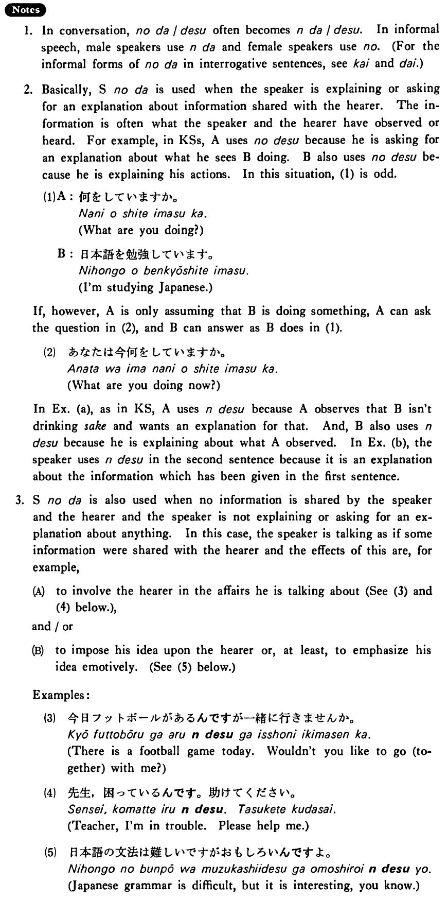

# のだ

[1. Summary](#summary) 
[2. Formation](#formation) 
[3. Example Sentences](#example-sentences) 
[4. Explanation](#explanation) 
[5. Grammar Book Page](#grammar-book-page) 

## Summary

<table><tr>   <td>Summary</td>   <td>A sentence ending which indicates that the speaker is explaining or asking for an explanation about some information shared with the hearer, or is talking about something emotively, as if it were of common interest to the speaker and the hearer.</td></tr><tr>   <td>Equivalent</td>   <td>The explanation is that ~; The reason is that ~; The fact is that ~; It is that ~</td></tr><tr>   <td>Part of speech</td>   <td>Phrase</td></tr></table>

## Formation

<table class="table"> <tbody><tr class="tr head"> <td class="td">(i)  {V/Adjective い}    informal</td> <td class="td">のだ </td> <td class="td">&nbsp;</td> </tr> <tr class="tr"> <td class="td">&nbsp;</td> <td class="td">{話す /話した} のだ</td> <td class="td">Someone    (will) talk/talked</td> </tr> <tr class="tr"> <td class="td">&nbsp;</td> <td class="td">{高い /高かった} のだ</td> <td class="td">Something    is/was expensive</td> </tr> <tr class="tr head"> <td class="td">(ii)  {Adjective な/N}</td> <td class="td">{な/だった} のだ</td> <td class="td">&nbsp;</td> </tr> <tr class="tr"> <td class="td">&nbsp;</td> <td class="td">{静かな/静かだった} のだ</td> <td class="td">Something    is/was quiet</td> </tr> <tr class="tr"> <td class="td">&nbsp;</td> <td class="td">{先生な/先生だった} のだ</td> <td class="td">Someone    is/was a teacher</td> </tr></tbody></table>

## Example Sentences

<table><tr>   <td>何をしているん・のですか。</td>   <td>What are you doing?</td></tr><tr>   <td>日本語を勉強しているん・のです。</td>   <td>I'm studying Japanese.</td></tr><tr>   <td>A:どうしてお酒を飲まないんですか。  B:私はまだ十七なんです。</td>   <td>A: Why don't you drink sake?&emsp;&emsp;B: (The reason is that) I'm still seventeen.</td></tr><tr>   <td>僕は今日のパーティーに行けません。宿題が沢山あるんです。</td>   <td>I can't go to today's party. I have a lot of homework.</td></tr><tr>   <td>あなたと結婚したいんです。</td>   <td>I want to marry you.</td></tr></table>

## Explanation

1. In conversation, のだ/です often becomes んだ/です. In informal speech, male speakers use んだ and female speakers use の. (For the informal forms of のだ in interrogative sentences, see <a href="#㊦ かい">かい</a> and <a href="#㊦ だい">だい</a>.)
  
2. Basically, Sentenceのだ is used when the speaker is explaining or asking for an explanation about information shared with the hearer. The information is often what the speaker and the hearer have observed or heard. For example, in Key Sentences, A uses のです because he is asking for an explanation about what he sees B doing. B also uses のです because he is explaining his actions. In this situation, (1) is odd.
  <ul>(1) <li>A: 何をしていますか。</li> <li>What are you doing?</li> 

 <li>B: 日本語を勉強しています。</li> <li>I'm studying Japanese.</li> </ul>  
If, however, A is only assuming that B is doing something, A can ask the question in (2), and B can answer as B does in (1).
  <ul>(2) <li>あなたは今何をしていますか。</li> <li>What are you doing now?</li> </ul>  
In Example (a), as in Key Sentence, A uses んです because A observes that B isn't drinking sake and wants an explanation for that. And, B also uses んです because he is explaining about what A observed. In Example (b), the speaker uses んです in the second sentence because it is an explanation about the information which has been given in the first sentence.
  
3. Sentenceのだ is also used when no information is shared by the speaker and the hearer and the speaker is not explaining or asking for an explanation about anything. In this case, the speaker is talking as if some information were shared with the hearer and the effects of this are, for example,
  <ul>(A) <li>to involve the hearer in the affairs he is talking about (See (3) and (4) below.),</li> </ul>  <ul>and/or</ul>  <ul>(B) <li>to impose his idea upon the hearer or, at least, to emphasize his idea emotively. (See (5) below.)</li> </ul>  
Examples:  <ul>(3)  <li>今日フットボールがあるんですが一緒に行きませんか。</li> <li>There is a football game today. Wouldn't you like to go (together) with me?</li> </ul>  <ul>(4) <li>先生、困っているんです。助けてください。</li> <li>Teacher, I'm in trouble. Please help me.</li> </ul>  <ul>(5) <li>日本語の文法は難しいですがおもしろいんですよ。</li> <li>Japanese grammar is difficult, but it is interesting, you know.</li> </ul>

## Grammar Book Page

