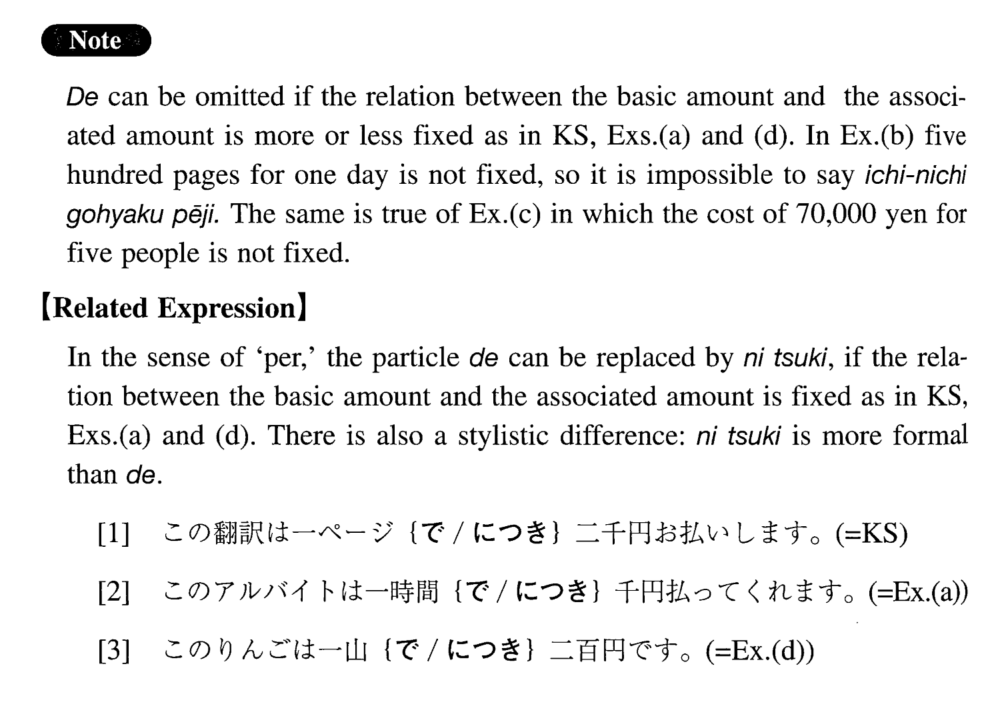

# で

[1. Summary](#summary) 
[2. Example Sentences](#example-sentences) 
[3. Grammar Book Page](#grammar-book-page) 

## Summary

<table><tr>   <td>Summary</td>   <td>A particle which indicates a basic quantity, for each of which certain amount is associated.</td></tr><tr>   <td>Equivalent</td>   <td>For; per</td></tr><tr>   <td>Part of speech</td>   <td>Particle</td></tr><tr>   <td>Related expression</td>   <td>につき</td></tr></table>

## Example Sentences

<table><tr>   <td>この翻訳は一ページで二千円お払いします。</td>   <td>We will pay 2.000 yen per page for this translation.</td></tr><tr>   <td>このアルバイトは一時間で千円払ってくれます。</td>   <td>They will pay me 1,000 yen per hour for this part-time job.</td></tr><tr>   <td>昨日は一日で本を五百ページ読んだ。</td>   <td>Yesterday I read 500 pages in a day.</td></tr><tr>   <td>食べて飲んで、五人で、七万ぐらいでした。</td>   <td>We ate and drank and it cost us about 70,000 yen for five persons.</td></tr><tr>   <td>この林檎は一山で二百円です。</td>   <td>These apples are 200 yen for one pile.</td></tr></table>

## Grammar Book Page

