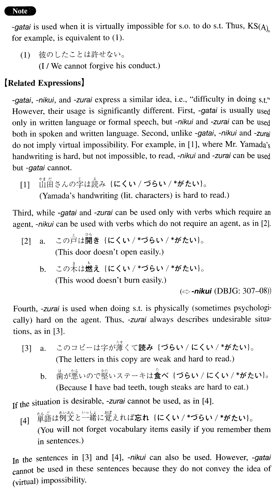

# がたい

[1. Summary](#summary) 
[2. Formation](#formation) 
[3. Example Sentences](#example-sentences) 
 

## Summary

<table><tr>   <td>Summary</td>   <td>An auxiliary adjective which expresses the idea that for someone to do something is virtually impossible or impossible.</td></tr><tr>   <td>English</td>   <td>Cannot; un—able; can hardly; difficult to; impossible</td></tr><tr>   <td>Part of speech</td>   <td>Auxiliary Adjective (い)</td></tr><tr>   <td>Related expression</td>   <td>かねる; 難い; づらい</td></tr></table>

## Formation

<table class="table"> <tbody><tr class="tr head"> <td class="td">Vます</td> <td class="td">がたい </td> <td class="td">&nbsp;</td> </tr> <tr class="tr head"> <td class="td">&nbsp;</td><td class="td">信じがたい </td> <td class="td">Hard to believe; unbelievable</td> </tr> </tbody></table>

## Example Sentences

<table><tr>   <td>彼のしたことは許しがたい。</td>   <td>What he did is unforgivable.</td></tr><tr>   <td>この旅行は私にとって忘れがたい思い出になるだろう。</td>   <td>This trip will be an unforgettable one (literally: memory) for me.</td></tr><tr>   <td>彼の行為は理解しがたい。</td>   <td>His behaviour is hard to understand.</td></tr><tr>   <td>あの先生は偉すぎて私には近寄りがたい。</td>   <td>That professor is so respected that I can hardly approach him.</td></tr><tr>   <td>この二つの作品は甲乙付けがたい。</td>   <td>Between these two works, it is hard to say that one is better than the other.</td></tr><tr>   <td>このプロジェクトは成功したとは言いがたい。</td>   <td>It is hard to say that this project was a success.</td></tr><tr>   <td>ジョーンズ氏は得がたい人物だ。</td>   <td>Mr. Jones is an irreplaceable person (literally: a person hard to get).</td></tr><tr>   <td>我々は彼の犯行に関する動かしがたい証拠をつかんだ。</td>   <td>We obtained an indisputable piece of evidence concerning his crime.</td></tr><tr>   <td>私は過去に彼から耐えがたい屈辱を受けた。</td>   <td>I was intolerably humiliated by him in the past. (literally: received an intolerable humiliation from him.)</td></tr></table>

## Grammar Book Page

