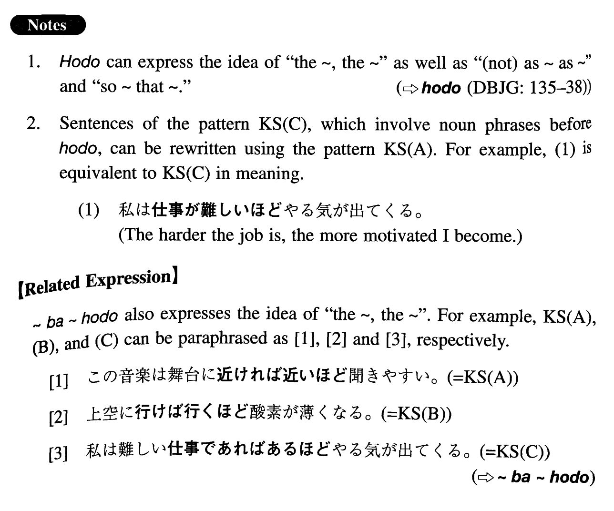

# ほど

[1. Summary](#summary) 
[2. Formation](#formation) 
[3. Example Sentences](#example-sentences) 
[4. Grammar Book Page](#grammar-book-page) 

## Summary

<table><tr>   <td>Summary</td>   <td>A particle which indicates the extent or the degree to which someone/something does something or is in some state.</td></tr><tr>   <td>English</td>   <td>The ~, the ~; as; to the extent</td></tr><tr>   <td>Part of speech</td>   <td>Particle</td></tr><tr>   <td>Related expression</td>   <td>ば~ほど; くらい</td></tr></table>

## Formation

<table class="table"> <tbody><tr class="tr head"> <td class="td">(i) {V/Adjective い}informal    nonpast </td> <td class="td">ほど </td> <td class="td">&nbsp;</td> </tr> <tr class="tr"> <td class="td">&nbsp;</td> <td class="td">勉強するほど </td> <td class="td">The    more someone studies</td> </tr> <tr class="tr"> <td class="td">&nbsp;</td> <td class="td">高いほど </td> <td class="td">The    more expensive something is</td> </tr> <tr class="tr head"> <td class="td">(ii)  Adjective な stem</td> <td class="td">{な/である} ほど</td> <td class="td">&nbsp;</td> </tr> <tr class="tr"> <td class="td">&nbsp;</td> <td class="td">便利{な/である} ほど</td> <td class="td">The    more convenient something is</td> </tr> <tr class="tr head"> <td class="td">(iii)  Relative Clause+Noun</td> <td class="td">ほど </td> <td class="td">&nbsp;</td> </tr> <tr class="tr"> <td class="td">&nbsp;</td> <td class="td">考え方が論理的な人ほど </td> <td class="td">The    more logical a person’s way of thinking is</td> </tr> <tr class="tr"> <td class="td">&nbsp;</td> <td class="td">よく勉強する学生ほど </td> <td class="td">A    student who studies harder; the harder a student studies</td> </tr> </tbody></table>

## Example Sentences

<table><tr>   <td>この音楽は舞台に近いほど聞きやすい。</td>   <td>The closer (you sit) to the stage, the easier this music is to hear.</td></tr><tr>   <td>上空に行くほど酸素が薄くなる。</td>   <td>Oxygen is less dense at higher altitudes. (literally: Oxygen becomes thinner as you go higher / the extent to which you go higher in the air.)</td></tr><tr>   <td>私は難しい仕事ほどやる気が出てくる。</td>   <td>I get more motivated by a harder job.</td></tr><tr>   <td>子供は小言を言うほど反発するものだ。</td>   <td>The more you nag children, the more they disobey you.</td></tr><tr>   <td>私は静かなほど落ち着かない。</td>   <td>The quieter it is, the more uneasy I feel.</td></tr><tr>   <td>駅に近くなるほど家賃が高くなる。</td>   <td>The closer to the station, the higher the rent.</td></tr><tr>   <td>運動するほど体の調子が変になる。</td>   <td>The more I exercise, the worse I feel.</td></tr><tr>   <td>元気な人ほど無理をしがちだ。</td>   <td>Stronger people tend to strain themselves more.</td></tr><tr>   <td>あまり働かない者ほど不平が多い。</td>   <td>Lazier people complain more.</td></tr></table>

## Grammar Book Page

