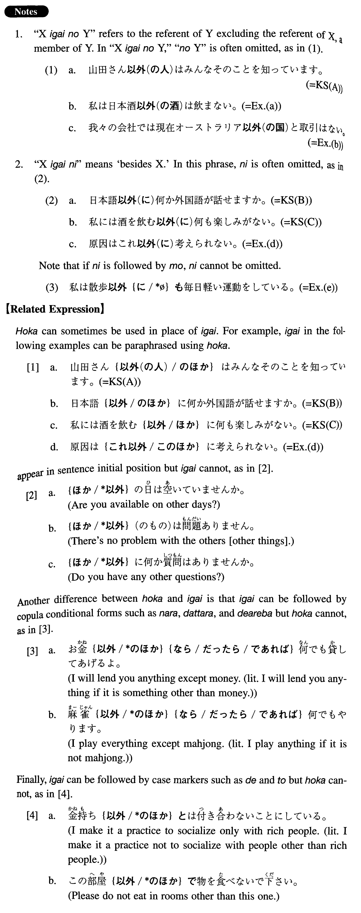

# 以外

[1. Summary](#summary) 
[2. Formation](#formation) 
[3. Example Sentences](#example-sentences) 
[4. Grammar Book Page](#grammar-book-page) 

## Summary

<table><tr>   <td>Summary</td>   <td>A dependent noun which means \"something/someone other than\".</td></tr><tr>   <td>English</td>   <td>Other than; except (for); but; besides; as well as</td></tr><tr>   <td>Part of speech</td>   <td>Noun</td></tr><tr>   <td>Related expression</td>   <td>ほか</td></tr></table>

## Formation

<table class="table"> <tbody><tr class="tr head"> <td class="td">(i)  Noun</td> <td class="td">以外(のNoun) </td> <td class="td">&nbsp;</td> </tr> <tr class="tr"> <td class="td">&nbsp;</td> <td class="td">コーヒー以外(の飲み物) </td> <td class="td">(drinks)    other than coffee</td> </tr> <tr class="tr head"> <td class="td">(ii)  Sinformal</td> <td class="td">以外 </td> <td class="td">だ after Adjective な    stem and Noun changes to である</td> </tr> <tr class="tr"> <td class="td">&nbsp;</td> <td class="td">勉強する以外 </td> <td class="td">Besides    studying</td> </tr> <tr class="tr"> <td class="td">&nbsp;</td> <td class="td">高い以外 </td> <td class="td">Besides    the fact that something is expensive</td> </tr> <tr class="tr"> <td class="td">&nbsp;</td> <td class="td">便利である以外 </td> <td class="td">Besides    the fact that something is convenient</td> </tr> <tr class="tr"> <td class="td">&nbsp;</td> <td class="td">先生である以外 </td> <td class="td">Besides    the fact that someone is a teacher</td> </tr> </tbody></table>

## Example Sentences

<table><tr>   <td>山田さん以外の人はみんなそのことを知っています。</td>   <td>Everybody except Yamada knows it.</td></tr><tr>   <td>日本語以外に何か外国語が話せますか。</td>   <td>Can you speak any foreign language besides Japanese?</td></tr><tr>   <td>私には酒を飲む以外に何も楽しみがない。</td>   <td>I have nothing to enjoy other than drinking.</td></tr><tr>   <td>私は日本酒以外の酒は飲まない。</td>   <td>I do not drink any alcohol but sake.</td></tr><tr>   <td>我々の会社では現在オーストラリア以外の国と取引はない。</td>   <td>At present our company is not dealing with any countries but Australia.</td></tr><tr>   <td>アメリカ以外の国からも沢山研究者が来た。</td>   <td>Many researchers came from countries other than America, too.</td></tr><tr>   <td>原因はこれ以外に考えられない。</td>   <td>I can't think of any causes other than this.</td></tr><tr>   <td>私は散歩以外にも毎日軽い運動をしている。</td>   <td>I take (other) light exercise every day as well as taking a walk.</td></tr><tr>   <td>ここで待っている以外ない。</td>   <td>There is nothing to do but wait here. (literally: There is no other way but waiting here.)</td></tr><tr>   <td>安い以外に何かいいことがありますか。</td>   <td>Is there any merit besides the price (literally: besides the fact that it is cheap)?</td></tr><tr>   <td>この分は少し漢字の間違いがあるが、それ以外は完全だ。</td>   <td>This sentence (or passage) contains a few kanji mistakes, but other than that, it is perfect.</td></tr><tr>   <td>従業員以外立入禁止。[Doorsign]</td>   <td>[Door sign] Employees only. (literally: Entry of those other than employees is prohibited.)</td></tr></table>

## Grammar Book Page

