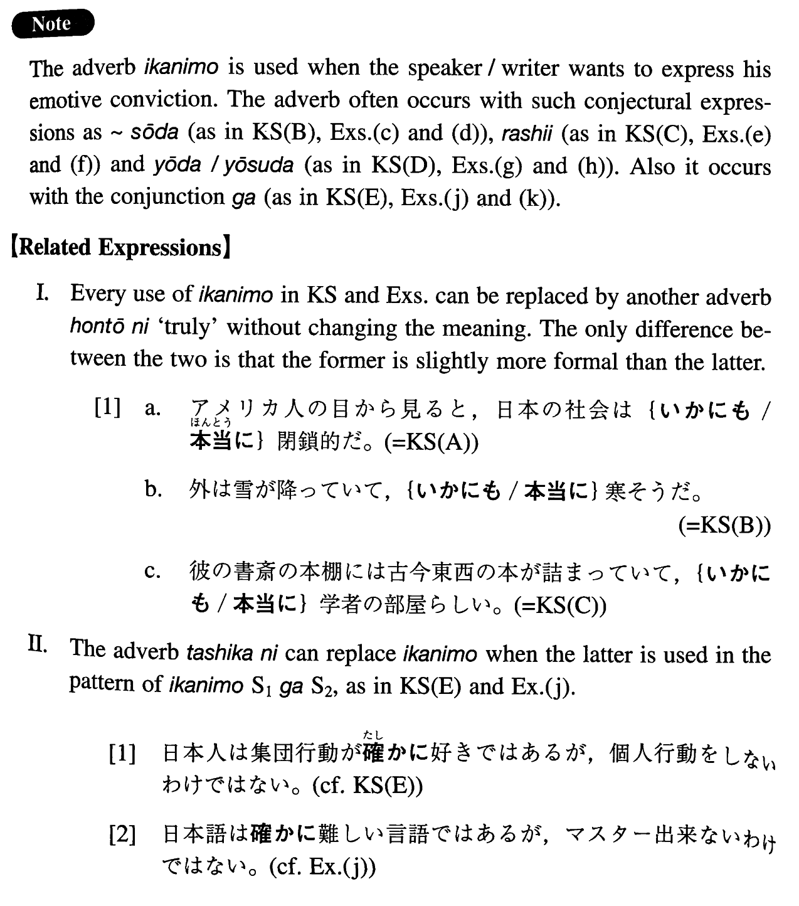

# いかにも

[1. Summary](#summary) 
[2. Example Sentences](#example-sentences) 
[3. Grammar Book Page](#grammar-book-page) 

## Summary

<table><tr>   <td>Summary</td>   <td>An adverb that indicates the speaker/writer's emotive conviction.</td></tr><tr>   <td>English</td>   <td>Really; truly; indeed</td></tr><tr>   <td>Part of speech</td>   <td>Adverb</td></tr><tr>   <td>Related expression</td>   <td>本当に; 確かに</td></tr></table>

## Example Sentences

<table><tr>   <td>アメリカ人の目から見ると、日本の社会はいかにも閉鎖的だ。</td>   <td>From an American perspective, Japanese society is indeed closed.</td></tr><tr>   <td>外は雪が降っていて、いかにも寒そうだ。</td>   <td>It is snowing outside, and it looks really cold.</td></tr><tr>   <td>彼の書斎の本棚には古今東西の本が詰まっていて、いかにも学者の部屋らしい。</td>   <td>The bookshelves of his study room are packed with books of all ages and countries, and it surely looks like a scholar's room.</td></tr><tr>   <td>先生は最近いかにもお忙しいよう/様子だ。</td>   <td>These days the professor appears to be really busy.</td></tr><tr>   <td>日本人は集団行動がいかにも好きではあるが、個人行動をしないわけではない。</td>   <td>The Japanese indeed like group behaviour, but it is not the case that they do not behave individually.</td></tr><tr>   <td>彼はいかにも紳士であるかのように振る舞っているが、なかなかの策士だ。</td>   <td>He is behaving as if he were truly a gentleman, but he is quite calculated.</td></tr><tr>   <td>彼の発想はいかにも日本的だ。</td>   <td>His manner of thinking is very Japanese.</td></tr><tr>   <td>その教授の知識はいかにも百科全書的だ。</td>   <td>The professor's knowledge is really encyclopaedic.</td></tr><tr>   <td>デーヴィッドは文部省の奨学金が貰えて、いかにも嬉しそうだった。</td>   <td>David was able to get a Ministry of Education scholarship and he looked really happy about it.</td></tr><tr>   <td>父は退院して、いかにも元気そうになった。</td>   <td>My father left the hospital and became really healthy-looking.</td></tr><tr>   <td>彼女は明るく、陽気で、いかにもアメリカ人らしい。</td>   <td>She is light-hearted and cheerful, and is truly like an American.</td></tr><tr>   <td>僕の大学の友人はいかにも金持ちらしく、いつも洒落た物を着ている。</td>   <td>A friend of mine in college appears to be truly rich, and is always wearing fancy clothes.</td></tr><tr>   <td>ジョンは恋人と別れて、いかにも落ち込んでいるようだった。</td>   <td>John split up with his girlfriend and looked truly depressed.</td></tr><tr>   <td>みゆきは母を失って、いかにも悲しんでいる様子だった。</td>   <td>Miyuki lost her mother and looked really saddened.</td></tr><tr>   <td>いかにもおっしゃる通りです。</td>   <td>It is exactly as you have said.</td></tr><tr>   <td>日本語はいかにも難しい言語ではあるが、マスター出来ないわけではない。</td>   <td>Japanese is indeed a difficult language, but it is not the case that you cannot master it.</td></tr></table>

## Grammar Book Page

