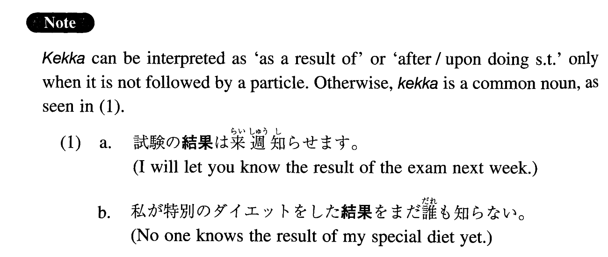

# 結果

[1. Summary](#summary) 
[2. Formation](#formation) 
[3. Example Sentences](#example-sentences) 
[4. Grammar Book Page](#grammar-book-page) 

## Summary

<table><tr>   <td>Summary</td>   <td>A noun which expresses the idea \"as a result of\".</td></tr><tr>   <td>Equivalent</td>   <td>As a result of; after; upon</td></tr><tr>   <td>Part of speech</td>   <td>Noun</td></tr></table>

## Formation

<table class="table"> <tbody><tr class="tr head"> <td class="td">(i)  Noun</td> <td class="td">の結果 </td> <td class="td">&nbsp;</td> </tr> <tr class="tr"> <td class="td">&nbsp;</td> <td class="td">試験の結果 </td> <td class="td">As a result of an exam</td> </tr> <tr class="tr head"> <td class="td">(ii)  Vinformal nonpast</td> <td class="td">結果 </td> <td class="td">&nbsp;</td> </tr> <tr class="tr"> <td class="td">&nbsp;</td> <td class="td">話した結果 </td> <td class="td">Upon/after talking</td> </tr> </tbody></table>

## Example Sentences

<table><tr>   <td>投票の結果、その提案は反対多数で否決された。</td>   <td>As a result of the vote, the proposal was rejected by the majority's opposition.</td></tr><tr>   <td>妻と相談した結果、家を買うことにした。</td>   <td>After my wife and I discussed it, we decided to buy a house.</td></tr><tr>   <td>相談の結果、今回の旅行は延期することになった。</td>   <td>After discussion, it's been decided that the planned trip will be postponed.</td></tr><tr>   <td>検査の結果、妻の体はどこにも異状がないことが分かった。</td>   <td>As a result of the examination, my wife was found to be healthy (literally: it was found that there was no abnormality with my wife's body).</td></tr><tr>   <td>調査の結果、新しい事実が発見された。</td>   <td>As a result of the investigation, new facts emerged.</td></tr><tr>   <td>警察で調べた結果、原因は煙草の火の不始末と分かった。</td>   <td>As a result of the police investigation, it was determined that the cause (of the fire) was the careless handling of a cigarette butt.</td></tr><tr>   <td>特別のダイエットをした結果、十キロの減量に成功した。</td>   <td>I've succeeded in losing ten kilos as the result of a special diet.</td></tr><tr>   <td>新しい教科書を使った結果、学生の成績が著しく伸びた。</td>   <td>As a result of using a new textbook, the students improved their performance remarkably (literally: the performance of the students improved remarkably).</td></tr><tr>   <td>ゴルフの個人指導を受けた結果、自分の問題点が明らかになった。</td>   <td>Upon taking a private golf lesson, my problems became clear.</td></tr></table>

## Grammar Book Page

