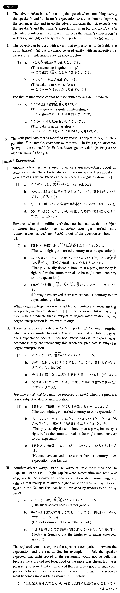

# 結構

[1. Summary](#summary) 
[2. Example Sentences](#example-sentences) 
 

## Summary

<table><tr>   <td>Summary</td>   <td>An adverb that indicates that something exceeds the speaker's and/or hearer's expectation to a considerable degree.</td></tr><tr>   <td>English</td>   <td>Quite; rather; pretty</td></tr><tr>   <td>Part of speech</td>   <td>Adverb (used in conversation only)</td></tr><tr>   <td>Related expression</td>   <td>案外; いがいと; 割合</td></tr></table>

## Example Sentences

<table><tr>   <td>ここの寿司は、結構美味しいね。</td>   <td>The sushi in this place is quite good, isn't it?</td></tr><tr>   <td>この車は古いんだけど、結構よく走りますよ。</td>   <td>This car is old, but it runs quite well, you know.</td></tr><tr>   <td>あの人は間抜けに見えるでしょう。でも、結構頭がいいんです。</td>   <td>He looks dumb, but he is quite sharp.</td></tr><tr>   <td>四月だというのに、結構寒いね。</td>   <td>It is April, but it is rather cold, isn't it?</td></tr><tr>   <td>小さい町なのに、結構いいレストランがあるね。</td>   <td>There are quite a few good restaurants in this small town, aren't there?</td></tr><tr>   <td>この料理は量は少ないけど、結構胃にもたれるね。</td>   <td>This dish is small in quantity, but it is pretty heavy on the stomach.</td></tr><tr>   <td>今日は日曜日なのに高速が結構混んでいるね。</td>   <td>Today is Sunday, but the highway is rather crowded, isn't it?</td></tr><tr>   <td>父は楽天的な人でしたが、失職した時に結構悩んだようです。</td>   <td>My father was an optimist, but when he lost his job, I think he suffered quite a bit.</td></tr><tr>   <td>カラオケは初めてだったが、結構楽しかった。</td>   <td>It was my first karaoke, but it was rather enjoyable.</td></tr></table>

## Grammar Book Page

