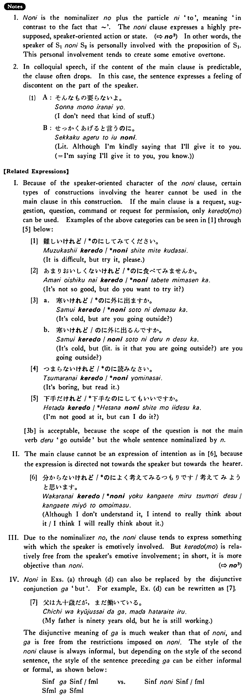

# のに (1)

[1. Summary](#summary) 
[2. Formation](#formation) 
[3. Example Sentences](#example-sentences) 
[4. Explanation](#explanation) 
 

## Summary

<table><tr>   <td>Summary</td>   <td>Contrary to everybody’s expectation based on the sentence preceding [x], the proposition in the sentence following [x] is the case.</td></tr><tr>   <td>English</td>   <td>Even though; despite the fact that ~; although; but; in spite of the fact that ~</td></tr><tr>   <td>Part of speech</td>   <td>Conjunction</td></tr><tr>   <td>Related expression</td>   <td>が; けれど(も)</td></tr></table>

## Formation

<table class="table"> <tbody><tr class="tr head"> <td class="td">(i)  {V/Adjective い}    informal</td> <td class="td">のに </td> <td class="td">&nbsp;</td> </tr> <tr class="tr"> <td class="td">&nbsp;</td> <td class="td">{話す /話した} のに</td> <td class="td">Although someone    talks/talked</td> </tr> <tr class="tr"> <td class="td">&nbsp;</td> <td class="td">{高い /高かった} のに</td> <td class="td">Although something is/was    expensive</td> </tr> <tr class="tr head"> <td class="td">(ii)  {Adjective な stem/   N}</td> <td class="td">{な/だった} のに</td> <td class="td">&nbsp;</td> </tr> <tr class="tr"> <td class="td">&nbsp;</td> <td class="td">{静かな/静かだった} のに</td> <td class="td">Although something is/was    quiet</td> </tr> <tr class="tr"> <td class="td">&nbsp;</td> <td class="td">{先生な/先生だった} のに</td> <td class="td">Although something is/was a    teacher</td> </tr></tbody></table>

## Example Sentences

<table><tr>   <td>毎日漢字を勉強しているのによく覚えられない・覚えられません。</td>   <td>Although I'm studying kanji every day, I cannot memorize them well.</td></tr><tr>   <td>このステーキは高いのに美味しくない・美味しくありません。</td>   <td>In spite of the fact that this steak is expensive, it isn't delicious.</td></tr><tr>   <td>清水さんはゴルフが下手なのに大好きだ・大好きです。</td>   <td>Although Mr. Shimizu is not good at golf, he loves it.</td></tr><tr>   <td>ホールさんはアメリカ人なのに肉が嫌いだ・嫌いです。</td>   <td>In spite of the fact that Mr. Hall is an American, he doesn't like meat.</td></tr><tr>   <td>中学と高校で六年間も英語を勉強したのにまだ英語が話せません。</td>   <td>I studied English for as many as six years at junior high and senior high, but I still cannot speak it.</td></tr><tr>   <td>寒いのにオーバーを着ないで出かけた。</td>   <td>Although it was cold, he went out without wearing an overcoat.</td></tr><tr>   <td>あの人はピアノが上手なのにめったに弾きません。</td>   <td>He is good at piano, but seldom plays.</td></tr><tr>   <td>父は九十歳なのにまだ働いています。</td>   <td>My father is still working in spite of the fact that he is ninety years old.</td></tr></table>

## Explanation

1. のに is the nominalizer の plus the particle に 'to', meaning 'in contrast to the fact that ~'. The のに clause expresses a highly presupposed, speaker-oriented action or state. (⇨ <a href="#㊦ の (3)">の3</a>) In other words, the speaker of SentenceのにSentence2 is personally involved with the proposition of Sentence1. This personal involvement tends to create some emotive overtone.
  
2. In colloquial speech, if the content of the main clause is predictable, the clause often drops. In this case, the sentence expresses a feeling of discontent on the part of the speaker.
  <ul>(1) <li>A: そんなもの要らないよ。</li> <li>I don't need that kind of stuff.</li> 

 <li>B: せっかくあげると言うのに。</li> <li>Literally: Although I'm kindly saying that I'll give it to you. (= I'm saying I'll give it to you, you know.)</li> </ul>  
【Related Expressions】
  
I. Because of the speaker-oriented character of the のに clause, certain types of constructions involving the hearer cannot be used in the main clause in this construction. If the main clause is a request, suggestion, question, command or request for permission, only けれど(も)can be used. Examples of the above categories can be seen in [1] through [5] below:
  
[1]
  <ul> <li>難しいけれど/*のにしてみてください。</li> <li>It is difficult, but try it, please.</li> </ul>  
[2]
  <ul> <li>あまりおいしくないけれど/*のに食べてみませんか。</li> <li>It's not so good, but do you want to try it?</li> </ul>  
[3]
  <ul> <li>a. 寒いけれど/*のに外に出ますか。</li> <li>It's cold, but are you going outside?</li> 

 <li>b. 寒いけれど/のに外に出るんですか。</li> <li>It's cold, but (literally: is it that you are going outside?) are you going outside?</li> </ul>  
[4]
  <ul> <li>つまらないけれど/*のに読みなさい。</li> <li>It's boring, but read it.</li> </ul>  
[5]
  <ul> <li>下手だけれど/*下手なのにしてもいいですか。</li> <li>I'm not good at it, but can I do it?</li> </ul>  
[3b] is acceptable, because the scope of the question is not the main verb 出る 'go outside' but the whole sentence nominalized by ん.
  
II. The main clause cannot be an expression of intention as in [6], because the expression is directed not towards the speaker but towards the hearer.
   
[6]
  <ul> <li>分からないけれど/*のによく考えてみるつもりです/考えてみようと思います。</li> <li>Although I don't understand it, I intend to really think about it/I think I will really think about it.</li> </ul>  
III. Due to the nominalizer の, the のに clause tends to express something with which the speaker is emotively involved. But けれど(も) is relatively free from the speakers emotive involvement; in short, it is more objective than のに.
  (⇨ <a href="#㊦ の (3)">の3</a>)
  
IV. のに in Examples (a) through (d) can also be replaced by the disjunctive conjunction が 'but'. For example, Example (d) can be rewritten as [7].  
[7]
  <ul> <li>父は九十歳だが、まだ働いている。</li> <li>My father is ninety years old, but he is still working.</li> </ul>  
The disjunctive meaning of が is much weaker than that of のに, and が is free from the restrictions imposed on のに. The style of the のに clause is always informal, but depending on the style of the second sentence, the style of the sentence preceding が can be either informal or formal, as shown below:
  <table class="table"> <tbody> <tr class="tr"> <td class="td">Sentence informalがSentence informal/formal</td> <td class="td">vs</td> <td class="td">Sentence informalのにSentence informal/formal</td> </tr> <tr class="tr"> <td class="td">Sentence formalがSentence formal</td> <td class="td"></td> <td class="td"></td> </tr> </tbody> </table>

## Grammar Book Page

