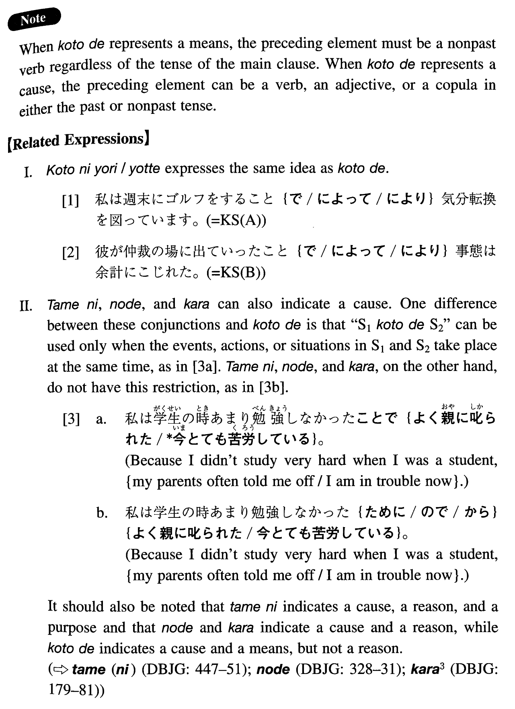

# ことで

[1. Summary](#summary) 
[2. Formation](#formation) 
[3. Example Sentences](#example-sentences) 
 

## Summary

<table><tr>   <td>Summary</td>   <td>A compound particle which indicates a means or a cause.</td></tr><tr>   <td>English</td>   <td>By V-ing; because; result in; cause</td></tr><tr>   <td>Part of speech</td>   <td>Compound Particle</td></tr><tr>   <td>Related expression</td>   <td>から; ことにより; よって; ので; 為(に)</td></tr></table>

## Formation

<table class="table"> <tbody><tr class="tr head"> <td class="td">(i)  Vinformal nonpast</td> <td class="td">ことで </td> <td class="td">Means</td> </tr> <tr class="tr"> <td class="td">&nbsp;</td> <td class="td">行くことで </td> <td class="td">By going</td> </tr> <tr class="tr head"> <td class="td">(ii)  Sinformal</td> <td class="td">ことで </td> <td class="td">Cause</td> </tr> <tr class="tr"> <td class="td">&nbsp;</td> <td class="td">{行く /行った} ことで</td> <td class="td">Because someone will go/went</td> </tr> <tr class="tr"> <td class="td">&nbsp;</td> <td class="td">{高い /高かった} ことで</td> <td class="td">Because something is/was high</td> </tr> <tr class="tr head"> <td class="td">(iii)  Adjective な stem</td> <td class="td">なことで </td> <td class="td">Exception</td> </tr> <tr class="tr"> <td class="td">&nbsp;</td> <td class="td">便利なことで </td> <td class="td">Because something is convenient</td> </tr> <tr class="tr head"> <td class="td">(iv)  Noun</td> <td class="td">であることで </td> <td class="td">Exception</td> </tr> <tr class="tr"> <td class="td">&nbsp;</td> <td class="td">女であることで </td> <td class="td">Because someone is a woman</td> </tr> </tbody></table>

## Example Sentences

<table><tr>   <td>私は週末にゴルフをすることで気分転換を図っています。</td>   <td>I try to lift my spirits by playing golf on weekends.</td></tr><tr>   <td>彼が仲裁の場に出ていったことで事態は余計にこじれた。</td>   <td>His appearance at the mediation scene complicated the situation even more. (literally: The situation got even more complicated because he appeared at the mediation scene.)</td></tr><tr>   <td>私が十万円出すことで問題は解決した。</td>   <td>The problem was solved by my paying 100,000 yen.</td></tr><tr>   <td>彼女はものを言わないことで私へ精一杯の抵抗を示しているのです。</td>   <td>She is demonstrating her utmost resistance to me by not talking.</td></tr><tr>   <td>朝晩簡単な体操をするだけのことで素晴らしい健康が保てます。</td>   <td>You can maintain wonderful health just by taking simple exercise in the morning and evening.</td></tr><tr>   <td>私が参加することであなたに迷惑はかかりませんか。</td>   <td>Wouldn't my participation cause you trouble?</td></tr><tr>   <td>彼のパーティーに行かなかったことで彼の気持ちを害したのでなければよいが。</td>   <td>I hope I didn't hurt his feelings because I didn't go to his party (literally: by not having gone to his party).</td></tr><tr>   <td>私は英語が下手ことで時々損をしている。</td>   <td>I am sometimes put at a disadvantage because I am poor at English.</td></tr><tr>   <td>この国では外国人であることで得をすることがある。</td>   <td>In this country there are times when you benefit for being a foreigner.</td></tr></table>

## Grammar Book Page

