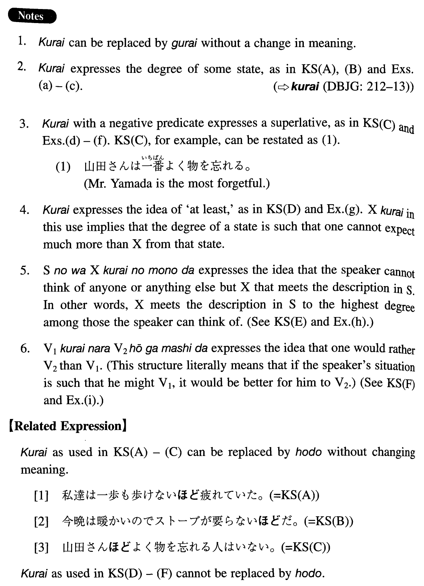

# くらい

 
 
 
 

## Summary

<table><tr>   <td>Summary</td>   <td>A particle which is used to express the degree of a state.</td></tr><tr>   <td>English</td>   <td>To the extent that; so ~ that ~ (almost) ~; at least; the only ~; rather than ~</td></tr><tr>   <td>Part of speech</td>   <td>Particle</td></tr><tr>   <td>Related expression</td>   <td>ほど</td></tr></table>

## Formation

<table class="table"><tbody><tr class="tr head"><td class="td">(i) Sinformal</td><td class="td">くらい</td><td class="td">The same as relative connection rules</td></tr><tr class="tr"><td class="td"></td><td class="td">泳げるくらい</td><td class="td">To the extent that one can swim</td></tr><tr class="tr"><td class="td"></td><td class="td">(先生も) 出来なかったくらい</td><td class="td">To the extent that (even our teacher) couldn’t do it</td></tr><tr class="tr"><td class="td"></td><td class="td">恐ろしいくらい</td><td class="td">To the extend that (I) am frightened</td></tr><tr class="tr"><td class="td"></td><td class="td">気の毒なくらい</td><td class="td">To the extent that (i) feel sorry</td></tr><tr class="tr head"><td class="td">(ii) Noun</td><td class="td">くらい</td><td class="td"></td></tr><tr class="tr"><td class="td"></td><td class="td">山田さんくらい</td><td class="td">To Yamada’s degree</td></tr></tbody></table>

## Example Sentences

<table><tr>   <td>私達は一歩も歩けないくらい疲れていた。</td>   <td>We were so tired that we couldn't even take a step. (literally: We were tired to the extent that we couldn't even walk one step.)</td></tr><tr>   <td>今晩は暖かいのでストーブが要らないくらいだ。</td>   <td>It is so warm this evening that we (almost) don't need a heater.</td></tr><tr>   <td>山田さんくらいよく物を忘れる人はいない。</td>   <td>There's no one who is as forgetful as Yamada (literally: who forgets things as much as Yamada does).</td></tr><tr>   <td>私は料理は下手ですが、ご飯くらい（は）炊けます。</td>   <td>I am a poor cook (literally: bad at cooking), but I can at least cook rice.</td></tr><tr>   <td>今この仕事が出来るのは彼くらいのものだ。</td>   <td>He is the only person who can do this job now. (literally: The person who is capable enough to do this job is he.)</td></tr><tr>   <td>そんなことをするくらいなら死んだ方がましだ。</td>   <td>I would rather die than do such a thing.</td></tr><tr>   <td>その家は直しようがないくらい傷んでいた。</td>   <td>That house was so damaged that it couldn't be repaired. (literally: That house was damaged to the extent that it couldn't be repaired.)</td></tr><tr>   <td>次郎はひどく酔っていて立っていられないくらいだった。</td>   <td>Jiro was so drunk that he couldn't hold himself upright.</td></tr><tr>   <td>こんな本、十ドルでもまだ高いくらいだ。</td>   <td>Even ten dollars would still be too expensive for a book like this.</td></tr><tr>   <td>内田さんくらいかわいそうな人はいない。</td>   <td>This is no one who is as pitiful as Uchida.</td></tr><tr>   <td>あの時くらい苦しかった時はない。</td>   <td>I have never suffered as much as I did that time.</td></tr><tr>   <td>信頼していた人に裏切られる（こと）くらい辛いことはない。</td>   <td>There is nothing as painful as being betrayed by someone you have trusted.</td></tr><tr>   <td>いくら安い所でもシャワーくらい付いているでしょう。</td>   <td>Even though it is a cheap place, there should at least be a shower.</td></tr><tr>   <td>そんな物に二万円も出すのはあなたくらいのものですよ。</td>   <td>You are the only person who would pay as much as 20,000 yen for such a thing.</td></tr><tr>   <td>あんな男の下で働くくらいなら乞食になった方がましだ。</td>   <td>I would rather be a beggar than work under such a man.</td></tr></table>

## Grammar Book Page

