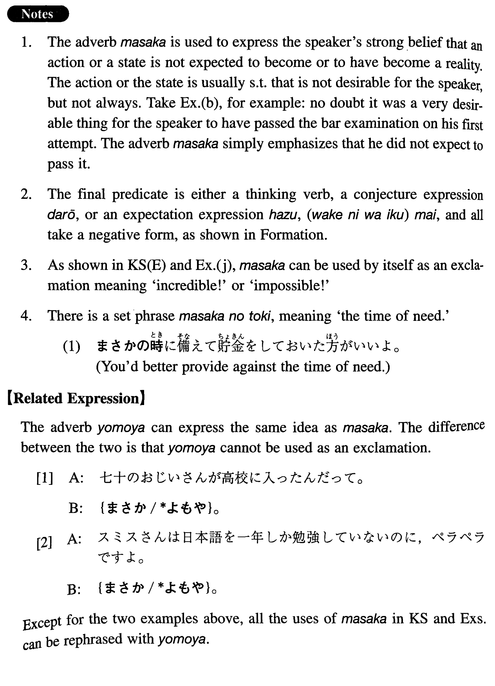

# まさか

[1. Summary](#summary) 
[2. Formation](#formation) 
[3. Example Sentences](#example-sentences) 
[4. Grammar Book Page](#grammar-book-page) 

## Summary

<table><tr>   <td>Summary</td>   <td>An adverb that indicates the speaker's strong belief that something is not expected to (have) become a reality.</td></tr><tr>   <td>Equivalent</td>   <td>Incredible; never thought; never dreamed; surely not; impossible; don't tell me that ~; not at all likely; absolutely not.</td></tr><tr>   <td>Part of speech</td>   <td>Adverb</td></tr><tr>   <td>Related expression</td>   <td>よもや</td></tr></table>

## Formation

<table class="table"><tbody><tr class="tr head"><td class="td">(i) まさかSとは</td><td class="td">{思わなかった/考えてもみなかった}</td><td class="td"></td></tr><tr class="tr"><td class="td"></td><td class="td">まさか雪が降るとは{思わなかった/考えてもみなかった}</td><td class="td">{I didn’t believe/I never though} that it would snow</td></tr><tr class="tr head"><td class="td">(ii) まさかS</td><td class="td">{んじゃ/のでは} ないだろうね</td><td class="td"></td></tr><tr class="tr"><td class="td"></td><td class="td">まさか会社を辞める{んじゃ/のでは}ないだろうね</td><td class="td">Don’t tell me that you are going to quit the company</td></tr><tr class="tr head"><td class="td">(iii) まさかS</td><td class="td">はずがない</td><td class="td"></td></tr><tr class="tr"><td class="td"></td><td class="td">まさか四月に雪が降るはずがない</td><td class="td">It is not at all likely that it will snow in April</td></tr><tr class="tr head"><td class="td">(iv) まさかS</td><td class="td">まい</td><td class="td"></td></tr><tr class="tr"><td class="td"></td><td class="td">まさか雪は降るまい</td><td class="td">Don’t tell me it’s going to snow</td></tr></tbody></table>

## Example Sentences

<table><tr>   <td>まさか美智子があんな男と結婚するとは思わなかった。</td>   <td>I never dreamed that Michiko would marry that kind of a guy.</td></tr><tr>   <td>まさかあたしの誕生日を忘れたんじゃないでしょうね。</td>   <td>Don't tell me that you forgot my birthday!</td></tr><tr>   <td>まさか彼がこんな寒い日に来るはずはないですよ。</td>   <td>Surely he won't show up on such a cold day!</td></tr><tr>   <td>最近父から手紙が来ないけれど、まさか具合が悪いのではあるまい。</td>   <td>Lately I haven't heard from my father, but God forbid that he might be ill.</td></tr><tr>   <td>Ａ：七十のおじいさんが高校に入ったんだって。Ｂ：まさか。</td>   <td>A: I heard that an old man of 70 entered a high school.  B: Incredible!</td></tr><tr>   <td>まさか自分が交通事故に巻き込まれるとは思いませんでしたよ。</td>   <td>I never thought that I would be involved in a traffic accident.</td></tr><tr>   <td>まさか司法試験に一度でパス出来るとは考えてもいなかった。</td>   <td>I never dreamed that I could pass the bar examination on my first attempt.</td></tr><tr>   <td>青い顔をしているけど、まさか病気じゃないでしょうね。</td>   <td>You look pale. Are you sure you are not ill?</td></tr><tr>   <td>まさかこんな高いダイヤモンドの指輪を買ってくれたんじゃないでしょうね。</td>   <td>I don't believe that you brought me such an expensive diamond ring!</td></tr><tr>   <td>まさかあんないい人が人を殺すなんてあるはずがない。</td>   <td>Don't tell me a good person like that killed someone.</td></tr><tr>   <td>まさか彼が日本語の先生になるとは考えてもみなかった。</td>   <td>I never thought that he would become a Japanese language teacher.</td></tr><tr>   <td>まさかあの人がそんなことを言うはずはないでしょ。</td>   <td>It's not at all likely that she has said such a thing!</td></tr><tr>   <td>もう五月なのだから、まさか雪は降るまい。</td>   <td>Since it is May it is very unlikely that it will snow.</td></tr><tr>   <td>母は入院中だから、まさか私の結婚式に出席するわけにはいくまい。</td>   <td>Because my mother is in the hospital right now, it is impossible to expect her to attend my wedding.</td></tr><tr>   <td>A:スミスさんは日本語を一年しか勉強していないのに、ペラペラですよ。B:まさか。</td>   <td>A: Smith has studied Japanese for only one year, but he is fluent, you know.   B: Impossible!</td></tr></table>

## Grammar Book Page

