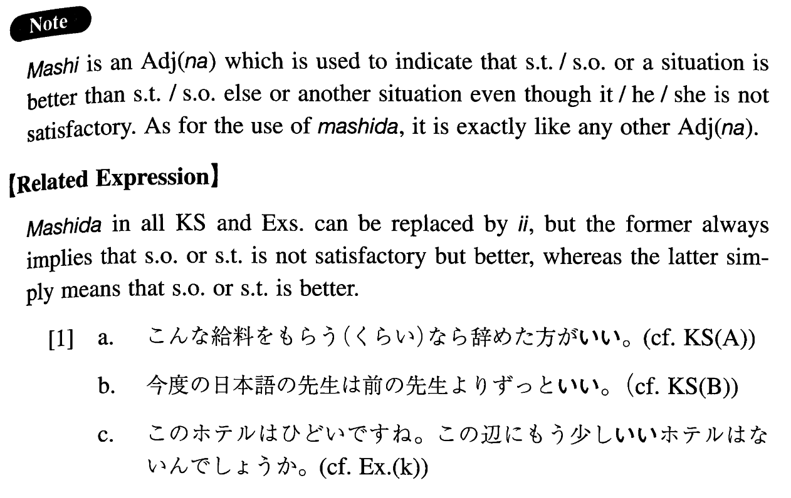

# ましだ

[1. Summary](#summary) 
[2. Example Sentences](#example-sentences) 
[3. Grammar Book Page](#grammar-book-page) 

## Summary

<table><tr>   <td>Summary</td>   <td>A phrase indicating that although someone/something (or some situation) is not satisfactory it is better than someone/something else.</td></tr><tr>   <td>Equivalent</td>   <td>Better; less objectionable; preferable; might as well ~</td></tr><tr>   <td>Part of speech</td>   <td>Adjective (な)</td></tr><tr>   <td>Related expression</td>   <td>いい</td></tr></table>

## Example Sentences

<table><tr>   <td>こんな給料をもらう（くらい）なら辞めた方がましだ。</td>   <td>If this is the salary, it would be better to quit.</td></tr><tr>   <td>今度の日本語の先生は前の先生よりずっとましだ。</td>   <td>This new Japanese teacher is much better than the former teacher.</td></tr><tr>   <td>もう少しましなコーヒーはありませんか。</td>   <td>Isn't there coffee that's a bit better?</td></tr><tr>   <td>こんな大学に入るくらいなら、仕事をした方がましだ。</td>   <td>I might as well work as enter such a college.</td></tr><tr>   <td>こんな苦しい生活をするくらいなら、死んだ方がましだ。</td>   <td>It is better to die than to lead such a life.</td></tr><tr>   <td>学校へ行くくらいなら家でテレビでも見ていた方がましだ。</td>   <td>It's better to watch TV at home rather than going to school.</td></tr><tr>   <td>こんな不味いご飯を食べるくらいなら何も食べない方がいい。</td>   <td>It's better not to eat anything rather than eating such an untasteful meal.</td></tr><tr>   <td>あのレストランよりこのレストランの方がましだ。</td>   <td>This restaurant is better than that restaurant over there.</td></tr><tr>   <td>ここの夏も暑いですが、東京の夏よりましですね。</td>   <td>Summer here is hot, too, but it's better than summer in Tokyo.</td></tr><tr>   <td>僕の車もとても古いけど、君のよりましだ。</td>   <td>My car is also very old, but it is better than yours.</td></tr><tr>   <td>給料は二万円でも、ないよりましだ。</td>   <td>Although the salary is just 20,000 yen it's better than nothing.</td></tr><tr>   <td>お宅は狭いと言っても私の家に比べたらずっとましですよ。</td>   <td>You say your house is small, but it is much better than our house, you know.</td></tr><tr>   <td>もう少しましな人間になろうと思っています。</td>   <td>I am thinking of becoming a slightly better person.</td></tr><tr>   <td>このホテルはひどいですね。この辺にもう少しましなホテルはないんでしょうか。</td>   <td>This hotel is awful. Isn't there a slightly better hotel around here?</td></tr></table>

## Grammar Book Page

