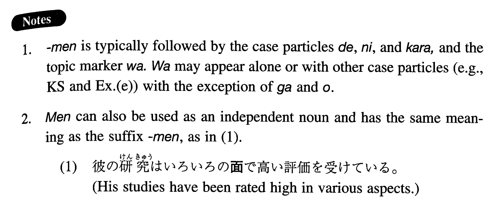

# 面

[1. Summary](#summary) 
[2. Formation](#formation) 
[3. Example Sentences](#example-sentences) 
[4. Grammar Book Page](#grammar-book-page) 

## Summary

<table><tr>   <td>Summary</td>   <td>A suffix which forms a compound that means a side of X, or an aspect of X.</td></tr><tr>   <td>English</td>   <td>(on) the side of; (from) the aspect of; (from) the standpoint/viewpoint of; in terms of</td></tr><tr>   <td>Part of speech</td>   <td>Suffix</td></tr><tr>   <td>Related expression</td>   <td>点(で)</td></tr></table>

## Formation

<table class="table"><tbody><tr class="tr head"><td class="td">Noun</td><td class="td">面</td><td class="td"></td></tr><tr class="tr"><td class="td"></td><td class="td">運営面</td><td class="td">The aspect of operation; the standpoint of operation</td></tr></tbody></table>

## Example Sentences

<table><tr>   <td>彼か学業面では優秀だが、精神面に少し弱さがあるようだ。</td>   <td>He is excellent in terms of his academic performance (literally: on the side of his academic performance) but he seems to have some psychological weakness (literally: have some weakness on the side of his psychology).</td></tr><tr>   <td>この食堂は衛生面によく気を配っている。</td>   <td>This restaurant pays close attention to hygiene (literally: the hygienic aspect).</td></tr><tr>   <td>藤田さんは技術面からのみものを見る傾向がある。</td>   <td>Mr. Fujita tends to view things from the technical standpoint alone.</td></tr><tr>   <td>ここの土地所有者は税金面で優遇措置を受けている。</td>   <td>The land owners here receive favourable treatment in terms of tax.</td></tr><tr>   <td>あの候補者の演説は政策面での説得力に欠ける。</td>   <td>That candidate's speech is not convincing (literally: lacks persuasive power) from the standpoint of policy.</td></tr><tr>   <td>彼女は日本へ行っても語学面は心配しなくてもいい。</td>   <td>She does not need to worry about language (literally: the aspect of language) when she goes to Japan</td></tr><tr>   <td>この車は性能面を高く評価された。</td>   <td>This car was highly regarded in terms of performance.</td></tr></table>

## Grammar Book Page

