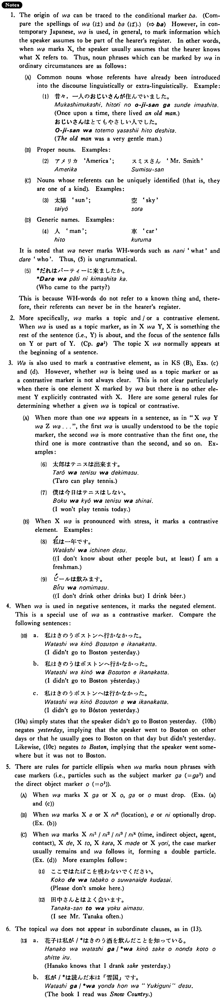

# は (1)

[1. Summary](#summary) 
[2. Example Sentences](#example-sentences) 
[3. Explanation](#explanation) 
[4. Grammar Book Page](#grammar-book-page) 

## Summary

<table><tr>   <td>Summary</td>   <td>A particle which marks a topic or a contrastive element.</td></tr><tr>   <td>Equivalent</td>   <td>Talking about ~; as for ~; the</td></tr><tr>   <td>Part of speech</td>   <td>Particle</td></tr><tr>   <td>Related expression</td>   <td>が</td></tr></table>

## Example Sentences

<table><tr>   <td>私は学生だ・です。</td>   <td>I am a student.</td></tr><tr>   <td>杉田さんは行きますが私は行きません。</td>   <td>Mr. Sugita will go (there) but I won't go.</td></tr><tr>   <td>ジョーンズさんは今日本語を勉強している。</td>   <td>Mr. Jones is studying Japanese now.</td></tr><tr>   <td>この町には大学が二つある。</td>   <td>There are two universities in this town.</td></tr><tr>   <td>私はビールは飲みますが酒は飲みません。</td>   <td>I drink beer but don't drink sake.</td></tr><tr>   <td>春子には人形を、秋子には絵本をあげた。</td>   <td>I gave Haruko a doll and Akiko a picture book.</td></tr></table>

## Explanation

1. The origin of は can be traced to the conditional marker ば. (Compare the spellings of は and ば) (⇨ <a href="#㊦ ば">ば</a>) However, in contemporary Japanese, は is used, in general, to mark information which the speaker assumes to be part of the hearer's register. In other words, when は marks X, the speaker usually assumes that the hearer knows what X refers to. Thus, noun phrases which can be marked by は in ordinary circumstances are as follows:
  
(A) Common nouns whose referents have already been introduced into the discourse linguistically or extra-linguistically. Example:
  <ul>(1) <li>昔々、一人のおじいさんが住んでいました。</li> <li>Once upon a time, there lived an old man.</li> 

 <li>おじいさんはとてもやさしい人でした。</li> <li>The old man was a very gentle man.</li> </ul>  
(B) Proper nouns. Examples:
  <ul>(2) <li>アメリカ&nbsp;&nbsp;America</li> 

 <li>スミスさん&nbsp;&nbsp;Mr. Smith</li> </ul>  
(C) Nouns whose referents can be uniquely identified (that is, they are one of a kind). Examples:
  <ul>(3) <li>太陽&nbsp;&nbsp;sun</li> 

 <li>空&nbsp;&nbsp;sky</li> </ul>  
(D) Generic names. Examples:
  <ul>(4) <li>人&nbsp;&nbsp;man</li> 

 <li>車&nbsp;&nbsp;car</li> </ul>  
It is noted that は never marks interrogative words such as 何 'what' and 誰 'who' .Thus, (5) is ungrammatical.
  <ul>(5) <li>*誰はパーティーに来ましたか。</li> <li>Who came to the party?</li> </ul>  
This is because interrogative words do not refer to a known thing and, therefore, their referents can never be in the hearer's register.
  
2. More specifically, は marks a topic and/or a contrastive element. When は is used as a topic marker, as in XはY, X is something the rest of the sentence (i.e., Y) is about, and the focus of the sentence falls on Y or part of Y. The topic Xは normally appears at the beginning of a sentence.
  
3. は is also used to mark a contrastive element, as in Key Sentence (B), Examples (c) and (d). However, whether は is being used as a topic marker or as a contrastive marker is not always clear. This is not clear particularly when there is one element X marked by は but there is no other element Y explicitly contrasted with X. Here are some general rules for determining whether a given は is topical or contrastive.
  
(A) When more than one は appears in a sentence, as in "XはYはZは...", the first は is usually understood to be the topic marker, the second は is more contrastive than the first one, the third one is more contrastive than the second, and so on. Examples :
  <ul>(6) <li>太郎はテニスは出来ます。</li> <li>Taro can play tennis.</li> </ul>  <ul>(7) <li>僕は今日はテニスはしない。</li> <li>I won't play tennis today.</li> </ul>  
(B) When Xは is pronounced with stress, it marks a contrastive element. Examples:
  <ul>(8) <li>私は一年です。</li> <li>(I don't know about other people but, at least) I am a freshman.</li> </ul>  <ul>(9) <li>ビールは飲みます。</li> <li>(I don't drink other drinks but) I drink beer.</li> </ul>  
4. When は is used in negative sentences, it marks the negated element. This is a special use of は as a contrastive marker. Compare the following sentences:
  <ul>(10) <li>a. 私はきのうボストンへ行かなかった。</li> <li>I didn't go to Boston yesterday.</li> 

 <li>b. 私はきのうはボストンへ行かなかった。</li> <li>I didn't go to Boston yesterday.</li> 

 <li>c. 私はきのうボストンへは行かなかった。</li> <li>I didn't go to Boston yesterday.</li> </ul>  
(10a) simply states that the speaker didn't go to Boston yesterday. (10b) negates yesterday, implying that the speaker went to Boston on other days or that he usually goes to Boston on that day but didn't yesterday. Likewise, (10c) negates to Boston, implying that the speaker went somewhere but it was not to Boston.
  
5. There are rules for particle ellipsis when は marks noun phrases with case markers (i.e., particles such as the subject marker が (= <a href="#㊦ が (1)">が1</a>) and the direct object marker を (= <a href="#㊦ を (1)">を1</a>)).
  
(A) When は marks Xがa or Xを, が or を must drop. (Examples (a) and (c))
  
(B) When は marks Xへ or Xに6 (location), へ or に optionally drop, (Example (b))
  
(C) When は marks Xに1/に2/に3/に4 (time, indirect object, agent, contact), Xで, Xと, Xから, Xまで or Xより, the case marker usually remains and は follows it, forming a double particle. (Example (d)) More examples follow:
  <ul>(11) <li>ここではたばこを吸わないでください。</li> <li>Please don't smoke here.</li> </ul>  <ul>(12) <li>田中さんとはよく会います。</li> <li>I see Mr. Tanaka often.</li> </ul>  
6. The topical は does not appear in subordinate clauses, as in (13).
  <ul>(13) <li>a.花子は私が/*はきのう酒を飲んだことを知っている。</li> <li>Hanako knows that I drank sake yesterday.</li> 

 <li>b.私が/*は読んだ本は「雪国」です。</li> <li>The book I read was Snow Country.</li> </ul>

## Grammar Book Page

