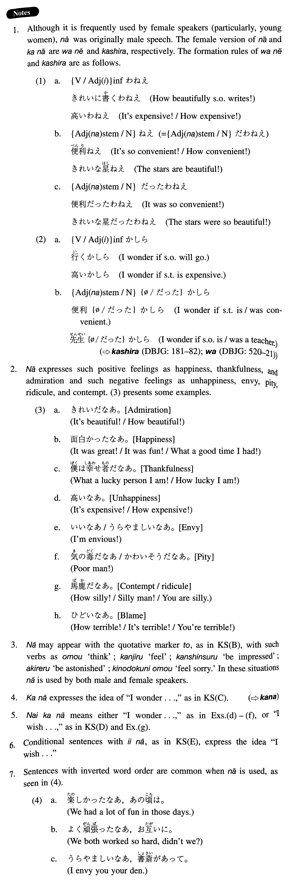

# なあ

[1. Summary](#summary) 
[2. Formation](#formation) 
[3. Example Sentences](#example-sentences) 
[4. Grammar Book Page](#grammar-book-page) 

## Summary

<table><tr>   <td>Summary</td>   <td>An exclamatory sentential particle which is used in informal male speech.</td></tr><tr>   <td>Equivalent</td>   <td>How ~!; what ~! ~!; I wonder; I wish</td></tr><tr>   <td>Part of speech</td>   <td>Particle (used in conversation only)</td></tr></table>

## Formation

<table class="table"><tbody><tr class="tr head"><td class="td">(i) Sinformal</td><td class="td"></td><td class="td"></td></tr><tr class="tr"><td class="td"></td><td class="td">高いなあ</td><td class="td">It’s expensive!/How expensive!</td></tr><tr class="tr head"><td class="td">(ii) Sinformal</td><td class="td">かなあ</td><td class="td"></td></tr><tr class="tr"><td class="td"></td><td class="td">高いかなあ</td><td class="td">I wonder if it’s expensive</td></tr><tr class="tr head"><td class="td">(iii) Vnegative informal</td><td class="td">かなあ</td><td class="td"></td></tr><tr class="tr"><td class="td"></td><td class="td">くれないかなあ</td><td class="td">I wish someone would give me something</td></tr></tbody></table>

## Example Sentences

<table><tr>   <td>彼はよく食べるなあ。</td>   <td>He eats a lot!</td></tr><tr>   <td>素晴らしい映画だなあと思った。</td>   <td>I was so impressed by that (wonderful) movie. (literally: What a wonderful movie, I thought.)</td></tr><tr>   <td>まだ間に合うかなあ。</td>   <td>I wonder if I can still make it in time.</td></tr><tr>   <td>河合君、早く来ないかなあ。</td>   <td>I wish Kawai would come soon.</td></tr><tr>   <td>車があったらいいなあ。</td>   <td>I wish I had a car. (literally: It would be nice if I had a car.)</td></tr><tr>   <td>よく飲んだなあ。</td>   <td>We drank a lot! / Did we drink!</td></tr><tr>   <td>あのけちの吉田がよく金を出したなあ。</td>   <td>I'm surprised that that stingy guy Yoshida gave money.</td></tr><tr>   <td>家が欲しいなあ。</td>   <td>I want a house so badly.</td></tr><tr>   <td>山内さん、今日は来ないかなあ。</td>   <td>I wonder if Mr. Yamauchi is not coming today.</td></tr><tr>   <td>何か面白い映画はないかなあ。</td>   <td>I wonder if there is (literally: isn't) an interesting movie.</td></tr><tr>   <td>彼女、こんなことを言っても怒らないかなあ。</td>   <td>I wonder if she will (literally: won't) get mad if I say such a thing.</td></tr><tr>   <td>タイガース、今日勝たないかなあ。</td>   <td>I wish the Tigers would win today.</td></tr></table>

## Grammar Book Page

