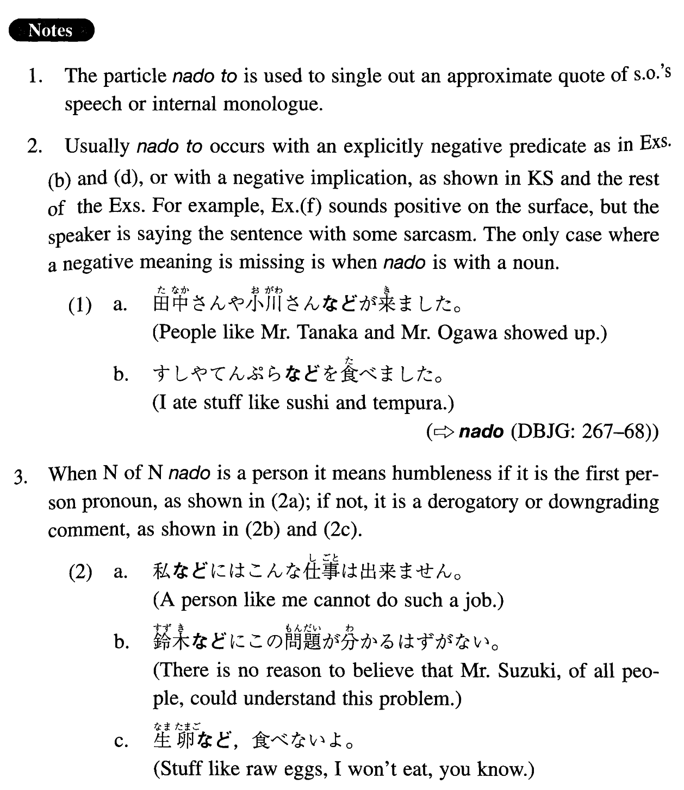

# などと

 
 
 
 

## Summary

<table><tr>   <td>Summary</td>   <td>A compound particle that indicates an approximate quote of words or ideas.</td></tr><tr>   <td>English</td>   <td>(things) like ~; ~ or something like</td></tr><tr>   <td>Part of speech</td>   <td>Compound Particle</td></tr></table>

## Formation

<table class="table"><tbody><tr class="tr head"><td class="td">(i) {V/Adjective い}informal</td><td class="td">などと</td><td class="td"></td></tr><tr class="tr"><td class="td"></td><td class="td">話すなどと</td><td class="td">(say) something like someone talks</td></tr><tr class="tr"><td class="td"></td><td class="td">つまらないなどと</td><td class="td">(say) something like something is uninteresting</td></tr><tr class="tr head"><td class="td">(ii) {Adjectiveな stem/Noun}</td><td class="td">{だ/だった}などと</td><td class="td"></td></tr><tr class="tr"><td class="td"></td><td class="td">便利{だ/だった}などと</td><td class="td">(say) something like something is/was convenient</td></tr><tr class="tr"><td class="td"></td><td class="td">学生{だ/だった}などと</td><td class="td">(say) something like someone is/was a student</td></tr></tbody></table>

## Example Sentences

<table><tr>   <td>日本の文化はユニークだなどと言う人がいるが、私はそうは思わない。</td>   <td>There are people who say things like Japanese culture is unique, but I don't think so.</td></tr><tr>   <td>お金がないから、日本へ行くなどということは夢です。</td>   <td>I don't have money, so ideas like going to Japan are just dreams.</td></tr><tr>   <td>毎日運動しろなどとは言いませんから、週に二、三度運動したらどうですか。</td>   <td>I'm not saying you should exercise every day, but why don't you do it 2 or 3 times a week.</td></tr><tr>   <td>ジョンソンさんは日本語で何でも話せるなどと言っている。</td>   <td>Mr. Johnson says things like he can say anything in Japanese.</td></tr><tr>   <td>困った時は助けてくれるだろうなどと甘く考えてはいけない。</td>   <td>Don't think indulgently things like people will help you when you are in trouble.</td></tr><tr>   <td>日本へ留学しようとしているケントさんは、うまく日本の生活に適応出来るかなどと心配している。</td>   <td>Mr. Kent, who is about to go to Japan to study, is worried about things like whether he will be able to adjust to Japanese life.</td></tr><tr>   <td>みんなが君のことをクラブのホープだなどと言っているよ。</td>   <td>Everybody is saying something like you are the hope of our club.</td></tr><tr>   <td>尊敬しています、などと言われると照れくさい。</td>   <td>When I am told that they respect me, I feel embarrassed.</td></tr></table>

## Grammar Book Page

