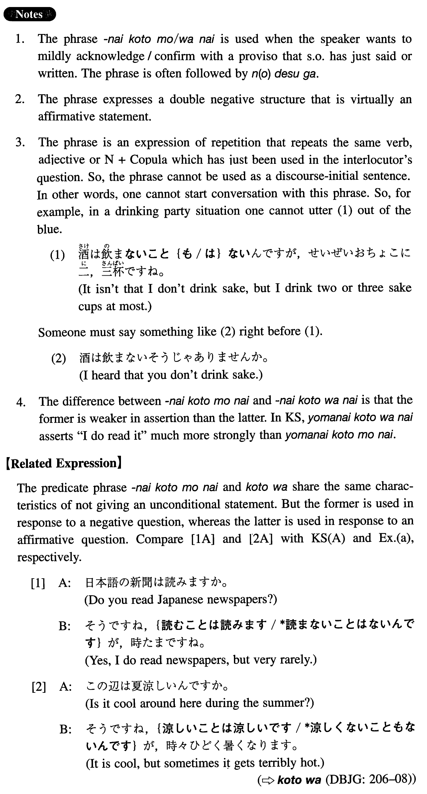

# ないことも / はない

[1. Summary](#summary) 
[2. Formation](#formation) 
[3. Example Sentences](#example-sentences) 
 

## Summary

<table><tr>   <td>Summary</td>   <td>A double negative phrase used to make a conditional affirmative statement.</td></tr><tr>   <td>English</td>   <td>It isn't the case that ~ not ~; it is not that ~ not ~</td></tr><tr>   <td>Part of speech</td>   <td>Phrase</td></tr><tr>   <td>Related expression</td>   <td>ことは</td></tr></table>

## Formation

<table class="table"><tbody><tr class="tr head"><td class="td">{V/Adjectiveい/な/Copula}negative</td><td class="td">ないこと{も/は}ない</td><td class="td"></td></tr><tr class="tr"><td class="td"></td><td class="td">話さないこと{も/は}ない</td><td class="td">I do speak, but ~</td></tr><tr class="tr"><td class="td"></td><td class="td">高くないこと{も/は}ない</td><td class="td">Something is expensive/high, but ~</td></tr><tr class="tr"><td class="td"></td><td class="td">不便{で/じゃ}ないこと{も/は}ない</td><td class="td">Something is frequent, but ~</td></tr><tr class="tr"><td class="td"></td><td class="td">学者{で/じゃ}ないこと{も/は}ない</td><td class="td">Someone is a scholar, but ~</td></tr></tbody></table>

## Example Sentences

<table><tr>   <td>Ａ：日本語の新聞は読まないんですか。Ｂ：いいえ、読まないこと{も/は}ないんですが、時たまですね。</td>   <td>A: Don't you read Japanese newspapers? B: I do read them, but very rarely. (literally: It isn't the case that I don't read them, but very rarely.)</td></tr><tr>   <td>A:この辺は夏涼しくないんですか。B:いや、涼しくないこともないんですが、時々ひどく暑くなります。</td>   <td>A: Isn't it cool around here during the summer? B: Yes, it is cool, but sometimes it gets terribly hot.</td></tr><tr>   <td>A:お父さんはお元気じゃないんですか。B:いや、元気じゃないことはないんですが、血圧が少し高いようです。</td>   <td>A: Isn't your father in good health? B: Yes, he is healthy, but his blood pressure is a bit high.</td></tr><tr>   <td>A：日本語は難しくありませんか。B:いえ、難しくないこともないんですが、日本語の難しさは強調されすぎていると思いますよ。</td>   <td>A: Isn't Japanese difficult? B: Yes, it is difficult, but it seems that the difficulty of Japanese is overemphasized.</td></tr><tr>   <td>A：山田さんは政治学者じゃないんですね。B:いや、政治学者じゃないこともないんですが、どちらかというと政治家です。</td>   <td>A: Mr. Yamada isn't a political scientist, is he? B: Yes, he is a political scientist, but he is more of a politician.</td></tr><tr>   <td>日本人は集団行動が好きだとよく言われている。確かに、集団行動をしないことはないのだが、個人行動をとる日本人も結構いる。</td>   <td>Japanese are said to like group behaviour. Certainly, they do behave as a group, but there are quite a few Japanese who behave individually.</td></tr></table>

## Grammar Book Page

