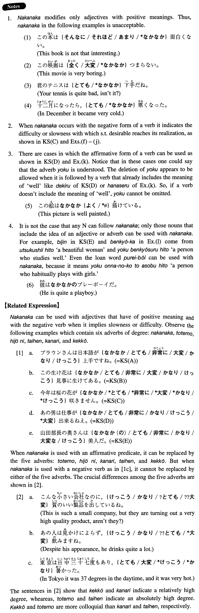

# なかなか

[1. Summary](#summary) 
[2. Formation](#formation) 
[3. Example Sentences](#example-sentences) 
[4. Grammar Book Page](#grammar-book-page) 

## Summary

<table><tr>   <td>Summary</td>   <td>An adverb used to indicate the speaker's feelings that something is impressive or his annoyance at slowness or difficulty in achieving something.</td></tr><tr>   <td>Equivalent</td>   <td>Quite; fairly; considerably; (not) easily; pretty; (not) readily</td></tr><tr>   <td>Part of speech</td>   <td>Adverb</td></tr><tr>   <td>Related expression</td>   <td>非常に; かなり; 結構; 大変; とても</td></tr></table>

## Formation

<table class="table"><tbody><tr class="tr head"><td class="td">(i) なかなか</td><td class="td">Adjective(い/な)affirmative</td><td class="td"></td></tr><tr class="tr"><td class="td"></td><td class="td">なかなか面白い</td><td class="td">Quite interesting</td></tr><tr class="tr"><td class="td"></td><td class="td">なかなか便利だ</td><td class="td">Quiet convenient</td></tr><tr class="tr head"><td class="td">(ii) なかなか</td><td class="td">Vaffirmative</td><td class="td"></td></tr><tr class="tr"><td class="td"></td><td class="td">なかなかやる</td><td class="td">Someone performs something quite well</td></tr><tr class="tr head"><td class="td">(iii) なかなか</td><td class="td">Vnegative</td><td class="td"></td></tr><tr class="tr"><td class="td"></td><td class="td">なかなか分からない</td><td class="td">Cannot understand something easily</td></tr><tr class="tr head"><td class="td">(iv) なかなか</td><td class="td">Adverb</td><td class="td"></td></tr><tr class="tr"><td class="td"></td><td class="td">なかなか上手に話す</td><td class="td">Someone speaks quite well</td></tr><tr class="tr head"><td class="td">(v) なかなか(の) </td><td class="td">Noun</td><td class="td"></td></tr><tr class="tr"><td class="td"></td><td class="td">なかなか(の)学者</td><td class="td">Quite a scholar</td></tr></tbody></table>

## Example Sentences

<table><tr>   <td>ブラウンさんは日本語がなかなか上手ですね。</td>   <td>{Mr. Brown is / Mr. Brown, you are} remarkably good at Japanese.</td></tr><tr>   <td>この生け花はなかなか見事に生けてある。</td>   <td>This flower arrangement is done quite nicely.</td></tr><tr>   <td>今年は桜の花がなかなか咲きません。</td>   <td>It will be a long time before the cherry blossoms are out this year. (literally: This year the cherry blossoms do not bloom easily.)</td></tr><tr>   <td>あの男は仕事がなかなか出来るねえ。</td>   <td>That guy does his job quite well, doesn't he?</td></tr><tr>   <td>山田部長の奥さんはなかなか（の）美人だ。</td>   <td>The wife of our departmental chief Yamada is quite a beauty.</td></tr><tr>   <td>この庭園はなかなか綺麗ですね。</td>   <td>This garden is quite beautiful, isn't it?</td></tr><tr>   <td>この数学の問題はなかなか難しそうだ。</td>   <td>This math problem looks quite difficult, doesn't it?</td></tr><tr>   <td>君はなかなかコンピュータに強いそうじゃないか。</td>   <td>I heard that you are quite good with computers.</td></tr><tr>   <td>この大学の学生はなかなかよく出来る。</td>   <td>The students at this college are pretty good.</td></tr><tr>   <td>あのピアニストはモーツァルトをなかなかうまく弾く。</td>   <td>That pianist plays Mozart quite well.</td></tr><tr>   <td>テニスは毎日練習しているのに、なかなか上手にならないんです。</td>   <td>I am practicing tennis every day, but I cannot become good at it readily.</td></tr><tr>   <td>約束の時間になっても友達がなかなか来なかったので家に帰ってしまった。</td>   <td>The meeting time long passed, but my friend didn't show up for a long time, so I went home.</td></tr><tr>   <td>あの人はどんなに説明しても、僕の言うことがなかなか分からないようだ。</td>   <td>No matter how hard I try to explain, he doesn't seem to understand me easily.</td></tr><tr>   <td>風邪がなかなか治らないので、困っているんです。</td>   <td>I'm having a difficult time, because my cold won't go away easily.</td></tr><tr>   <td>河豚は怖くて、なかなか食べられないんだ。</td>   <td>I am scared of blowfish and cannot eat it easily.</td></tr><tr>   <td>中村先生はなかなか話せる先生だ。</td>   <td>Mr. Nakamura is a teacher who (literally: can talk with us) can understand us.</td></tr></table>

## Grammar Book Page

