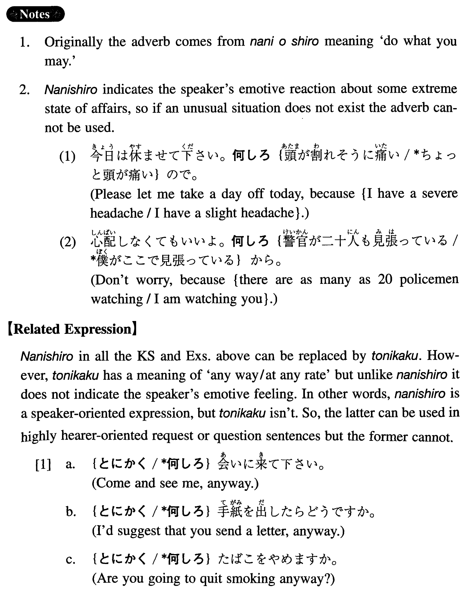

# 何しろ

[1. Summary](#summary) 
[2. Example Sentences](#example-sentences) 
[3. Grammar Book Page](#grammar-book-page) 

## Summary

<table><tr>   <td>Summary</td>   <td>An adverb that indicates the speaker's emotive feeling about some extreme state of affairs.</td></tr><tr>   <td>Equivalent</td>   <td>As a matter of fact; no matter what; believe it or not; you may be surprised, but ~; in fact; unbelievably</td></tr><tr>   <td>Part of speech</td>   <td>Adverb (used in conversation only)</td></tr><tr>   <td>Related expression</td>   <td>とにかく</td></tr></table>

## Example Sentences

<table><tr>   <td>うちの父は頑固なんだ。何しろ一度言い出したら絶対に引き下がらないんだから。</td>   <td>My father is obstinate. As a matter of fact, once he says he will do something, he never changes his mind.</td></tr><tr>   <td>Ａ：この大学の教育はいいらしいね。Ｂ：うん、何しろ学生六人に先生一人だからね。</td>   <td>A: I heard that education at this college is good. B: Yeah, you may be surprised, but the student-instructor ratio is 6 to 1.</td></tr><tr>   <td>一日中ボスにがなり立てられるんで、何しろ、ストレスが多いんだ。</td>   <td>Because my boss hollers at me all day long, I'm unbelievably stressed.</td></tr><tr>   <td>あの人は金持ちですよ。何しろベンツを三台も持っているんですからね。</td>   <td>He is rich, you know. Believe it or not, he has three Mercedes Benz.</td></tr><tr>   <td>今年の冬は本当に雪が多かったです。何しろ、雪の降らない日の方が少ないくらいでしたからね。</td>   <td>It snowed a lot this winter. In fact, there were less snow-free days than snowy days, you know.</td></tr><tr>   <td>あの人はよく煙草を吸いますよ。何しろ一日に六十本ぐらい吸うんですから。</td>   <td>He is a heavy smoker. In fact, he smokes about 60 cigarettes a day.</td></tr><tr>   <td>A:日本は人が多いねえ。B:うん、何しろ、面積はアメリカの二十五分の一なのに、人口は二分一だからね。</td>   <td>A: Japan is crowded, isn't it? B: Yeah, as a matter of fact, the size is one twenty fifth of America but the population is one half, you know.</td></tr><tr>   <td>何しろ、忙しいんだ。寝る時間もないんですよ。</td>   <td>I'm unbelievably busy. I don't have any sleeping time, you know.</td></tr></table>

## Grammar Book Page

