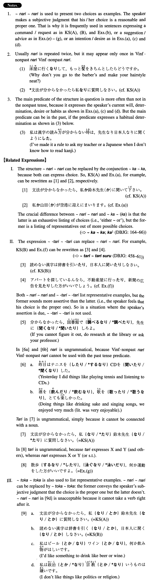

# なり~なり

[1. Summary](#summary) 
[2. Formation](#formation) 
[3. Example Sentences](#example-sentences) 
[4. Grammar Book Page](#grammar-book-page) 

## Summary

<table><tr>   <td>Summary</td>   <td>A phrase to indicate two representative choices/examples.</td></tr><tr>   <td>Equivalent</td>   <td>~ or ~ (for example); like ~ or ~</td></tr><tr>   <td>Part of speech</td>   <td>Strength</td></tr><tr>   <td>Related expression</td>   <td>か~か; たり~たり; とか~とか</td></tr></table>

## Formation

<table class="table"><tbody><tr class="tr head"><td class="td">(i) Noun</td><td class="td">なりNounなり{が/を}</td><td class="td"></td></tr><tr class="tr"><td class="td"></td><td class="td">田中君なり山田君なり{が/を}</td><td class="td">Either Tanaka or Yamada</td></tr><tr class="tr head"><td class="td">(ii) Noun</td><td class="td">Noun1 Particleなり Noun2 Particleなり</td><td class="td">Where Particle=other particles than が/を</td></tr><tr class="tr"><td class="td"></td><td class="td">山へなり海へなり</td><td class="td">To the mountain or to the oceans</td></tr><tr class="tr"><td class="td"></td><td class="td">田中君になり山田君になり</td><td class="td">Either to Tanaka or to Yamada</td></tr><tr class="tr head"><td class="td">(iii) Noun</td><td class="td">Noun1なり Noun2 Particle</td><td class="td">Where the Particle is に,へ,と,で,から</td></tr><tr class="tr"><td class="td"></td><td class="td">ラジオなりテレビなりで</td><td class="td">Either on the radio or TV</td></tr><tr class="tr head"><td class="td">(iv) Vinformal nonpast</td><td class="td">なり Vinformal nonpast なり</td><td class="td"></td></tr><tr class="tr"><td class="td"></td><td class="td">読むなり、書くなり</td><td class="td">Reading or writing</td></tr></tbody></table>

## Example Sentences

<table><tr>   <td>文法が分からなかったら、私なり鈴木先生なりに質問しなさい。</td>   <td>If you don't understand grammar, ask me or Professor Suzuki.</td></tr><tr>   <td>読めない漢字は辞書を引くなり、日本人に聞くなりしなさい。</td>   <td>As for kanji you can't read, find out the reading either by looking it up in a dictionary or by asking a Japanese.</td></tr><tr>   <td>私なり山田なりが空港に迎えに参ります。</td>   <td>Either I or Yamada will go to the airport to pick you up.</td></tr><tr>   <td>何か連絡することがありましたら電話なりファックスなりでお願いします。</td>   <td>If you have something that you want to report, please do it by telephone or by fax.</td></tr><tr>   <td>両親なり親友なりに会って、ゆっくり話したいんです。</td>   <td>I would like to see my parents or a close friend, and talk leisurely.</td></tr><tr>   <td>今は忙してく旅行が出来ないが、春休みなり夏休みなりにするつもりだ。</td>   <td>Right now I'm so busy that I can't make a trip, but I intend to make one during the spring break or summer vacation.</td></tr><tr>   <td>テニスがしたかったら、トムなりチャールズなりとしたらいいでしょう。</td>   <td>If you want to play tennis, why don't you play with Tom or Charles?</td></tr><tr>   <td>アパートを探しているんなら、不動産屋に行くなり、新聞の広告を見るなりしたらどうですか。</td>   <td>If you are looking for an apartment, you should go to a realtor or look at the newspaper ads.</td></tr><tr>   <td>散歩するなり、泳ぐなり、何か運動をした方がいいですよ。</td>   <td>You'd better do some exercise, like taking a walk or swimming.</td></tr></table>

## Grammar Book Page

