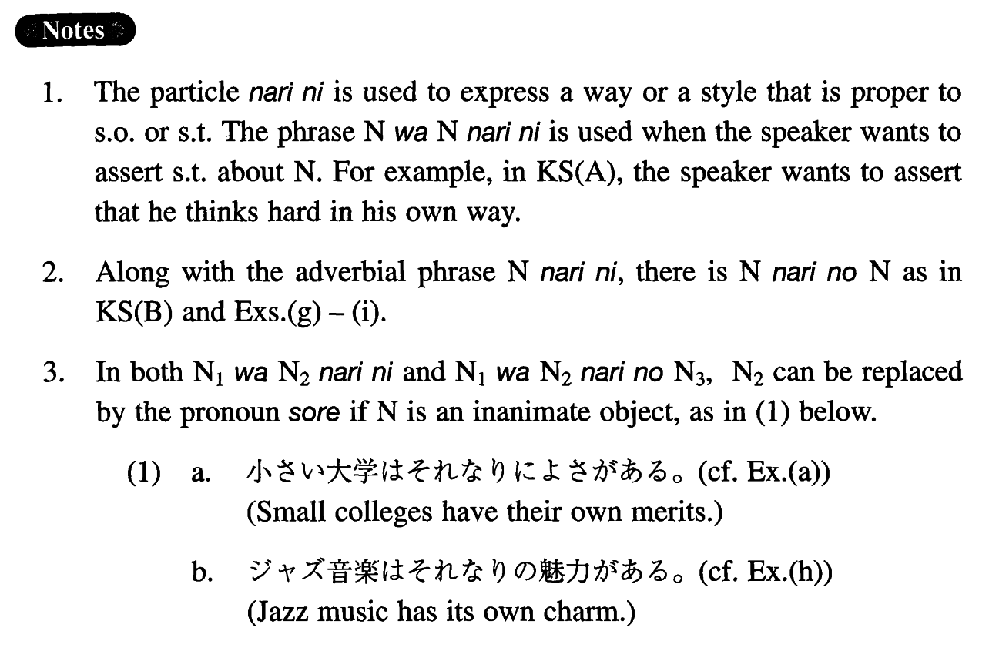

# なりに

 
 
 
 

## Summary

<table><tr>   <td>Summary</td>   <td>In a way/style that is proper to someone/something.</td></tr><tr>   <td>English</td>   <td>In one's own way; in one's own style</td></tr><tr>   <td>Part of speech</td>   <td>Compound Particle</td></tr></table>

## Formation

<table class="table"><tbody><tr class="tr head"><td class="td">(i) Noun1はNoun2</td><td class="td">なりに</td><td class="td">Where Noun1=Noun2</td></tr><tr class="tr"><td class="td"></td><td class="td">学生は学生なりに</td><td class="td">Students ~ in their own way</td></tr><tr class="tr head"><td class="td">(ii) Noun1はNoun2</td><td class="td">なりのNoun3</td><td class="td">Where Noun1=Noun2</td></tr><tr class="tr"><td class="td"></td><td class="td">先生なりの考え</td><td class="td">Teachers’ own idea</td></tr></tbody></table>

## Example Sentences

<table><tr>   <td>あの人はあの人なりによく考えているらしい。</td>   <td>He appears to think hard in his own way.</td></tr><tr>   <td>動物は動物なりのコミュニケーションが出来る。</td>   <td>Animals are capable of their own communication.</td></tr><tr>   <td>小さい大学は小さい大学なりによさがある。</td>   <td>Small colleges have their own merits.</td></tr><tr>   <td>私は私なりに、人生観を持っています。</td>   <td>I have my own outlook on life.</td></tr><tr>   <td>自転車は自転車なりに、車は車なりに、長所、短所がある。</td>   <td>A bike and a car have their own merits and demerits.</td></tr><tr>   <td>健康な人は健康な人なりに、体に気をつけた方がいい。</td>   <td>Healthy people had better take care of themselves in their own way.</td></tr><tr>   <td>私は老人が老人なりに生活を楽しめる社会が好きだ。</td>   <td>I like a society in which old people can enjoy life in their own way.</td></tr><tr>   <td>私は私なりに一生懸命働くつもりです。</td>   <td>I intend to work very hard in my own way.</td></tr><tr>   <td>この問題について、父は父なりの考えを持っているようです。</td>   <td>My father seems to have his own idea about this issue.</td></tr><tr>   <td>ジャズ音楽はジャズ音楽なりの魅力がある。</td>   <td>Jazz music has its own charm</td></tr><tr>   <td>金持ちは金持ちなりの悩みがあるのだ。</td>   <td>Rich people have their own suffering.</td></tr></table>

## Grammar Book Page

