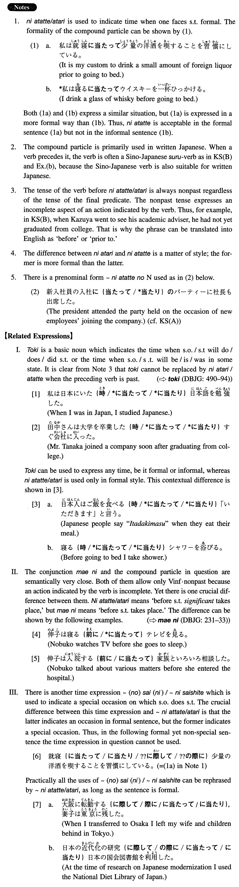

# に当たって/当たり

[1. Summary](#summary) 
[2. Formation](#formation) 
[3. Example Sentences](#example-sentences) 
[4. Grammar Book Page](#grammar-book-page) 

## Summary

<table><tr>   <td>Summary</td>   <td>A compound particle that indicates occasion of doing something or of having done something in formal Japanese.</td></tr><tr>   <td>Equivalent</td>   <td>On the occasion of; at; in; before; prior to</td></tr><tr>   <td>Part of speech</td>   <td>Compound Particle (used in writing and formal speech only)</td></tr><tr>   <td>Related expression</td>   <td>前に; に際して; 際(に); 時</td></tr></table>

## Formation

<table class="table"><tbody><tr class="tr head"><td class="td">(i) Noun</td><td class="td">に{当たって/当たり}</td><td class="td"></td></tr><tr class="tr"><td class="td"></td><td class="td">結婚に{当たって/当たり}</td><td class="td">On the occasion of the marriage</td></tr><tr class="tr head"><td class="td">(ii) Vinformal nonpast</td><td class="td">に{当たって/当たり}</td><td class="td"></td></tr><tr class="tr"><td class="td"></td><td class="td">話すに{当たって/当たり}</td><td class="td">On the occasion of talking</td></tr></tbody></table>

## Example Sentences

<table><tr>   <td>新入社員の入社に{当たって/当たり}社長はホテルでパーティーを開いた。</td>   <td>On the occasion of new employees' entering the company, the president threw a party at a hotel.</td></tr><tr>   <td>和也は大学を卒業するに{当たって/当たり}、指導教官に今後の進路について相談した。</td>   <td>On the occasion of graduating from college, Kazuya consulted with his academic adviser on his future direction.</td></tr><tr>   <td>私の留学に当たり、父は自分の経験を話してくれた。</td>   <td>On the occasion of my study abroad, my father told me about his own experience.</td></tr><tr>   <td>日本の経済を研究するに当たって、国会図書館で資料集めをした。</td>   <td>Before I did research on the Japanese economy, I collected materials at the National Diet Library.</td></tr><tr>   <td>総理はサミット出席に当たり、閣僚と会議をした。</td>   <td>The Premier had a conference with cabinet members before attending the summit.</td></tr><tr>   <td>小説家は時代小説を書くに当たり、その時代の歴史を詳しく調べた。</td>   <td>Before writing a historical novel, the novelist did an in-depth survey of the history of the period he dealt with.</td></tr></table>

## Grammar Book Page

