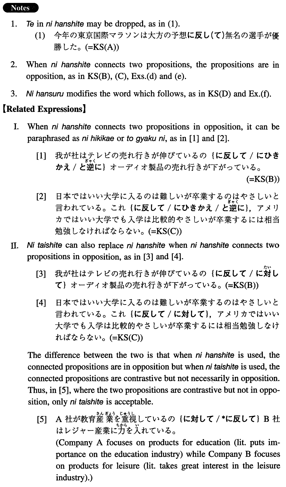

# に反して/反する

 
 
 
 

## Summary

<table><tr>   <td>Summary</td>   <td>Contrary to or in contrast to.</td></tr><tr>   <td>English</td>   <td>Against; contrary to; in contrast to; in violation of; while; whereas</td></tr><tr>   <td>Part of speech</td>   <td>Compound Particle (used in writing and formal speech only)</td></tr><tr>   <td>Related expression</td>   <td>にひきかえ; に対して; と逆に</td></tr></table>

## Formation

<table class="table"><tbody><tr class="tr head"><td class="td">(i) Noun</td><td class="td">に反して</td><td class="td"></td></tr><tr class="tr"><td class="td"></td><td class="td">予想に反して</td><td class="td">Contrary to expectation</td></tr><tr class="tr head"><td class="td">(ii) Sinformal</td><td class="td">のに反して</td><td class="td">Connection rules: the same as のだ</td></tr><tr class="tr"><td class="td"></td><td class="td">よく勉強するのに反して</td><td class="td">In contrast to the fact that someone studies hard</td></tr><tr class="tr head"><td class="td">(iii) Demonstrative Pronoun</td><td class="td">に反して</td><td class="td"></td></tr><tr class="tr"><td class="td"></td><td class="td">これに反して</td><td class="td">In contrast to this</td></tr><tr class="tr head"><td class="td">(iv) Noun</td><td class="td">に反するNoun</td><td class="td"></td></tr><tr class="tr"><td class="td"></td><td class="td">予想に反する結果</td><td class="td">A result which is contrary to someone’s expectation</td></tr></tbody></table>

## Example Sentences

<table><tr>   <td>今年の東京国際マラソンは大方の予想に反して無名の選手が優勝した。</td>   <td>Contrary to the majority's expectations, an unknown runner won the Tokyo International Marathon this year.</td></tr><tr>   <td>我が社はテレビの売れ行きが伸びているのに反してオーディオ製品の売れ行きが下がっている。</td>   <td>In our company, in contrast to the increase in sales of TV sets, the sales in audio products are decreasing.</td></tr><tr>   <td>Ｓ１：日本ではいい大学に入るのは難しいが卒業するのは易しいと言われている。Ｓ２：これに反して、アメリカではいい大学でも入学が比較的易しいが卒業するには相当勉強しなければならない。</td>   <td>S1: It is said that to enter good universities in Japan is difficult but to graduate from them is easy. S2: In contrast to this, in America even good universities are relatively easy to enter, but students must study quite hard to graduate from them.</td></tr><tr>   <td>妙子は意に反する結婚を押しつけられた。</td>   <td>Taeko was forced to marry. (literally: A marriage which was against Taeko's will was forced upon her.)</td></tr><tr>   <td>浩は両親の期待に反して高校を出てからコックになった。</td>   <td>Contrary to his parents' wishes, Hiroshi became a chef after finishing high school.</td></tr><tr>   <td>彼は自分の意思に反して賄賂を受け取ってしまった。</td>   <td>He was forced to accept a bribe. (literally: He received a bribe against his will.)</td></tr><tr>   <td>この規則に反して従業員を働かせた場合は一か月の営業停止になる。</td>   <td>Your business will be suspended for one month if you work your employees in violation of these rules.</td></tr><tr>   <td>奥村さんのうちはご主人が無口なのに反して奥さんが人一倍のおしゃべりだ。</td>   <td>In Okumura's family, whereas the husband is quite, the wife is very talkative.</td></tr><tr>   <td>日本での初等教育は生徒に知識を与えることに主眼が置かれている。これに反して、アメリカでは生徒の創造性や個性を伸ばすことに重点が置かれている。</td>   <td>The principle consideration of elementary education in Japan is to provide students with knowledge. In America, in contrast (to this), emphasis is put on increasing students' creativity and individual talents.</td></tr><tr>   <td>今回の選挙は一般の予想に反する結果に終わった。</td>   <td>The election this time ended up with results which were against the general prediction.</td></tr></table>

## Grammar Book Page

