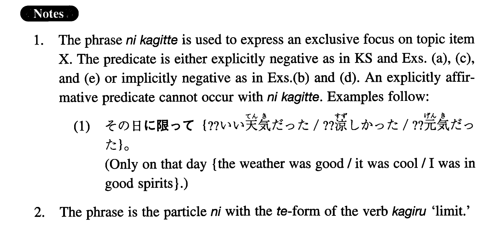

# に限って

[1. Summary](#summary) 
[2. Formation](#formation) 
[3. Example Sentences](#example-sentences) 
 

## Summary

<table><tr>   <td>Summary</td>   <td>A compound particle to show that only X is different from others.</td></tr><tr>   <td>English</td>   <td>(X) of all (X's); only</td></tr><tr>   <td>Part of speech</td>   <td>Compound Particle</td></tr></table>

## Formation

<table class="table"><tbody><tr class="tr head"><td class="td">Noun</td><td class="td">に限って</td><td class="td"></td></tr><tr class="tr"><td class="td"></td><td class="td">あの日に限って</td><td class="td">Only on that day</td></tr><tr class="tr"><td class="td"></td><td class="td">あの人に限って</td><td class="td">Only that person</td></tr></tbody></table>

## Example Sentences

<table><tr>   <td>うちの子供に限ってそんなひどいことはしませんよ。</td>   <td>Our child, of all children, would not do such a terrible thing.</td></tr><tr>   <td>中野先生はたいてい研究室にいらっしゃるのに、今日に限っていらっしゃらなかった。</td>   <td>Professor Nakano is usually in his office, but today, of all days, he wasn't there.</td></tr><tr>   <td>傘を持って来ない日に限って雨が降るんですよ。</td>   <td>Only on the day when I don't bring my umbrella, it rains, you know.</td></tr><tr>   <td>急ぐ時に限って、バスがなかなか来ない。</td>   <td>Of all times, when I am in a hurry, the bus doesn't come for ages.</td></tr><tr>   <td>嫌なことがある時に限って、嫌なことが重なる。</td>   <td>Only when something unpleasant happens, do other unpleasant things occur.</td></tr><tr>   <td>この小説家の書いたものに限って、つまらないものはない。</td>   <td>Only works written by this novelist are never boring.</td></tr></table>

## Grammar Book Page

