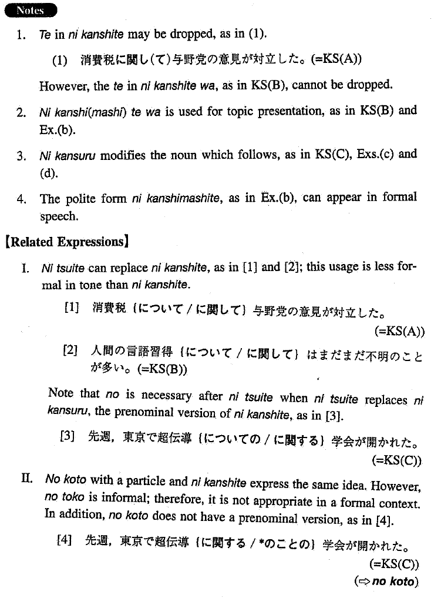

# に関して/関する

[1. Summary](#summary) 
[2. Formation](#formation) 
[3. Example Sentences](#example-sentences) 
[4. Grammar Book Page](#grammar-book-page) 

## Summary

<table><tr>   <td>Summary</td>   <td>Related to.</td></tr><tr>   <td>Equivalent</td>   <td>Concerning; with regard to; about; on</td></tr><tr>   <td>Part of speech</td>   <td>Compound Particle (used in writing and formal speech only)</td></tr><tr>   <td>Related expression</td>   <td>について; のこと</td></tr></table>

## Formation

<table class="table"><tbody><tr class="tr head"><td class="td">(i) Noun</td><td class="td">に関して</td><td class="td"></td></tr><tr class="tr"><td class="td"></td><td class="td">首相の訪米に関して</td><td class="td">Concerning the Prime Minister’s visit to the U.S.</td></tr><tr class="tr head"><td class="td">(ii) Noun</td><td class="td">に関するNoun</td><td class="td"></td></tr><tr class="tr"><td class="td"></td><td class="td">首相の訪米に関する世論</td><td class="td">Public opinion concerning the Prime Minister’s visit to the U.S.</td></tr></tbody></table>

## Example Sentences

<table><tr>   <td>消費税に関して与野党の意見が対立した。</td>   <td>With regard to the sales tax, the opinions of the leading party and the opposition parties conflicted.</td></tr><tr>   <td>人間の言語習得に関してはまだまだ不明のことが多い。</td>   <td>Concerning human language acquisition, there are still many unknown things.</td></tr><tr>   <td>先週、東京で超伝導に関する学会が開かれた。</td>   <td>Last week a conference on superconductivity was held in Tokyo.</td></tr><tr>   <td>その学会で吉岡氏の発表に関して多くの批判がなされた。</td>   <td>There was a lot of criticism concerning Mr. Yoshioka's presentation at the conference.</td></tr><tr>   <td>その件に関しましては、まだ発表できる段階ではありません。</td>   <td>With regard to that issue, we are not yet at the stage where we can announce anything.</td></tr><tr>   <td>最近老人問題に関する記事が目に付く。</td>   <td>We see many articles about problems of the elderly these days.</td></tr><tr>   <td>大気汚染に関する報告書が委員会に提出された。</td>   <td>A report concerning environmental pollution was submitted to the committee.</td></tr></table>

## Grammar Book Page

